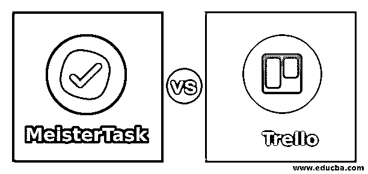
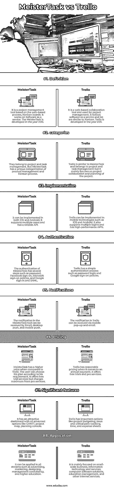

# meistartask vs trello

> 原文：<https://www.educba.com/meistertask-vs-trello/>

## MeisterTask 与 Trello 的区别

项目管理工具用于调整和正确导航任务以完成任务。这种用于有效目的的项目管理工具可以实现高生产率。MeisterTask vs Trello 是团队内部采用的管理工具，用于遵循敏捷方法在目标期限内完成任务。Trello 被定义为一种协作工具，将工作安排到电路板上。尽管 meistertask 是在 Trello 板中实现的，但它变成了有吸引力的、敏捷的产品，通过智能自动化来适应需求并提高团队的生产力。

### MeisterTask 与 Trello 的面对面比较(信息图)

以下是 MeisterTask 和 Trello 之间的顶级比较

<small>网页开发、编程语言、软件测试&其他</small>

### MeisterTask 与 Trello 的主要区别

让我们看看 MeisterTask 和 Trello 之间的主要区别:

meistertask 和 Trello 之间的主要区别在于它们的功能、适应性、定价、优势和局限性，可以在下面讨论:

#### 定义

Meistertask 让任务变得过于简单和用户友好。可以根据需求高度定制。因此，除非用户指定，否则仪表板中不会有任何更新。

Trello 是无限的，用于跟踪项目的状态，这些项目有一个特定的截止日期，应该按照正确的顺序完成。Trello 的灵活性使得实施和与感兴趣的客户共享新仪表板变得简单。

#### 可用性

Trello 的可用性非常强大，在团队中运行良好。该工具的仪表板很简单，所有插件都在左边，其他访问控件在右边。在卡片中拖放的交互使得不可访问列表变得紧凑和可定制。它包括截止日期、图像、颜色编码和一个组织在一个图形栏中的清单，可以很容易地跟踪任务的状态。

#### 可供选择的事物

许多用户尝试了许多工具来进行有效的项目管理，但 MeisterTask 独树一帜，并以其先进的特性击败了所有这些工具。但是一些企业使用其他软件来对员工进行个人管理，而当涉及到专业管理时，使用 MeisterTask 是最好的选择。特雷罗可以根据球队的需要适应小规模的球队。它用于完成基本操作，如分配任务和待办事项。它可以在最小的可扩展项目中实施，工作负载类型是一致的。

#### 优势

与其他软件相比，Meistertask 的学习曲线非常低，它可以在工作状态下通过时间消耗同时管理多个项目。管理列表的组件非常容易，它允许多个界面。在这里，所有的工作都是按照轻重缓急有条不紊地安排的。它有许多适合企业的版本，并且它提供个人使用，因为它有许多关于日常活动的高级功能。在 Trello 中，颜色的分类是基于用来代表任务、项目状态和预定工作的卡片。它用于表示员工的整体绩效和活动，并将它们分成几列，并根据员工的工作状态而变化。它创造了许多有吸引力的董事会，有广阔的空间来保存已完成或待完成的任务。也可以是私人时间表。他们可以与团队中的其他成员共享白板，并将卡片分配给相关的团队成员。该卡被设计成存储文件和格式化文本的格式。

#### 限制

有吸引力的 MeisterTask 有一些限制，例如任务的详细描述，这很难实现。传统项目认为 MeisterTask 是肤浅的。完成看板低效率的附加工具，在看板中缺乏团队绩效、时间和计划，并且它只产生有限的分析报告。Trello 有一个不可能存在的泳道，它被表现为一个第三方工具，然后它是能动的，很容易被运输。视图和集成选项在这个过程中提供了许多折叠，并且在通知中缺少弹出选项。所以应该定期检查更新，因为不会显示任何通知。

### MeisterTask 与 Trello 对比表

以下是主要对比:

| **属性** | 大师任务 | 特雷罗 |
| 定义 | 这是一个基于网络流程的项目管理工具，看板。它以软件即服务的方式工作。MeisterTask 是 2015 年开发的。 | 它是一个基于网络的协作工具，用于项目管理。它遵循软件即服务，列表类似于看板。Trello 于 2011 年开发。 |
| 种类 | 它们属于项目和任务管理。但是 MeisterTask 对产品管理和看板流程有一个独特的分类。 | Trello 类似于 MeisterTask，属于项目和任务管理，但主要侧重于项目协作和项目的规划。 |
| 履行 | iOS 和 Android 都可以实现。它支持多用户，并有一个可靠的 API。 | Trello 可以在 iOS 和 Android 等移动技术中实现。它还支持多次登录，并具有高性能的 API |
| 证明 | MeisterTask 的认证有几个步骤，如密码、脸书登录、微软登录策略、谷歌登录和 SAML。 | Trello has a simple authentication process such as password login and Google sign-on policies. |
| 通知 | MeisterTask 工具中的通知可以通过电子邮件、桌面推送和移动推送接收。 | 可以通过手机弹出窗口和电子邮件接收 Trello 中的通知。 |
| 定价 | 与 Trello 相比，MeisterTask 的价格更高。用户可以根据自己的需要选择自己的方案。它提供免费试用服务，但对专业服务收费最高。 | 当谈到年度付款时，特雷罗有合理的定价。它提供免费试用和专业服务。 |
| 重要特征 | 它有一个吸引人的仪表板，带有所有高级选项，如甘特图、项目图、计划控制台。 | Trello 有一些重要的选项，如项目预算、问题和关键路径跟踪、时间和费用表。 |
| 应用 | 它可以应用于所有领域，如广告、营销、设计、管理咨询和高等教育。 | 它主要专注于小型企业、信息技术和服务、计算机软件解决方案、教育管理和其他互联网服务。 |

### 结论

在讨论了这些项目管理工具的优缺点后，Trello 因其受限的可靠特性而在市场上获得了更多的关注，并在全球调查中获得了前 5 名到第 1 名的排名，而 MeisterTask 则排名第 60 位到第 3 名。

### 推荐文章

这是 MeisterTask vs Trello 的指南。在这里，我们讨论 MeisterTask 与 Trello 之间的区别，并给出主要区别和比较表。您也可以浏览我们的其他相关文章，了解更多信息——

1.  [吉拉 vs 特雷罗](https://www.educba.com/jira-vs-trello/)
2.  [冲刺吉拉](https://www.educba.com/sprint-in-jira/)
3.  [吉拉史诗](https://www.educba.com/jira-epic/)
4.  [吉拉版本](https://www.educba.com/jira-versions/)

