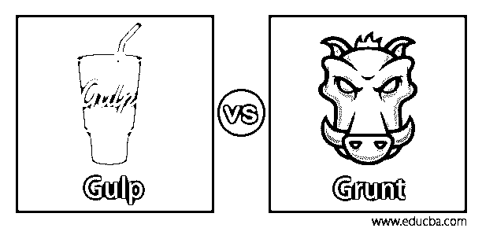
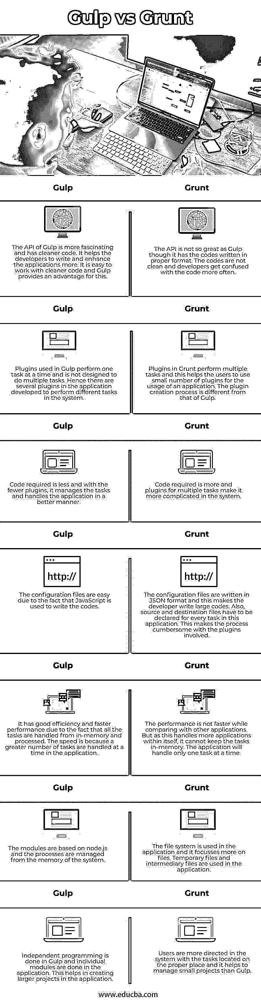

# 吞咽 vs 咕哝

> 原文：<https://www.educba.com/gulp-vs-grunt/>

## 吞咽和咕哝的区别

Gulp 是开发用于前端开发中的流的工具包。用 JavaScript 编写，它是一个任务运行器，开发人员可以在其中自动化大多数开发任务。文件被认为是流，它们作为不同的任务被传输。插件被用来运行任务，并且为任务编写代码。Grunt 也是一个任务运行器，它自动地按顺序一个接一个地运行任务。它是用 Node.js 编写的，使用命令行界面来运行应用程序中的文件。自定义任务在 CLI 中运行。

### Gulp 与 Grunt Classic 的面对面比较(信息图)

以下是 Gulp 和 Grunt 之间的主要对比:

<small>网页开发、编程语言、软件测试&其他</small>

### 吞咽和咕哝的主要区别

让我们讨论一下 Gulp 和 Grunt 之间的一些主要区别:

*   当我们比较两者时，我们可以看到两者都使用节点编码，两者都是一个系统中的构建块。两者的工作原理也是相似的。让我们深入了解他们的不同之处，这些不同之处并不少，但很容易识别。首先，在自动化任务时，Gulp 使用存储在内存中的文件并使用它。但是 Grunt 使用系统中的临时文件和输入输出操作来工作。这些中间文件编译结果，并保存在目标文件中。
*   如上所述，由于 Gulp 将文件写入并存储到自己的内存中，因此它在系统中的运行速度比 Grunt 快。速度可比咕噜快一倍。这是一个很大的优势，因为系统的内存不会受到任何外部文件的影响，可以很好地管理。Grunt 使用中间文件或临时文件，这使得系统在内存和存储方面更加复杂。检索文件不像 Gulp 那么容易。
*   为了管理内存和速度，即将发布的 Grunt 版本包含了新的更新，比如支持存储库和加速进程。这使得 app 在客户面前要定期变脸。所有 Grunt 版本都有新的更新，这有助于应用程序支持更多的文件并迁移到新技术。而考虑 Gulp，发布的版本更少，即使有新的发布，应用程序也不会有太大的变化。主要是补丁更新和系统支持。
*   Grunt 比 Gulp 早一年开发出来。它是 2012 年开发的，而 Gulp 是 2013 年开发的。这使得社区支持 Grunt 成为一个巨大的备份。支持是巨大的，社区帮助发布插件，这是更多的咕噜比吞咽。Gulp 中使用的插件更少，因此由于社区支持，人们更喜欢使用 Grunt。社区里所有的问题都会很快得到回答。这种情况在未来几年可能会改变，因为现在吞咽的使用越来越多。
*   和 Webpack 一样，Grunt 也有配置复杂的问题，这让 Gulp 有点优势。用 Grunt 编写的代码很难阅读和理解，而在 Gulp 中，很容易理解并以另一种格式重写代码。这使得代码可以在应用程序中轻松地转移到另一个平台。Grunt 中的代码很复杂，不容易从一个平台移植到另一个平台。

### 吞咽与咕噜声对照表

让我们来看看吞咽和咕噜咕噜之间的主要比较:

| **一饮而尽** | **咕噜声** |
| Gulp 的 API 更吸引人，代码也更干净。它帮助开发人员编写和增强应用程序。使用更干净的代码很容易，Gulp 为此提供了优势。 | API 并不像 Gulp 那样伟大，尽管它有以适当格式编写的代码。代码不干净，开发人员更容易对代码感到困惑。 |
| Gulp 中使用的插件一次执行一个任务，而不是被设计成执行多个任务。因此，应用程序中有几个插件被开发来执行系统中的不同任务。 | Grunt 中的插件执行多种任务，这有助于用户使用少量插件来使用应用程序。插件创建过程与 Gulp 不同。 |
| 所需的代码更少，插件更少，它可以更好地管理任务和处理应用程序。 | 需要的代码更多，多任务的插件使得系统更加复杂。 |
| 由于使用 JavaScript 编写代码，配置文件很容易。 | 配置文件以 JSON 格式编写，这使得开发人员编写大量代码。此外，必须为该应用程序中的每个任务声明源文件和目标文件。这使得插件相关的过程很麻烦。 |
| 由于所有任务都是从内存中处理和处理的，因此它具有良好的效率和更快的性能。速度快是因为在应用程序中一次处理更多的任务。 | 与其他应用程序相比，性能并没有提高。但是由于它本身处理更多的应用程序，它不能将任务保存在内存中。应用程序一次只能处理一个任务。 |
| 这些模块基于 node.js，进程从系统内存中管理。 | 文件系统在应用程序中使用，它更侧重于文件。应用程序中使用了临时文件和中间文件。 |
| 独立编程是囫囵吞枣地完成的，单个模块是在应用中完成的。这有助于在应用程序中创建更大的项目。 | 用户在系统中得到更多的指导，任务被放在适当的位置，这比囫囵吞枣更有助于管理小项目。 |

### 结论

而在工作中考虑选择哪一个，总是看个人喜好。但是如果你已经在使用 Grunt 或 Gulp 了，并且你对这个应用程序很满意，那就继续使用它。但是如果你对两者都不熟悉，并且需要更多的插件，那就选择 Grunt 吧。你可以开发插件，但是你所关心的只是速度；咽下去。

### 推荐文章

这是一个吞咽和咕哝的指南。在这里，我们讨论关键的区别，用信息图和比较表来说明直接的区别。您也可以浏览我们的其他相关文章，了解更多信息——

1.  [CSS Vs CSS3](https://www.educba.com/css-vs-css3/)
2.  [DES 与 AES](https://www.educba.com/des-vs-aes/)
3.  [坞站 vs VM](https://www.educba.com/docker-vs-vms/)
4.  [Flexbox Vs Bootstrap](https://www.educba.com/flexbox-vs-bootstrap/)

