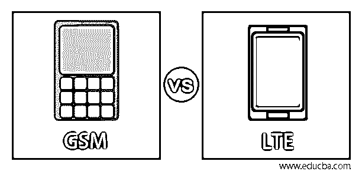
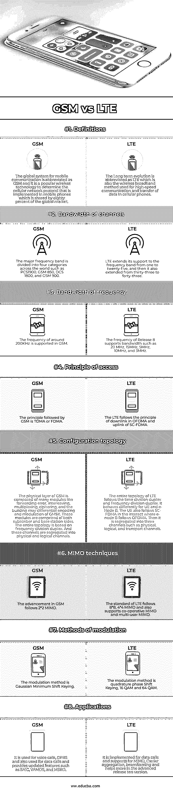

# GSM 与 LTE

> 原文：<https://www.educba.com/gsm-vs-lte/>

## GSM 与 LTE 的区别

全球移动通信系统简称为 GSM。它是一种流行的无线技术，用于确定在移动电话中实现的蜂窝网络协议，该技术占有全球市场的 80%。而长期演进被缩写为 LTE，这也是用于蜂窝电话中的高速通信和数据传输的无线宽带方法。在本主题中，我们将了解 GSM 和 LTE。

### GSM 与 LTE 的直接对比(信息图表)

以下是 GSM 和 LTE 的主要区别

<small>网页开发、编程语言、软件测试&其他</small>

### GSM 与 LTE 的主要区别

本节简要说明了 GSM 和 LTE 在架构、工作机制、传输线路、频率等方面的主要区别。

#### 历史

GSM 是欧洲人在 1982 年左右开发的最著名的数字网络。移动系统背后的原理可以在整个欧洲电信标准中使用，它活跃在大约 3 亿用户中。它以其端到端有效的移动通信网络构建获得了巨大的声誉，这标志着移动通信设备事实上的校准。

LTE 被扩展为长期演进，并以其最大速度的无线宽带服务而著称。它是由第三代合作项目的术语创造出来的。该企业有责任遵循 UMTS 和 GSM 标准。UMTS 和 3GPP 的合作提出了重组移动通信核心网络的想法，该想法上升到 LTE 标准，并成为 3GPP release 的正式部分。

#### GSM 和 LTE 上的传输范围

GSM 技术与 TDMA 和 FDMA 的组合一起工作。从每个载频中划分出八个时隙，建立 GSM 连接。然后，每个用户被分配每个时隙和唯一的频率信道，在该频率信道上可以接收或发送信号。LTE 遵循 OFDM 和 SC-FDMA 以及信号保持器及其相关的接入理论。

#### GSM 和 LTE 中的频道范围

GSM 的系统频率包括双频段，如 900 MHz 和 1800 MHz，通常称为 DCS-1800 和 GSM-900。频分多址将 25 MHz 的带宽分成 124 的载波频率，信道的宽度测量为 200 kHz。然后通过使用时分多址接入将每个载波频率分成八个时隙。在 DCS-1800 中，包含 1710 至 1785 MHz 和 1805 至 1880 MHz 两个子频段。以下是在不同国家为 LTE 测量的几个频段，每个频段都有设定的限制。1 到 25 个频带被分配给 FDD，而 LTE 频带范围从 33 到 41 个用于 TDD。

#### GSM 和 LTE 的架构

GSM 系统架构由核心网、用户设备、基站子系统三个重要子系统组成。接口层位于系统之间，用组件之间的协作规则来描述和确定。LTE 架构是扁平的，从上一代 UMTS 的基础上发展而来。它包括演进分组核心，并具有其他八个核心元素，例如 E-UTRAN 节点 B、接入网关、移动管理实体和用户规划。

### GSM 与 LTE 对比表

为了便于理解，让我们通过一个比较表来看看 GSM 和 LTE 之间的更多差异:

| **特征元素** | **GSM** | **LTE** |
| **定义** | 全球移动通信系统简称为 GSM。它是一种流行的无线技术，用于确定在移动电话中实现的蜂窝网络协议，该技术占有全球市场的 80%。 | 长期演进缩写为 LTE，这也是用于蜂窝电话中高速通信和数据传输的无线宽带方法。 |
| **通道带宽** | 主要频段在全球分为四类，如 PCS1900、GSM 850、DCS 1800 和 GSM 900。 | LTE 将其支持的频段从一个扩展到二十五个，然后它也从三十三个扩展到四十三个。 |
| **频率带宽** | GSM 支持 200KHz 左右的频率。 | 版本 8 的频率支持 20 MHz、15MHz、5MHz、10MHz 和 3MHz 等带宽。 |
| **访问原理** | GSM 遵循的原理是 TDMA 或 FDMA | LTE 遵循 OFDMA 的下行链路和 SC-FDMA 的上行链路的原理。 |
| **配置拓扑** | GSM 的物理层由许多模块组成，如转发错误、交织、复用、加密，并且该架构可能包含 GMSK 的差分编码和调制。这些模块由用户侧和基站侧组成。整个拓扑结构基于频分双工。并且这些信道被分成物理和逻辑信道。 | LTE 的整个拓扑遵循时分双工和频分双工。对于 UE 和 e-node B，其表现不同。在交互中，UE 也遵循 SC-FDMA，其中 e-Node B 遵循 OFDMA。然后，它被分成三个通道，如物理通道、逻辑通道和传输通道。 |
| **MIMO 技术** | GSM 的进步遵循 2*2 MIMO。 | LTE 的标准遵循 8*8、4*4 MIMO，并且还支持协作 MIMO 和多用户 MIMO |
| **调制方法** | 调制方法是高斯最小频移键控。 | 调制方法是正交相移键控、16 QAM 和 64 QAM |
| **应用程序** | 它用于语音通话、GPRS 和数据通话，并提供 SAIC、VAMOS 和 MSRD 等更新功能。 | 它是为数据呼叫而实施的，并支持 MIMO、载波聚合、波束成形和高级版本 10。 |

### 结论

第二代移动电话被称为 GSM，它很受欢迎，并有很好的移动通信标准。它被部署到网络中，该网络是统一的，由十二个欧洲国家遵循。另一方面，LTE 被默认为在移动设备中隐含的无线宽带技术上以最大速度建立开放的蜂窝移动通信。它负责确保 UMTS 和 GSM 的定义和标准。

### 推荐文章

这是 GSM 与 LTE 的对比指南。在这里，我们讨论 GSM 和 LTE 的主要区别，通过信息图和比较表进行面对面的比较。您也可以看看以下文章，了解更多信息–

1.  [Elegoo vs Arduino](https://www.educba.com/elegoo-vs-arduino/)
2.  [MVVM vs MVC](https://www.educba.com/mvvm-vs-mvc/)
3.  [吉拉 vs ServiceNow](https://www.educba.com/jira-vs-servicenow/)
4.  背对背

