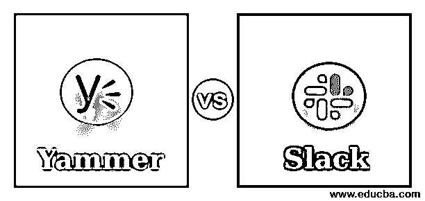
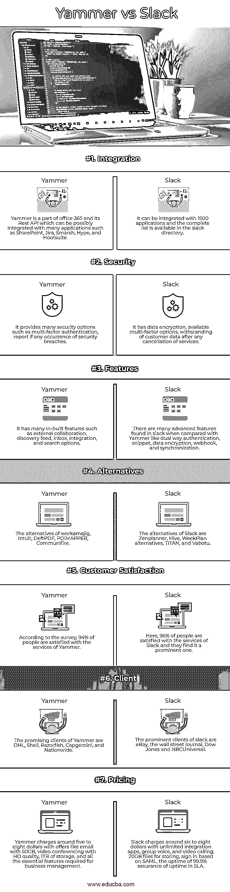

# Yammer vs Slack

> 原文：<https://www.educba.com/yammer-vs-slack/>

## Yammer 和 Slack 的区别

团队成员之间交流的有效工具是 yammer 和 slack。Yammer 主要用于企业和社交网络，而 slack 是一个与团队互动的消息应用程序。Yammer 类似于该组织的脸书，通过在新闻提要中发布一张图片来发起对话，企业的员工可以对其做出反应。Slack 是一种通信工具，员工可以在公司内部进行交互，发送文件和附件，而不是邮件链。本文解释了 yammer 和 slack 之间的主要区别和比较。

### Yammer 与 Slack 的面对面比较(信息图)

以下是 Yammer 和 Slack 的 7 大区别:

<small>网页开发、编程语言、软件测试&其他</small>

### Yammer 与 Slack 的主要区别

主要的关键区别，如定价、功能、支持、应用程序和集成，将在下面讨论:

#### 1.总说明

Yammer 具有潜在的强大功能，是分享员工想法的好地方。不重要的数据，如非紧急通知、工作公告、完成任务的提示、结婚照、资金请求、某个人群的观点，都发布在 Yammer 的 feed 中。通过组合 Yammer 中发布的所有数据，员工可以将其用于任何数据或调查分析。Slack 对于团队成员之间的快速和即时消息服务是有效的，而 Yammer 没有像预期的那样管理它，所以建议使用 Skype。Slack 也可以共享非强制性的信息。但在工作环境中，新的即时消息流更有可能覆盖任何正在进行的问题的重要和机密状态。

#### 2.强集成

Slack 帐户有许多选项来连接不同的工具，如吉拉，谷歌驱动，销售力量。它使用户能够开发和响应 slack 中的文件，并节省用户登录时间和状态。Slack 替代了电子邮件，消耗了员工的工作时间；代替检查和回复邮件，他可以通过 slack 发送文件并得到确认。这样人们可以在最短的时间内完成任务。Yammer 在 Office 365 的一个套件中可用。在 Yammer 的仪表板中传输和编辑 Office 365 文档中的数据非常简单。它很有吸引力，而且节省时间，使用户能够在 word 文档或电子表格中进行更改，而无需注销集成的 Yammer。在包含 OneDrive 和 SharePoint 的 Office 365 产品中，搜索选项非常有效。

#### 3.沟通

根据邮件链和对团队会议的响应，用户可以使用 Yammer 发送即时和快速的消息。这是真正的沟通，使其更有效，并取代冗长的邮件交谈，不增加任何不必要的团队成员。微软做了一项调查，宣称大约 75%的团队成员与 Yammer 进行了有效的沟通。使用 Slack 有助于将对话组织成可以针对团队、任何公告、项目或任何与企业相关的内容进行分离的渠道。支持功能是它确保只有相关成员可以加入或离开会议或频道。它阻止人们浪费时间参与任何不相关的会议或讨论，这种情况发生在邮件讨论中。

#### 4.应用程序

Yammer 可以安装在 Windows、Android、Mac、基于 web、iPhone、iPad 和 Windows mobile 上。它适用于小型企业、中型和大型行业。Slack 可以安装在 Windows、Android、iPhone、iPad、基于 web 和 Mac 上，该服务可以扩展到所有三种类型的企业，如小型、中型和大型企业。即使是自由职业者也发现使用 Slack 很有效。

#### 5.支持

随时随地访问客户反馈，检查当前问题，并提供可行的客户支持想法。由于 slack 提供了一种简单的搜索方式，客户支持团队可以搜索任何关键字，并根据以前发生的案例的反馈实时回复他们的客户。Yammer 中可用的客户支持是电子邮件、电话、跟踪和实时支持，而 Slack 有像机票、邮件和电话这样的客户支持。

### Yammer 与 Slack 比较表

让我们讨论一下 Yammer 和 Slack 之间的顶级比较:

| **特性** | **Yammer** | **松弛** |
| **整合** | Yammer 是 office 365 及其 Rest API 的一部分，可以与许多应用程序集成，如 SharePoint、吉拉、Smarsh、Hype 和 Hootsuite。 | 它可以与 1500 个应用程序集成，完整的列表可以在 slack 目录中找到。 |
| **安全** | 它提供了许多安全选项，如多因素身份验证、安全违规事件报告。 | 它具有数据加密、可用的多因素选项，能够承受任何服务取消后的客户数据。 |
| **特性** | 它有许多内置功能，如外部协作、发现提要、收件箱、集成和搜索选项。 | 与 Yammer 相比，slack 具有许多高级特性，比如双向认证、snippet、数据加密、webhook 和同步。 |
| **替代品** | workamajig，Intuit，DeftPDF，POIMAPPER，Communifire 的替代品。 | Slack 的替代品有 Zenplanner、Hive、WeekPlan 替代品、TITAN 和 Vabotu。 |
| **客户满意度** | 调查显示，94%的人对 Yammer 的服务感到满意。 | 在这里，96%的人对 Slack 的服务感到满意，他们认为它是一个突出的服务。 |
| **客户端** | Yammer 有前途的客户有 DHL、壳牌、Razorfish、凯捷和 Nationwide。 | slack 的主要客户有易贝、华尔街日报、道琼斯和 NBC 环球。 |
| **定价** | Yammer 收费大约 5 到 8 美元，提供 50GB 的电子邮件、高清视频会议、1TB 的存储空间以及业务管理所需的所有基本功能。 | Slack 收费约 6 至 8 美元，包括无限集成应用程序、群组语音和视频通话、20GB 文件存储、基于 SAML 的登录、99.9%的正常运行时间 SLA 保证。 |

### 结论

根据需要，可以选择 slack 和 yammer 进行业务管理。Slack 的价格暂定为每月 8 美元左右，而 Yammer 每月收费约 5 美元。定价选项包括免费试用，不需要基于订阅的信用卡，以及免费帐户。Slack 按月、按年提供订阅服务。

### 推荐文章

这是 Yammer 和 Slack 之间主要区别的指南。在这里，我们还将讨论信息图和比较表的主要区别。您也可以看看以下文章，了解更多信息–

1.  [比特巴克 vs 去](https://www.educba.com/bitbucket-vs-git/)
2.  [MongoDB vs Elasticsearch](https://www.educba.com/mongodb-vs-elasticsearch/)
3.  [JMeter vs Selenium](https://www.educba.com/jmeter-vs-selenium/)
4.  [JMeter vs LoadRunner](https://www.educba.com/jmeter-vs-loadrunner/)

