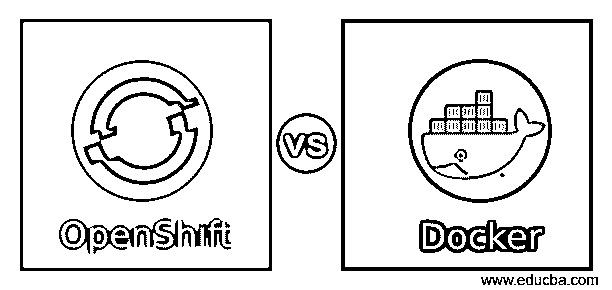
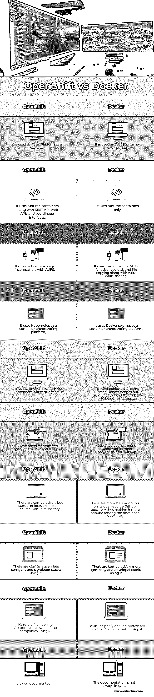

# openshift 与 docker

> 原文:# t0]https://www . educba . com/open hift-vs 坞站/

## OpenShift 与 Docker 的区别

OpenShift 是一种流行的基于 Linux 的云技术，它是开源的，由 RedHat corporation 管理。OpenShift 是一个 Paas(平台即服务)，运行在现有的 AWS、Google 云平台等提供的云服务之上。开发者将 docker 描述为一个容器平台，用于需要快速创新速度的企业应用程序。它使组织能够利用无缝集成和共享来使用和构建他们现有的遗留项目。它还确保应用程序在运行时有足够的安全措施。它属于技术堆栈中的虚拟机容器和平台类别。

### OpenShift 和 Docker 的详细信息

OpenShift 和 docker 解释如下:

<small>网页开发、编程语言、软件测试&其他</small>

#### OpenShift

OpenShift 是一个 Paas(平台即服务),可以像 Google Compute platform、Amazon web services、Microsoft Azure 等同类产品一样使用。，就其用法而言。它还通过确保开发人员不必担心在需要时在物理和虚拟服务器之间切换，使应用程序的开发和测试工作流变得更加容易，从而为开发人员提供支持。因此，它有助于提高现有应用程序工作流程的生产率和效率，同时降低维护成本。它还使用通过卡带使用功能单元的容器，卡带是一组使用 shell 脚本编写的挂钩，当调用系统调用时调用 shell 脚本。它还定义了一个 API，代理(也称为协调器)通过该 API 与相应的节点(托管多个租户容器的服务器)通信，这些节点调用容器的端点。

#### 码头工人

Caas(容器即服务)用于构建和无缝集成遗留项目，使组织能够实现高速创新。它通过 CI/CD(持续集成/持续开发)鼓励 DevOps 方法的概念。因此，开发人员可以尽早地将他们的代码集成到一个共享的存储库中，并快速有效地部署它。因此，本地开发设置就像一个活动的服务器。它提供了集成的开发工具。此外，虚拟机映像可以公开访问和共享。在其上开发的应用程序可以重用和共享。它是开源的，可以在 Github 上获得。

OpenShift 和 Docker 可以在单个客户应用程序工作流中联合使用。由于 OpenShift 是 PaaS(平台即服务)，它可以在 Docker 企业平台上部署的现有云服务上使用，即 Caas(容器即服务)。这降低了客户的设置成本，并提高了现有应用程序工作流的效率和生产力，因为两者都是开源技术。这也确保了现有应用程序工作流的可伸缩性。此外，由于这两种技术都是云平台不可或缺的一部分，它们可以独立使用。

### OpenShift 与 Docker 的面对面比较(信息图表)

以下是 OpenShift 与 Docker 的 10 大区别:

### OpenShift 与 Docker 的主要区别

让我们讨论一下 OpenShift 和 Docker 之间的一些主要区别:

*   **技术栈类别:** OpenShift 属于 Paas(平台即服务)类别，Docker 属于技术栈中的虚拟机容器和平台类别。
*   **容器:** OpenShift 包括一个运行时容器，以及用于部署和管理各个容器的 REST API、coordination 和 web 接口，而 Docker 只使用运行时容器来部署项目。OpenShift 和 Docker 都使用内核隔离特性来保持运行时容器中租户进程的独立性。Docker 通过使用 LXC 来实现这一点，而 OpenShift 使用 SELinux 和 MCS(多类别安全)。为了减少租户进程对 CPU、内存和 I/O 的使用，OpenShift 和 Docker 都使用组。OpenShift 主要关注 LXC，以减少所涉及的长期工作。
*   **文件存储和传输:** Docker 将 AUFS 的概念用于高级磁盘和文件复制以及共享时写入。另一方面，OpenShift 并不需要它，也不与这类系统兼容。
*   **容器编排平台:** OpenShift 在内部使用 Kubernetes 进行容器编排，而 Docker 使用 Docker swarms。
*   **功能单元:** OpenShift 通过模块的概念对功能单元进行建模，这些模块基本上是使用 shell 脚本编写的钩子，这些脚本在系统调用期间被调用。另一方面，docker 通过使用 Docker 图像实现了同样的功能，但是为了实现这一点，在幕后，许多事情必须手动完成。

### OpenShift 与 Docker 对照表

以下是 OpenShift 和 Docker 之间最重要的比较:

| **OpenShift** | **码头工人** |
| 它被用作 Paas(平台即服务)。 | 它被用作 Caas(容器即服务)。 |
| 它使用运行时容器以及 REST API、web APIs 和协调器接口。 | 它只使用运行时容器。 |
| 它不要求 AUFS 教，也不与之相抵触。 | 它将 AUFS 的概念用于高级磁盘和文件复制以及共享时写入。 |
| 它使用 Kubernetes 作为容器编排平台。 | 它使用 Docker swarms 作为容器编排平台。 |
| 它通过模块对功能单元(web 界面)进行建模。 | Docker 使用 Docker 图像实现了同样的效果，但是另外，许多事情必须手动完成。 |
| 开发者推荐 OpenShift，因为它有很好的免费计划。 | 开发人员推荐 Docker，因为它可以快速集成和构建。 |
| 相对来说，开源的 Github 库中的星星和叉子较少。 | 它的开源 Github 知识库上有更多的星星和叉子，从而使它在开发人员社区中更受欢迎。 |
| 使用它的公司和开发者相对较少。 | 使用它的公司和开发者相对较多。 |
| Hazeroid、Vungle 和埃森哲是使用它的一些公司。 | Twitter、Spotify 和 Pinterest 是使用它的一些公司。 |
| 这是有据可查的。 | 文档并不总是同步的。 |

### 结论

OpenShift 和 Docker 都是开源的，可以一起使用，也可以独立使用。这两种技术都很受欢迎，并在全球广泛使用。考虑到这两种技术的优缺点，组织可以根据自己的需求选择其中的一种。

### 推荐文章

这是一个关于 OpenShift 和 Docker 区别的指南。在这里，我们还讨论了 OpenShift 与 Docker 在信息图和比较表方面的主要区别。您也可以看看以下文章，了解更多信息–

1.  [OpenStack vs OpenShift](https://www.educba.com/openstack-vs-openshift/)
2.  [OpenShift 替代方案](https://www.educba.com/openshift-alternatives/)
3.  [对象存储与块存储](https://www.educba.com/object-storage-vs-block-storage/)
4.  再编订备选案文

