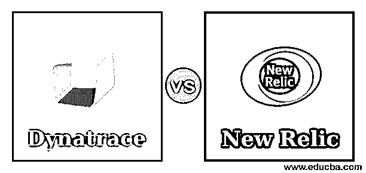
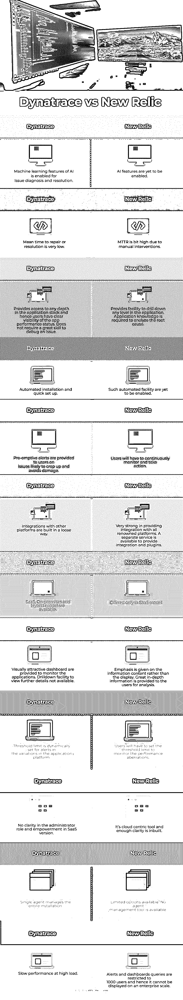

# Dynatrace vs 新遗迹

> 原文：<https://www.educba.com/dynatrace-vs-new-relic/>

## Dynatrace 与 New Relic 的区别

现代应用程序环境是由多种技术和与许多第三方应用程序的接口构成的。它处理多个服务提供商的 API 以获取实时数据，并管理微服务以满足用户的期望。由于设计如此复杂，目前的应用程序必须在强大的后端性能的帮助下提供良好的用户体验。

由于多个机构(如内部开发人员/高级用户、第三方供应商和软件服务提供商)参与了应用程序的开发，因此内部团队很难监控各个组件的性能和服务水平。例如，必须通过测量以下各项所需的时间来监控网页的性能:a .登录门户，b .加载页面，c .完成交易，d .发送电子邮件，e .进行 LDAP 搜索，e .下载文件。它包括在性能测量中对硬件组件和软件方面的监控。

<small>网页开发、编程语言、软件测试&其他</small>

因此，组织需要应用程序性能监控(APM)工具，该工具将监控应用程序所有组件的性能，诊断任何问题的根本原因，并确保平稳、无故障的服务。

### Dynatrace 与 New Relic 的直接对比(信息图)

以下是 Dynatrace 与 New Relic 的 12 大对比 **:**

### Dynatrace 与 New Relic 的主要区别

让我们从以下几点来讨论 Dynatrace 与 New Relic 之间的一些关键差异:

#### 1.关于公司

**Dynatrace:** 于 2005 年在奥地利成立，其第一台 APM 以 Dynatrace 收购的 Compuware 命名。在 2014 年 Dynatrace 从 Compuware 分离出来之前，Compuware 一直是该产品的名称，该产品被命名为 Dynatrace，从那以后，它在 APM 类别中得到了很好的确立。它专注于软件智能，提供 APM 服务、It 运营中的人工智能(AIOps)、用户体验管理和云基础架构管理。

New Relic:2008 年成立于加州旧金山，是一家帮助网站所有者监控服务性能的科技公司。产品名称 New relic 是其所有者名称 Lew Cirne 的变位词。2013 年，它从几个来源获得了资金，这帮助他们扩展到 IOS 和 Android 的分析平台。

#### 2.制品

**Dynatrace:**

*   Dynatrace:面向全栈或云基础架构的 SaaS/托管服务。
*   AppMon:监控应用程序性能。
*   云红外监测。
*   AI ops:IT 运营中的 AI 进行根本原因分析，以解决问题、流程编排、拓扑/依赖关系、开放接收。
*   数字体验管理:真实用户监控、合成监控、物联网、移动和 Web。

**新遗物:** SaaS 通过定制插件收集数据，实时监控移动和网络应用。它与 AWS、IBM Bluemix、Cloudbees、微软 Azure 和 Joyent 有合作关系。

#### 3.特征

**Dynatrace:**

*   有了机器学习功能，任何性能问题都可以被诊断到导致混乱的堆栈级别，并纠正堆栈的缺陷。代码中的杀手方法或场中特定服务器中的问题可以被隔离，缺陷可以被纠正。
*   该工具提供了跨所有层的整个堆栈的清晰可见性，因此可以执行任何性能改进。
*   关于这些问题的早期预警系统帮助用户了解可能在不久的将来出现的问题，并在问题变得复杂之前避免问题。
*   该工具有一个用户友好的界面，可以更容易地进行根本原因分析。
*   易于安装、配置和调试问题。
*   单个代理管理整个操作。
*   用户可以查看与其他系统的连接，并验证它们之间的关系。

**新遗迹:**

*   这个工具提供了进入应用程序的更好的细节。
*   它提供了一个窗口来检查程序的性能，在整个应用程序生命周期的任何部分，用户都可以深入到这个窗口的任何深度。
*   这个工具提供了与其他系统和服务的完美接口。
*   很容易配置设置和使用这个工具。
*   性能指标上丰富的图形可视化有助于用户轻松理解性能水平，而不仅仅是数字。

#### 4.警报的阈值限制

**Dynatrace:** 该工具在运行时动态设置自己的基线和阈值限制。超过此阈值限制的性能会突出显示。

**New Relic:** 它使用 Apdesk 分数索引，用户在该索引中设置用于突出显示目的的阈值限制。

#### 5.仪表盘

**Dynatrace:** 该工具提供的仪表盘在视觉上更加醒目。人们可以获得清晰、全面的性能视图，但它缺乏细节和粒度。

**新的遗迹:**该工具提供的仪表板更侧重于可用于业务决策的信息。该仪表板中的图形界面信息丰富、直观且易于理解。用户可以通过双击这个图表获得更多的信息。

#### 6.平台和安装

**Dynatrace:** 提供全 SaS、内部和混合安装模式。该工具因其简单的自动安装和快速设置而广受欢迎。

新遗迹:仅作为 SaaS 平台提供。

#### 7.插件和集成

**Dynatrace:** 集成不作为服务提供，对它的支持也不广泛。

**新遗迹:**集成作为平台服务提供，带有几乎所有平台的多个插件。

### Dynatrace 与新遗迹对比表

下表总结了 Dynatrace 与 New Relic **:** 的对比

| **Dynatrace** | **新遗迹** |
| AI 的机器学习功能可用于问题诊断和解决。 | 人工智能功能尚未启用。 |
| 修复或解决问题的平均时间非常短。 | 由于人工干预，MTTR 有点高。 |
| 它提供对应用程序堆栈中任何深度的访问，因此用户可以清楚地了解应用程序的性能状态。调试问题不需要很高的技能。 | 它提供了深入应用程序中任何级别的工具。分析根本原因需要应用知识。 |
| 自动安装和快速设置。 | 这种自动化设施尚未启用。 |
| 就可能出现的问题向用户提供先发制人的警报，避免损害。 | 用户必须持续监控并采取行动。 |
| 与其他平台的集成是以松散的方式构建的。 | 非常擅长提供与所有知名平台的集成。一个单独的服务可用于提供集成和插件。 |
| 提供 SaaS、内部部署和混合模式。 | 仅在 SaaS 车型中提供。 |
| 提供了视觉上吸引人的仪表板来监控应用程序。无法使用钻取功能来查看更多详细信息。 | 重点是信息内容而不是显示。向用户提供了大量深入的信息以供分析。 |
| 阈值限制是为应用程序平台中的变化中的警报动态设置的。 | 用户必须设置阈值限制来监控性能异常。 |
| SaaS 版本中的管理员角色和授权不明确。 | 这是一个以云为中心的工具，内置了足够的清晰度。 |
| 单一代理管理整个安装。 | 可用的选项有限。没有代理管理工具可用。 |
| 高负载时性能缓慢。 | 警报和仪表板查询限制为 1000 个用户，因此无法在企业范围内显示。 |

**结论:**在激烈的竞争中，Dynatrace 凭借其简单的操作和鲜明的特色占据了第一的位置。New relic 位居第二，另一款 APM 工具 Appdynamics 位居第三。

### 推荐文章

这是一个关于 Dynatrace 和 New Relic 之间的主要区别的指南。在这里，我们用信息图和比较表来讨论 Dynatrace 和 New Relic 的主要区别。您也可以看看以下文章，了解更多信息–

1.  [IPS 工具| 7 大不同的 IPS 工具](https://www.educba.com/ips-tools/)
2.  [IDS 工具介绍|简要说明](https://www.educba.com/ids-tools/)
3.  [网络安全攻击的类型](https://www.educba.com/types-of-network-security-attacks/)
4.  [网络安全工具](https://www.educba.com/cyber-security-tools/)

