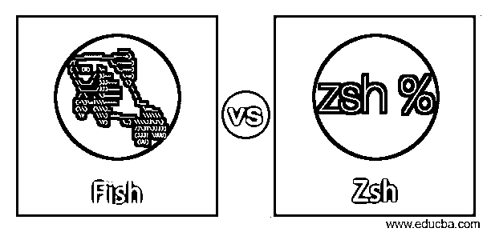
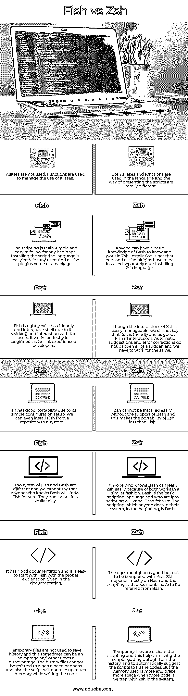

# 鱼 vs Zsh

> 原文：<https://www.educba.com/fish-vs-zsh/>

## Fish 和 Zsh 的区别

有许多文章解释了 shell 脚本、Bash、Zsh、Fish 和许多其他类型的脚本。大多数 shell 脚本基本上都是相同的。它们给出相同的输出，并共享相同的脚本环境。但是对于每个 shell 脚本来说，有些细微的差别是独一无二的。Fish 和 Zsh 都以其编写脚本和函数的方式在 shell 脚本中名列前茅。此外，两者都是开源工具，任何人都可以免费使用。Zsh 是从 Bash 语言扩展而来的，fish 脚本完全不同于 Bash，或者更确切地说，是 Zsh 语言。

### Fish 与 Zsh 的面对面比较(信息图)

下面是 Fish 和 Zsh 的 7 大对比 **:**

<small>网页开发、编程语言、软件测试&其他</small>

### Fish 与 Zsh 的主要区别

让我们从以下几点来讨论 Fish 和 Zsh 之间的一些关键差异:

*   与 Zsh 相比，Fish 非常容易理解和安装。我们不需要任何 Bash 命令或交互式 Bash 脚本来安装 Fish。插件需要下载并保存在一个特定的文件夹中，这样 Zsh 才能正常运行。而 Fish 是一个简单的工具，没有这些困难和干扰，可以在任何系统和用户中很好地工作。
*   两种语言的语法不同。我们不能说哪个容易，哪个困难，但它们是不同的。当在 Zsh 中使用更多的别名时，Fish 只是避免语言中的任何一种别名。
*   这里要强调的主要区别是，Fish 在脚本中确实具有语法突出显示和自动建议的特性。这有助于用户在任何情况下使用脚本，并突出显示该语言中显示的必要脚本。这使得 Fish 脚本从任何其他脚本语言中脱颖而出。甚至在按下键盘上的回车键之前，错误就被突出显示出来，这有多好？Zsh 没有这些特征，许多 Zsh 脚本编写人员喜欢 Fish 是因为这种语言的这种功能。但是这些特性可以通过在系统中安装一些插件在 Zsh 中得到。
*   Zsh 有许多可定制的设置，包括拼写纠正、颜色定制等等。Zsh 中的上下文很容易理解，它在 CLI 中自己填充脚本。对于 Fish 来说，它比 Zsh 更具可定制性，具有帮助特性、一致的语法和许多其他特性。在这些脚本语言中，自定义设置并不是一个挑战。
*   我的 Fish 社区是基于来自 Zsh 脚本社区 Oh my Zsh 的相关性而形成的。除了一些重要的变化外，两者的工作方式相似。在 Fish 脚本系统中设置了一个 web 配置，有助于美观地管理 shell。这项规定在 Zsh 是没有的。
*   此外，使用脚本语言中的 up 和 down 命令可以很容易地在 Fish 脚本中搜索历史。重复的匹配被自动删除，这使得脚本编写变得容易。这个特性在 Zsh 中是没有的，但是我们可以借助语言中的插件来使用它。
*   关于 Fish 的这些优点，有一点需要注意，Fish 脚本很慢，比 Zsh 慢。因此，任何想使用更快脚本的人都可以选择安装了所有插件的 Zsh。

### Fish 与 Zsh 对比表

下表总结了 Fish 与 Zsh 的比较 **:**

| **鱼** | **Zsh** |
| 不使用别名。函数用于管理别名的使用。 | 别名和函数都在语言中使用，呈现脚本是完全不同的。 |
| 该脚本对于任何初学者来说都非常简单和容易理解。安装脚本语言对任何用户来说都非常容易，所有插件都是打包提供的。 | 任何人都可以有 Bash 的基础知识来了解和使用 Zsh。安装没那么容易，所有的插件都要在安装完 Zsh 语言后单独安装。 |
| 由于它的工作和与用户的交互，Fish 被恰当地称为友好和交互的 shell。它对初学者和有经验的开发人员都非常适用。 | 虽然 Zsh 的交互很容易管理，但我们不能说 Zsh 在交互方面像鱼一样友好。自动建议和错误纠正不会突然发生，我们必须为此而努力。 |
| 由于其简单的配置设置，Fish 具有良好的可移植性。我们甚至可以将 Fish 从存储库安装到系统中。 | 如果没有 Bash 的支持，Zsh 是不容易安装的，这使得 Zsh 的可移植性不如 Fish。 |
| Fish 和 Bash 的语法是不同的，我们不能说任何了解 Bash 的人就一定了解 Fish。它们的工作原理不同。 | 任何了解 Bash 的人都可以很容易地学习 Zsh，因为两者以相似的方式工作。Bash 是基本的脚本语言，对脚本感兴趣的人肯定知道 Bash。一开始，任何人在他们的系统中做的脚本都是 Bash。 |
| 它有很好的文档，根据文档中给出的正确解释，从 Fish 开始很容易。 | 文件是好的，但不能与鱼相提并论。Zsh 主要依赖于 Bash，文档脚本必须从 Bash 引用。 |
| 临时文件不用于保存历史，这有时是一种优势，有时是一种劣势。当需要时，历史文件不能被引用，而且，脚本在编写代码时不会占用太多内存。 | 脚本中使用了临时文件，这有助于保存脚本，从历史记录中获取输出，并自动建议脚本填充代码。但是使用 Zsh 在系统中编写更多代码时，使用的内存更多，占用的空间也更多。 |

### 结论

由于其交互式脚本和配置设置，许多用户已经从 Bash 或 Zsh 转向 Fish。但是剧本基本上是一样的，都有一些优点和缺点。理解两者并根据我们的需要选择相关的语言是很好的。

### 推荐文章

这是一个关于 Fish 和 Zsh 的主要区别的指南。在这里，我们用信息图和比较表来讨论 Fish 和 Zsh 的主要区别。您也可以看看以下文章，了解更多信息–

1.  [IPS 工具| 7 大不同的 IPS 工具](https://www.educba.com/ips-tools/)
2.  [IDS 工具介绍|简要说明](https://www.educba.com/ids-tools/)
3.  [网络安全攻击的类型](https://www.educba.com/types-of-network-security-attacks/)
4.  [网络安全工具](https://www.educba.com/cyber-security-tools/)

