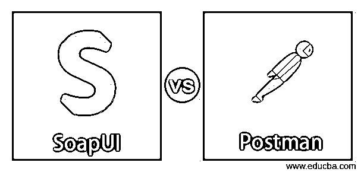
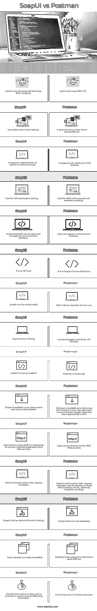

# SoapUI vs 邮递员

> 原文：<https://www.educba.com/soapui-vs-postman/>

## SoapUI 和 Postman 的区别

今天，我们将要看到一个 SoapUI 和 Postman 的对比。在 web 服务测试期间，您可能经常听说这些工具；这些工具用于 API(应用程序接口)测试。SoapUI 允许我们测试 REST 和 Soap API，而 Postman 是 Google Chrome 中的一个插件/扩展，可以在需要时启用。Postman 是一个 HTTP 客户端，用于测试基于 web 的服务。

Soap UI 是一个工具，可以用于功能和非功能测试，而不仅仅局限于服务。它支持功能测试、性能测试、回归测试、负载测试等。它使用户更容易将功能测试转换成非功能测试。Postman 是一个用户可以设计、构建和测试 API 来修改 API 的平台。它能够发出各种 HTTP 请求(GET、POST、PUT、PATCH)。

<small>网页开发、编程语言、软件测试&其他</small>

### 为什么要用 SoapUI 或者 Postman？

Postman 是超过 400 万次下载中最常见的选择之一，具有以下特性

*   **可访问性**:只要你的电脑上安装了 Postman，用户就可以登录自己的账号，随时随地访问文件。
*   **协作**:收藏导入导出，共享文件更容易。集合可以创建子文件夹和多个请求来组织测试用例或套件。
*   **创建测试:**检查点可以添加到 API 调用中，用于验证成功的 HTTP 响应。
*   自动化测试:测试可以在多次迭代中运行，这为重复迭代节省了时间
*   **调试**:postman 中的控制台有助于知道检索到了什么数据，这使得调试测试更加容易。
*   **持续集成**:开发实践是作为 postman 支持持续集成来完成的。

SoapUI 是一个开源的 API 测试工具，

*   SoapUI 支持测试 API 的所有标准协议和技术
*   允许测试人员编写功能 API 测试，通过高级脚本支持拖放功能。支持质量保证、开发和生产环境。
*   能够执行完整的安全测试，防止 SQL 注入。它还执行模糊扫描、边界扫描，以避免 web 服务的不必要行为。
*   通过模拟大容量负载测试并允许对应用程序/服务进行端到端监控，在多个负载代理之间分配负载测试。
*   SoapUI 支持如下协议
    *   SOAP:简单对象访问协议
    *   **休息**:表象状态转移
    *   **WSDL** : Web 服务定义语言
    *   **AMF** :动作信息格式
    *   **HTTP/ HTTPS** :超文本传输协议/安全超文本传输协议
    *   **JDBC** : Java 数据库连接
    *   **JMS** : Java 消息服务
*   SoapUI 与 Maven、Hudson、Junit 和 Apache-Ant 等其他自动化工具的集成。

### SoapUI 与 Postman 的正面比较(信息图)

以下是 SoapUI 与 Postman 的 15 大区别:

### SoapUI 和 Postman 的主要区别

我们现在将探讨 SoapUI 和 Postman 之间的一些关键区别:

*   SoapUI 允许简单的测试创建，通过拖放功能使得诸如使用 JSON 或 XML 之类的任务变得更容易，而 Postman 允许编写布尔测试用例。
*   在 Soap 中，功能测试用例可以作为负载测试用例重用，而在 Postman 中，REST 调用的集合可以保存起来供将来执行。
*   Soap 与大多数 API 管理平台集成，而 Postman 是一个测试 web 服务的 HTTP 客户端，也是手动测试的好选择，因为 Postman 更可靠。
*   Soap 完全基于数据，从文件中加载数据，例如 XML 在 Postman 中不是命令行工具，将文本粘贴到命令行窗口使它变得更容易。
*   SoapUI 提供了一个易于使用的接口，用户可以导入一个 WSDL 文件，项目被设置用于测试，然而，在 Postman 中，每个服务 URL 都必须用所需的方法进行检查，比如 Get、Post 等。
*   SoapUi 支持许多第三方插件，如 SOA DataPro、AgileTestware 和 TestMaker，从而更容易与 Eclipse、Maven 和 NetBeans 集成。相比之下，Postman 集成了 Interceptor、Newman 和 Echo。
*   Postman 有一个付费计划，队友可以访问团队库以加快协作。相比之下，SoapUI 有一个专业版，其中为并行测试和开发创建了动态 API 快照。
*   SoapUI 的替代产品是可用的，如 JMeter，主要是为应用程序测试而设计的，支持多线程，而 Postman 有 Postman Pro 和 Postman Enterprise。

### SoapUI 与 Postman 对比表

基于以上几点，我们现在将比较 SoapUI 和 Postman:

| **肥皂泡** | **邮递员** |
| 用于测试 API 协议，如 Soap、REST、GraphQL | 仅用于测试 REST API |
| 它提供数据驱动的测试。 | 它没有数据驱动的测试功能。 |
| 它支持定制各种格式的报告。 | 它只支持 JSON 和 HTML 格式。 |
| 用于 API 自动化测试。 | 用于 REST API 的手动和探索性测试 |
| 自动化测试可以通过命令行界面来执行。 | 不支持命令行界面。 |
| 它是一个 API 工具。 | 这是谷歌浏览器的扩展。 |
| 脚本可以很容易地重用。 | REST 调用被保存以备将来使用。 |
| 异步测试。 | 接受 Swagger 和 RAML API 格式。 |
| SoapUI 是 Groovy 脚本化的。 | 邮递员是 Javascript。 |
| SoapUI 是一个开源工具，可以下载。 | Postman 有 Windows、Linux、Mac 的原生 app 它还有一个 Chrome 浏览器插件，该插件在 2017 年已被弃用 |
| 面向服务的应用程序和 Web 服务的开源跨平台测试工具。 | REST Web 服务的开源测试工具。 |
| 不需要构建定制的 XML 请求消息。 | 需要构建定制的 XMl 请求消息，有一个接口来构建由 URL、方法、头和主体组成的 XML。 |
| SoapUI 的测试水平很高。 | 功能有限是它的缺点。 |
| Soap 请求很容易访问。 | 在 Postman 中构建 Soap 请求相当困难。 |
| 提供 14 天的免费试用期，并且继续需要 SmartBear 提供的许可证。 | 免费，因为它是一个铬延伸。 |

让我们看看应用程序的界面，Soap 和 Postman。

#### 索普伊

SoapUI 是基于 java 的，因此可以在多种操作系统上运行。它需要 1.6+版本的 JRE 和至少 1GB 的内存以及 100MB 的磁盘空间。下面是实际的 SoapUI，由 WSDL 文件、XML 数据等组成。

#### 邮递员

下面是 Postman 接口的样子，有各种类型的请求，如 GET、PUT、DELETE 等。，看起来像搜索坏的最长的输入字段是服务 URL 区域。为了提供输入数据，我们有各种形式，如表单数据、URL 编码数据、原始数据，可以是文本、JSON、XML 输入，也可以是二进制类型。我们还有 Postman Pro 和 Postman Enterprise，价格较贵，分别为 8 美元/月和 21 美元/月。Postman 还可以导入现有的工作空间，因此用户不需要从头开始 API 测试。

有了这个，我们就可以断定什么是 SoapUI，什么是 Postman 了。我们已经看到了 SoapUI 和 Postman 之间的关键区别，研究了它的接口和一些关键细节。比较了 SoapUI 和 Postman 的主要区别、用途、优缺点。尽管这两种工具都用于 API 测试，但它们都有自己的重要性。总之，Postman 更适合手工测试，REST API 测试也可以通过 HTTP 发送 SOAP 消息，这与 REST 配置类似。而 SoapUI 更适合 API 自动化，因为有各种协议支持它。

### 推荐文章

这是一个关于 SoapUI 和 Postman 之间主要区别的指南。在这里，我们还将讨论信息图和比较表的主要区别。您也可以看看以下文章，了解更多信息–

1.  [SoapUI 替代品](https://www.educba.com/soapui-alternatives/)
2.  [接口测试](https://www.educba.com/interface-testing/)
3.  [Trello vs Todoist](https://www.educba.com/trello-vs-todoist/)
4.  [IntelliJ vs NetBeans](https://www.educba.com/intellij-vs-netbeans/)

