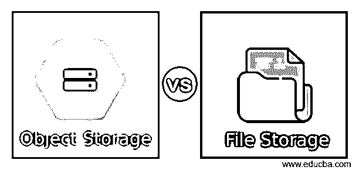
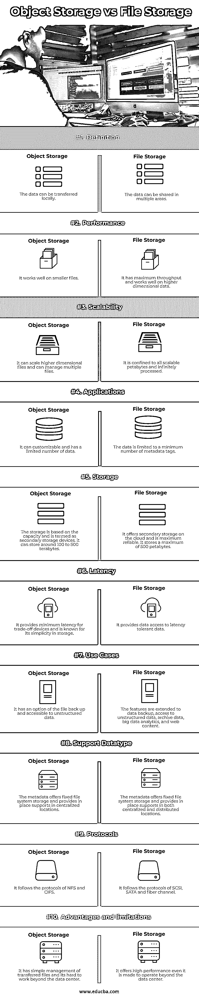

# 对象存储与文件存储

> 原文：<https://www.educba.com/object-storage-vs-file-storage/>

## 对象存储与文件存储的区别

对象和文件代表以不同方法组织和保存数据的存储排列结构。它有其独特的优势和局限性。文件存储器以文件夹格式在文档和文件的层次结构中安排数据。在对象存储中，数据被管理到连接到元数据的链接中。这种类型的文件和对象排列显示数据，并使其易于用户访问。它们在概念或原则上可能相似，但在结构、工作方式和数据管理上有所不同。本文简要说明了文件存储和对象存储的主要区别和比较。

### 对象存储与文件存储的直接比较(信息图表)

以下是对象存储与文件存储之间的 10 大区别:

<small>网页开发、编程语言、软件测试&其他</small>

### 对象存储与文件存储的主要区别

在对象和文件存储中提到的显著差异可能是它们的性能、体系结构、工作方式、存储和可伸缩性。

#### 定义

数据存储在保存在文件夹中的信息单元块中，类似于文件存储器中文件内部的文档。它也称为基于文件的存储或文件级存储。而在对象存储中，文件被分成几部分，分布在整个硬件中。信息被分离到定义为对象的关注单元中，并存储在特定的存储库中，而不是像存储服务器上的块那样将文件存储在文件夹中。

#### 工作

对象存储卷充当模块单元，其中每个单元都是拥有其自身数据的自包含储存库。它是唯一的标识符，使对象能够在分布式系统中被识别。它还描述了原始数据中存在的元数据。在这里，元数据与其数据一样重要。元数据包括年龄、安全策略和访问策略。对象存储中的元数据可以扩展为存储诸如视频位置、摄像机等产品描述和演员等信息。从存储空间中提取数据，该数据包括标识符和元数据。它平均分配负载并启用管理员策略，从而自动执行任何强大的搜索。在文件存储系统中，用户需要对计算机要求找到路径的数据块进行操作。数据保存在使用任何文件位置、库、目录以及相关数据的相关文件进行检索和组织的文件中。

#### 体系结构

该系统是直接的，并且具有网络连接存储系统。它类似于从文件存储生成的分层存储。任何时候访问的文档都可以保存在文件存储器中。它有广泛的能力，用于保存更高维度的数据。它用于快速排序复杂的数组文件，用于在界面之间导航。假设像一个文件柜的壁橱，其中的文件按逻辑层次组织。然后，它由抽屉、文件夹和橱柜组成，就像文件中的一张纸。

#### 储存；储备

它是传统的，广泛用于数据存储。对象中的存储空间有一个简单的 HTTP 结构，由一个应用程序编程接口组成。客户使用它，因为它有多种语言。在对象存储中，它遵循按使用付费和成本效益原则。

对象存储系统是可扩展的，并适应静态数据，具有敏捷性原则。它是平面的，管理更高维的数据。该对象为应用程序保存了足够的数据来快速识别数据，并且适合保存非结构化数据。

#### 限制

文件存储的问题是它需要一个虚拟抽屉，类似于文件柜。文件存储系统的可扩展性最低，需要更多容量。对象存储不能修改，用户只需正确地编写一次。它不能很好地操作传统的数据库，而且写对象是一个细长的过程。在编写应用程序以利用 API 的对象存储时，并不像使用文件存储那样容易。但是对象存储满足了文件存储系统的许多限制。和仓库差不多，需要更大的空间。它需要增长，直到仓库达到其容量。在分析之前，仓库需要容量。但是它应该被设计成存储无限的数据。

### 对象存储与文件存储比较表

让我们讨论一下对象存储与文件存储之间的主要比较:

| **属性** | **文件存储** | **对象存储** |
| **定义** | 数据可以在本地传输。 | 数据可以在多个区域共享。 |
| **性能** | 它适用于较小的文件。 | 它具有最大的吞吐量，并且可以很好地处理高维数据。 |
| **可扩展性** | 它可以缩放更高维度的文件，并且可以管理多个文件。 | 它仅限于所有可扩展的 Pb，并且可以无限处理。 |
| **应用程序** | 它可以是可定制的，并且具有有限数量的数据。 | 数据被限制为最小数量的元数据标签。 |
| **存储** | 存储基于容量，称为辅助存储设备。它可以存储大约 100 到 500 太字节 | 它在云上提供二级存储，是最可靠的。它最多可以存储 500。 |
| **等待时间** | 它为折衷设备提供最小的延迟，并以其存储的简单性而闻名。 | 它提供对延迟容忍数据的数据访问。 |
| **用例** | 它有一个文件备份选项，可以访问非结构化数据。 | 这些功能扩展到数据备份、非结构化数据访问、归档数据、大数据分析和 web 内容。 |
| **支持数据类型** | 元数据提供固定的文件系统存储，并在集中的位置提供适当的支持。 | 元数据提供固定的文件系统存储，并在集中式和分布式位置提供就地支持。 |
| **协议** | 它遵循 NFS 和 CIFS 的议定书。 | 它遵循 SCSI、SATA 和光纤通道协议。 |
| **优点和局限性** | 它对传输的文件进行简单的管理，并且很难在数据中心之外工作。 | 即使是在数据中心之外运行，它也能提供高性能。 |

### 推荐文章

这是关于对象存储和文件存储的指南。在这里，我们还将讨论信息图和比较表的主要区别。您也可以看看以下文章，了解更多信息–

1.  [科尔多瓦本地存储器](https://www.educba.com/cordova-local-storage/)
2.  [休息与宁静](https://www.educba.com/rest-vs-restful/)
3.  [Filebeat vs Logstash](https://www.educba.com/filebeat-vs-logstash/)
4.  [Azure vs 谷歌云](https://www.educba.com/azure-vs-google-cloud/)

