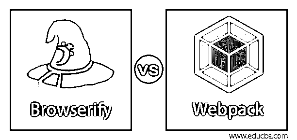
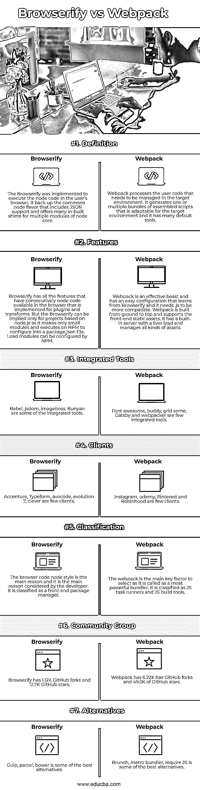

# Browserify 与 Webpack

> 原文：<https://www.educba.com/browserify-vs-webpack/>

## Browserify 与 Webpack 的区别

模块绑定器管理静态资产，以限制和管理 HTTP 请求，从而提高系统性能。捆绑包管理器和任务运行器之间的接口并不那么有效，并且使用 Browserify 和 webpack 之类的独立工具在资产捆绑上实现了一个键分隔符。Browserify 类似于 Webpack，处理代码以生成包和可执行脚本来管理目标环境。但是需要下载插件来拆分代码。

### Browserify 与 Webpack 之间的直接比较(信息图表)

以下是 Browserify 和 Webpack 之间的主要比较:

<small>网页开发、编程语言、软件测试&其他</small>

### Browserify 与 Webpack 的主要区别

让我们来讨论 Browserify 和 Webpack 之间的一些主要区别:

#### 1.操作和包装

Browserify 用于读取静态文件中可用的字符串，节点使用本机读取文件函数，而 webpack 使用一个公共对象来重载所需的函数，并应用不同的加载器来加载文件，其名称应该具有合适的模式。Webpack 并不喜欢任何普通的 js 而不喜欢任何 AMD，它管理所有开箱即用的模块格式。所以用 AMD 写完整的项目很容易，但也需要一个 webpack。所以它不会在没有任何改变的情况下在 node 中执行。Browserify 中有针对不同用途的独立软件包。watch 用于增量编译，对于束分裂，它使用因子束。当用户需要 AMD 支持时，使用 deAMDify

#### 2.束的分裂

webpack 有一些用于拆分包的内置功能。但是有了分区捆绑包和因子捆绑包，它可以很容易地使用，并具有与 Browserify 相同的功能。Webpack 和 Browserify 一样，有 react hot loading 之类的很酷的选项，可以更新用户网页上的 javascript，而不需要任何页面刷新。它不容易配置，一旦用户实践它，就会变得对用户友好。webpack 路由提供了使代码在 node.js 中运行的双重方式。用户可以将 node.js 中的代码作为目标导出，并使代码能够在 node.js 中执行。增强的模块需要重载 node.js 中的函数，以在包内运行 webpack。

#### 3.静态资产管理

Webpack 需要一个重载 CSS 文件，该文件需要在运行时执行浏览器的任何输入。Node.js 不需要任何 CSS 文件，但是 Webpack 可以根据需要进行配置。Browserify 在模块化和惯例方面有一些问题。工具 parcelify 用于补充 Browserify 并跟踪使用模块中 package.son 文件夹的依赖图。它还要求 CSS 文件以 JavaScript 包的形式提供。它试图用已配置的 package.json 文件将应用程序组合成多个模块。它运行完整的代码库，并使其更加可重用和模块化。

#### 4.配置

Browserify 支持单独的任务，从而实现高度明确和全面的构建。它允许广泛的插件，使适当的配置。但是当涉及到布线和调试的配置时，它有一些限制。Browserify 允许使用咕噜和吞咽。浏览器验证配置是在脚本中进行的，webpack 的配置保存在本地文件中。个人定制使其成为 webpack 的一个主要限制，占据了大量的复合空间，并且具有应用程序配置的简要细节。

#### 5.优势

webpack 的大小和功能使其更加有用和灵活。它涉及到执行最大配置文件的各种方法。它使用普通的 js，不使用任何 webpack 来管理图片或 CSS 然后，它使用 Browserify 并管理节点兼容性，但是 webpack 无法确认它。Browserify 是最小尺寸的，非常适合拾取。如果用户符合任何惯例，并且代码是操作配置的最小值。

### Browserify 与 Webpack 的比较表

让我们来看看 Browserify 和 Webpack 之间的主要比较:

| **行为属性** | **浏览确认** | **网络包** |
| **定义** | 实现 Browserify 是为了在用户的浏览器中执行节点代码。它支持包含 JSON 支持的 commons 节点风格，并为节点核心的多个模块提供了许多内置垫片 | Webpack 处理需要在目标环境中管理的用户代码。它生成一个或多个适合目标环境的组合脚本包，并且它有许多默认工具。 |
| **特性** | Browserify 具有所有的功能，这些功能在为插件和转换而实现的浏览器中具有连续可用的节点代码。但是 Browserify 只能用于基于 node.js 的项目，因为它只制作小模块，并在 NPM 上执行以配置成 package.json 文件。NPM 可以配置装载模块。 | Webpack is an effective beast and has an easy configuration that learns from Browserify, and it needs .js to be more compatible. Webpack is built from ground to top and supports the front-end static assets. It has a built-in server with a liver load and manages all kinds of assets. |
| **集成工具** | Babel、jsdom、imageboss、Bunyan 就是其中的一些集成工具。 | 字体牛逼，buddy，grid some，Gatsby 和 webpacker 是为数不多的集成工具。 |
| **客户端** | 埃森哲、Typeform、avocode、evolution 7、clever 是少数客户。 | Instagram、udemy、Pinterest 和 Robinhood 是为数不多的客户端。 |
| **分类** | 浏览器代码节点风格是主要原因，是开发者考虑的主要原因。它被归类为前端包管理器。 | webpack 是选择的主要关键因素，因为它被称为最强大的捆扎机。它被归类为 JS 任务运行器和 JS 构建工具。 |
| **社区组** | Browserify 有 1.12K 的 GitHub 分叉和 12.7K 的 GitHub 星星。 | Webpack 有 6.22K 有 GitHub forks，49.5K 有 GitHub stars。 |
| **替代品** | 咽，包裹，凉亭是一些最好的选择。 | 早午餐，metro bundler，require JS 是最好的选择。 |

### 结论

因此，Browserify 以最小的配置工作，并执行受限的约定规则。Webpack 需要一些配置来操作所有的工作，并使它成为一个更基本的情况。

### 推荐文章

这是 Browserify vs Webpack 的指南。这里我们讨论信息图和比较表之间的主要区别。您也可以浏览我们的其他相关文章，了解更多信息——

1.  [硬件 Vs 软件](https://www.educba.com/hardware-vs-software/?source=leftnav)
2.  [JavaScript Var Vs Let](https://www.educba.com/javascript-var-vs-let/?source=leftnav)
3.  [JavaScript 与安圭拉](https://www.educba.com/javascript-vs-angularjs/?source=leftnav)
4.  [Linux 与 Windows 性能对比](https://www.educba.com/linux-vs-windows-performance/?source=leftnav)

