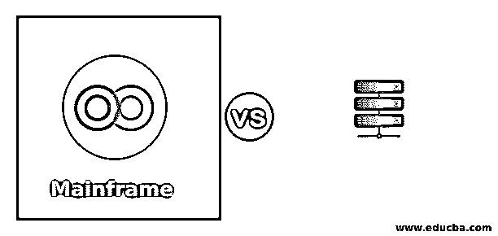
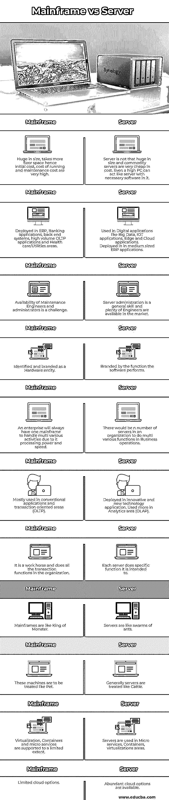

# 大型机与服务器

> 原文：<https://www.educba.com/mainframe-vs-server/>

## 大型机与服务器的区别

在大型机与服务器的对比中，大型机是一类处理大量用户、大量事务并提供可靠性能的计算机。它拥有丰富的处理能力和存储来管理强大的数据处理操作。它通常部署在 1。管理企业范围内任务关键型 ERP 运营的大型组织，2。银行要处理万亿次交易，3。许多数字应用程序的后端操作。这些计算机坚固、耐用、可靠、安全，可全天候不间断运行。

服务器，它是一台通过硬件连接在局域网、广域网和互联网上的计算机。它通过各种网络使用安装在其中的软件向其客户提供数据，特别是预定的服务。这些服务器有多种类型，即邮件服务器、Web 服务器、文件服务器、应用服务器、数据库服务器、打印服务器、代理服务器和管理服务器。这些服务器的硬件部分可以是廉价的商品硬件，并且这些部件可以容易地与来自任何其他计算机的部件交换。这些服务器具有用于存储引导文件的最小存储空间，并且实际数据存储在共享的外部公共存储中。这些服务器由加载到中以执行特定服务的软件来标识，而不是由硬件功能来标识。

<small>网页开发、编程语言、软件测试&其他</small>

### 大型机与服务器之间的直接比较(信息图表)

以下是大型机和服务器之间的 11 大比较

### 大型机与服务器的主要区别

让我们研究一下大型机和服务器之间的一些重要差异:

#### 工作量

大型机用于大量数据处理应用程序、批处理、OLTP 应用程序、企业范围部署(ERP)。非常适合处理更多数字运算和高交易流量的银行应用，以及数字应用的后端处理。在大型机应用程序中，通过确保所有事务都被正确提交，并且所有表都被正确更新，来维护高级别的事务完整性。在处理数万亿事务和数万亿字节数据的应用程序中，数据的一致性至关重要。服务器更关注它为连接到它的客户端机器提供的服务，而不是数字运算和交易处理。执行不同功能的多台服务器分担工作负载。Web 应用程序托管、文件托管、DNS 托管、应用程序托管、管理用户呼叫的 HTTP 服务、互联网服务是服务器的主要工作负载。

#### 身份

一类硬件标识一台大型机，它们的品牌有 IBM Z 系列 Z14、Z15 和 IBM 1401、system/360、IBM 4341 等。大型计算机的特点是它的数字处理能力和数据处理能力。服务器由加载在其中的软件以及该软件可以提供的典型服务来识别。硬件不是服务器的主要指标，低端规格的机器就足以充当服务器。服务总是以服务器的身份标记，如应用服务器、数据库服务器和代理服务器。

#### 负载系数

即使在极端条件下，主机的性能也很坚固，因为其中一个组件过载了。即使内存 80%已满或处理器负载更多，大型机的性能也是稳定的。许多冗余功能和无单点故障功能在大型机设计中得到了很好的考虑，使其成为一台健壮的机器。<u>服务器</u>如果任何组件过载超过一定程度，性能都会受到影响。由于这些服务器是商品级的，因此可以在现有服务器上添加新的服务器，并增强其功能。额外的服务器可以作为备用服务器以应对故障，并且可以轻松地进行自动切换，因为用户数据不在这些服务器中，而是存储在外部存储中。外部存储有自己的冗余来管理故障。

#### 沟通

大型计算机的主机组件通过高速通道互连，并且有一个单独的子系统来管理内部输入/输出操作。这种高速通信有助于大型计算机性能的全面提高。服务器通信速度受限于它所连接的网络速度，无论是局域网、广域网还是互联网。

### 大型机与服务器对比表

下面是对比表:

| **主机** | **服务器** |
| 体积庞大会占用更多的地面空间；因此，初始成本、运行成本和维护成本非常高。 | 服务器的体积不是很大，而且商用服务器的价格非常便宜。即使是一台很高的 PC 机，里面装上必要的软件，也可以充当服务器。 |
| 部署在 ERP、银行应用程序、后端系统、高容量 OLTP 应用程序和医疗保健/公用事业领域。 | 用于数字应用，如大数据、物联网应用、边缘和云应用。部署在中型 ERP 应用程序中。 |
| 维护工程师和管理员的可用性是一个挑战。 | 服务器管理是一项通用技能，市场上有大量的工程师。 |
| 作为硬件实体进行标识和标记 | 由软件执行的功能来标记 |
| 由于其处理能力和速度，企业将始终有一台大型机来处理多种活动。 | 一个组织中会有 n 台服务器在业务运营中执行多种功能。 |
| 主要用于传统应用程序和面向事务的领域(OLTP)。 | 部署在创新和新技术应用中。更多用于分析领域(OLAP) |
| 它是一个主力，完成组织中的所有事务功能。 | 每台服务器都执行特定的功能。 |
| 大型机就像怪兽之王 | 服务器就像一群蚂蚁。 |
| 这些机器将被像宠物一样对待。 | 一般服务器都是牛一样对待的。 |
| 对虚拟化、容器和微服务的支持有限。 | 服务器用于微服务、容器、虚拟化领域。 |
| 有限的云选项 | 丰富的云选项可用。 |

### 结论

由于服务器的低成本、灵活性和易维护性，IT 界正在转向服务器。服务器正在主宰这场表演，它们处于数字世界的最前沿，新技术的开发也考虑到了服务器的最终部署。

### 推荐文章

这是大型机与服务器的对比指南。在这里，我们讨论大型机与服务器之间的区别、主要差异和比较表。您也可以浏览我们的其他相关文章，了解更多信息——

1.  [主机测试](https://www.educba.com/mainframe-testing/)
2.  [什么是大型机？](https://www.educba.com/what-is-mainframe/)
3.  [大型机面试问题](https://www.educba.com/mainframe-interview-questions/)
4.  [服务器虚拟化](https://www.educba.com/server-virtualization/)

