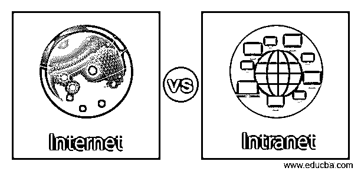
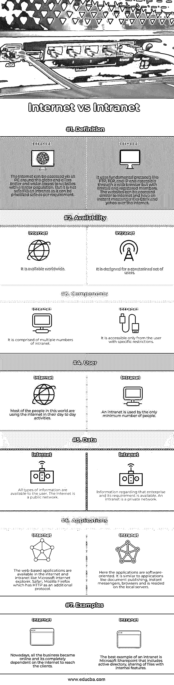

# 互联网与内部网

> 原文：<https://www.educba.com/internet-vs-intranet/>

## 互联网与内部网的区别

互联网是使用标准 TCP 或 IP 的多个互联计算机网络的全球连接。每个系统都有一个唯一的 IP，它由一组数字组成，有助于找到计算机的位置。一台特别设计的计算机，域名服务器，提供 IP 来定位用户。全球各地都可以上网。同时，任何系统的内部网都是跨多个计算机连接的，这些计算机不能被全世界访问，而是被限制在某些区域内。所有企业都有其专用的内部网连接，供其员工访问服务器。内部网中链接的每台计算机都有其唯一的 IP，并相应地进行区分。本文讨论了 internet 和 intranet 之间的相同点和不同点。

### 互联网与内部网的直接比较(信息图表)

以下是互联网与内部网的 7 大对比:

<small>网页开发、编程语言、软件测试&其他</small>

### 互联网与内部网的主要区别

让我们来讨论一下主要的区别，如应用、优点、工作原理和局限性，这些都在本节中进行了解释。下面我们讨论互联网与内部网的主要比较:

#### 1.工作

互联网是由不为实体所拥有的多重连接的计算机网络构成的。它不能由不拥有它的管理员来管理。IP/TCP 协议是除了 SMTP、HTTP 和 FTP 之外的互联网络使用的重要推动因素。同时，内部网是一个专用的私有网络，它采用因特网协议，可以访问和共享企业的信息，这些信息可以由员工来保护。它工作在相同的服务器-客户端设计上，可以在类似于互联网的 IP/TCP 协议上执行。在浏览器的引导下，可以提取公司内的数据。它的运行不需要在用户的机器上安装特殊的程序。

#### 2.高级功能

互联网的显著特点是它的全球网络，可以连接数十亿台计算机，而且它是分散的，每台计算机都可以无任何依赖性地工作，并有不同的方法访问互联网。内部网准确而快速，并且具有强大的防火墙，可以保护企业免受外部威胁。它易于监控，并且可以轻松地与员工交流观点。在内部网中，大多数带有大型图形视频、图像的网页处理速度更快。

#### 3.应用程序

互联网和内部网的重要应用是电子商务、文件共享、浏览不同类型的数据、视频和语音会议、浏览和下载补丁、文件和程序。它支持网址搜索选项来访问聊天选项和搜索引擎，并共享公司的政策、规则和法规描述。它使用户能够访问产品、员工数据库、客户信息，使用特定的主页，并通过报告提交和电话簿启动个人信息。

#### 4.优势

世界各地都可以访问互联网，用户可以从任何地方发送信息。它帮助用户在不同的服务器之间接收或传输文件。通过暗示互联网，用户可以参加任何会议、小组、邮件链和讨论组。它使所有大、中、小型企业都能以最小的投资销售产品。发布的信息在全球范围内被浏览，并通过全球趋势技术和最新新闻为人们创造意识。世界将人们联系得如此紧密，志同道合的人可以通过视频通话、论坛、社区、聊天和社交媒体网站进行互动。但是内部网的优势太有限了。它需要最低的部署成本，依赖于开放的企业标准，并支持与其他系统的连接。它提供了对外部和内部信息的便捷访问，从而增强了多个渠道之间的沟通。

#### 5.不足之处

互联网的局限性使得每个人都可以在没有任何审查委员会或限制的情况下畅所欲言，这对敏感的头脑产生了不良影响。有时，搜索引擎会显示虚假的结果，但却不能给出可靠的消息。互联网可以取代面对面的会议，但无法实现人情味。这也让我们更懒的去寻找附近的餐馆和最好的酒店。互联网的运营很累。尽管内部网的限制可以限制在一定的带宽内，但根据公司的政策，信息共享是一种威胁。过载的数据降低了生产力，复杂性未知。

### Internet 与 Intranet 对比表

下表总结了 Internet 与 Intranet 之间的比较:

| **属性** | **互联网** | **内部网** |
| **定义** | 互联网可以通过全球各地的所有 PC 访问，并为更多人提供更好、更广泛的网站访问。但是它不像内部网那样安全，因为它可以根据需要安全地私有化。 | 它使用 FTP、TCP 和 IP 等基本协议，可通过网络浏览器访问，但只有有限的注册会员。这些网站可以像互联网一样访问，并有一个即时通讯工具，如 Gtalk 和 yahoo。 |
| **可用性** | 它在世界范围内都可以买到。 | 它是为一组有限的用户设计的。 |
| **组件** | 它由多个内部网组成。 | 只有具有特定限制的用户才能访问它。 |
| **用户** | 这个世界上的大多数人都在日常活动中使用互联网。 | 只有极少数人使用内部网。 |
| **数据** | 用户可以获得所有类型的信息。互联网是一个公共网络。 | 关于该企业及其需求信息是可用的。内部网是一个专用网络。 |
| **应用程序** | 基于网络的应用程序可在互联网和内联网上获得，如微软的 internet explorer、Safari、Mozilla Firefox，它将 HTTP 作为附加协议。 | 这里的应用程序是面向软件的。它类似于文档发布、即时通讯、浏览器和驻留在本地服务器上的应用程序。 |
| **例题** | 如今，所有的业务都在网上进行，完全依靠互联网来联系客户。 | 内部网的最好例子是微软 Sharepoint，包括一个活动目录，具有内部功能的文件共享。 |

### 结论

互联网和内部网成为这个世界上必不可少的东西。不使用互联网，什么都达不到，而对于一个企业来说，为了安全防范，设置了专用的内网。

### 推荐文章

这是一个关于互联网和内部网的主要区别的指南。在这里，我们还通过信息图和比较表讨论了互联网和内部网的主要区别。您也可以看看以下文章，了解更多信息–

1.  [网络设备类型|前 8 种类型](https://www.educba.com/types-of-network-devices/)
2.  [什么是路由器？](https://www.educba.com/what-is-router/)
3.  [不同类型网络指南](https://www.educba.com/types-of-network/)
4.  [以太网拓扑|优势](https://www.educba.com/ethernet-topology/)

