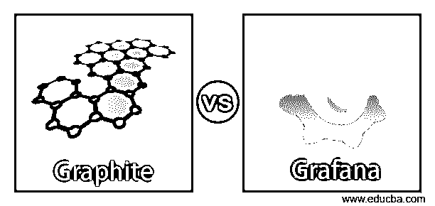

# 石墨 vs Grafana

> 原文：<https://www.educba.com/graphite-vs-grafana/>

## 石墨与 Grafana 的区别

Graphite 是一款开源软件，用于监控和提供与数字和时间序列相关的数据图表。这主要用于监控计算机系统的性能。它于 2008 年发布，帮助收集、存储和显示系统中的数据。使用的编程语言是 JavaScript。Grafana 用于指标分析，与存储区域无关。执行查询是为了可视化存储过程和操作指标。团队内部创建并共享仪表板，以了解数据并进行分析。

### Graphite 与 Grafana 的直接对比(信息图)

以下是石墨与 Grafana 之间的 7 大区别:

<small>网页开发、编程语言、软件测试&其他</small>

### 石墨与 Grafana 的主要区别

以下是石墨与 Grafana 之间的主要区别:

*   Graphite 是一个监控工具，它还提供基于数据分析的图表。数据收集和可视化是在应用程序中借助查询和图形完成的。存储的数据是基于时间序列的，显示的图形是数据的需求。Grafana 是一个数据可视化系统，其中集成了不同的数据存储，以便可以形成有时间限制的数据的适当度量。
*   石墨的文档不如 Grafana 好。在 Grafana 文档中，解释了基本概念以及所有的教程和插件，以便用户熟悉应用程序中的功能。
*   graphite 应用程序提供指标来存储和分析数据。有不同的度量标准可用来以 graphite 格式提供易于分析的数据。在 graphite 中管理数据很容易。Grafana 中提供了插件，使可视化更有效，从而更容易理解仪表板中的数据。网络浏览器用于向用户显示这些数据。
*   Graphite 存储时间序列数据，而 Grafana 不存储。储存在石墨中有助于数据更加准确，从而使分析变得容易。这是 Grafana 的一个优势，因为它不存储数据，只在可视化中做零件。
*   Graphite 从不同来源收集零碎的数据并存储在后端，以便在显示数据时提供支持。不同的解决方案，如已声明和已收集的解决方案，可以包含在时间序列中进行收集。Grafana 不支持数据收集，因为它仅适用于可视化部分。
*   graphite 提供了不同的工具来提供插件，尽管应用程序本身并不直接支持插件。同时，Grafana 中提供了一个很大的插件库，用户可以定制可视化的图形，并对图形进行更多的创新。此外，这些插件可以用于仪表板编辑。
*   这两个应用程序中都提供了可视化选项，但是定制和仪表板编辑在 graphite 中不可用。在 Grafana 和 visualization 中，编辑也包含了灵活和丰富的功能，以满足客户的需求。仪表板易于使用，因此客户喜欢 Grafana 提供的可视化效果。
*   随着数据收集的完成，事件跟踪也在 graphite 中完成。Grafana 中没有事件跟踪，它可以为系统中提供的图形创建日志。

### 石墨与 Grafana 对比表

让我们讨论石墨与 Grafana 之间的主要比较:

| **石墨** | **格拉法纳** |
| 云服务进行数据收集和事件跟踪，因此 graphite 的云兼容性较差。 | 云监控很容易与 Grafana 兼容，因为它在系统中实现了仪表板和可视化。 |
| 这些功能可用于数据收集和分析，因此也可用于企业。graphite 中没有托管选项。 | 所有这些特性都是可用的，可以在企业中用于数据的可视化。但是在这个应用程序中没有商业版本，但是提供了一个托管的解决方案，使得应用程序可以在所有版本中工作。 |
| 为数据收集选项提供了基础设施，因此可以使用度量选项存储、分析和可视化数据。因为存储和事件跟踪也是在 graphite 中完成的，所以它适合使用数据收集工具的用户。 | Grafana 不提供数据收集，如果系统内置了云服务，那么 Grafana 是在系统中获得数据可视化的解决方案。 |
| 不能在需要时配置警报并将其发送给用户。应该从用户端手动完成。 | 可以在 Grafana 中配置警报，以便可以发送仪表板图像或通知，如果发生任何数据泄露，可以发送给用户。 |
| Template variables 的特性在 graphite 中是不存在的，它在内置特性的帮助下进行数据存储和分析，这样数据可以被存储并用于创建日志。 | 可以定义变量源，并且可以收集所有可能的值，以便可以使用仪表板来显示系统的变量。这有助于用户了解可用的数据。 |
| 用户界面很简单，如果用户需要更多的应用程序，他们可以集成并使用该应用程序在单个图形中转换和过滤数据。 | 用户界面不像仪表板那样简单，可视化工具使它变得复杂。但是初学者可以从文档开始。 |
| 借助协议从不同来源收集数据并存储在数据库中。该数据库提供了收集和可视化系统数据的工具。 | Grafana 的架构很简单，因为它收集数据并直接提供可视化。没有存储，因此系统中不需要数据库。 |

### 结论

虽然两者的工作原理不同，但石墨和 Grafana 可以连接起来使用，以便更好地为用户服务。Graphite 可以存储数据，Grafana 可以用来可视化前端的数据。Grafana 为 graphite 用户提供了不同的图表特性。

### 推荐文章

这是石墨 vs Grafana 的指南。在这里，我们还讨论了 Graphite 与 Grafana 的主要区别，并提供了信息图表和比较表。您也可以看看以下文章，了解更多信息–

1.  [格拉法纳 vs 基巴纳](https://www.educba.com/grafana-vs-kibana/)
2.  [什么是 Logstash？](https://www.educba.com/what-is-logstash/)
3.  [Icinga vs Nagios](https://www.educba.com/icinga-vs-nagios/)
4.  [插图类型](https://www.educba.com/types-of-illustration/)

