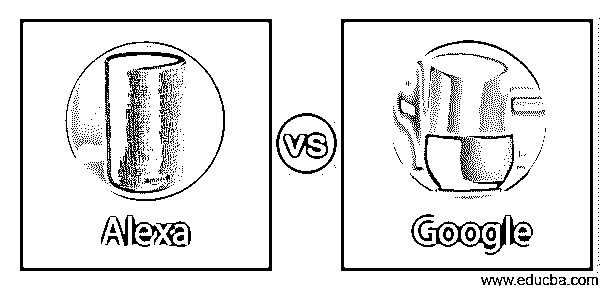
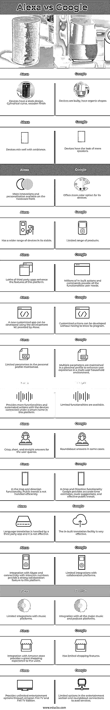

# Alexa vs 谷歌

> 原文：<https://www.educba.com/alexa-vs-google/>

## Alexa 与谷歌的区别

Alexa vs Google Assistant 是当今家喻户晓的名字，它们帮助人们以数字方式执行许多任务，而不必移动到任何地方和使用键盘。它们是最受欢迎的虚拟数据助理工具，分别由亚马逊和谷歌设计，它们在这些工具的开发中部署了机器学习、自然语言处理和人工智能技术的语音识别功能。

微软的 Crotona 和苹果的 Siri 是 Alexa 和 Google Assistant 的竞争产品。在过去的五年里，Alexa 和 Google Assistant 完善了它们的功能，填补了空白，并即兴发挥了它们产品的功能。在特性和性能方面，这两种产品都有相匹配的功能，但它们之间仍有细微的差别，在本文中，我们将尝试展示这些差别。

<small>网页开发、编程语言、软件测试&其他</small>

### 阿莱夏

2015 年作为亚马逊 Echo 的语音助手平台推出，这是一款智能扬声器，能够倾听用户的请求，并以相同的语言和语气做出回应。2017 年晚些时候，它扩展到第三方产品，并添加了新功能。

这种智能个人助理根据用户的命令，搜索网络信息，将事件添加到日历中，维护待办事项列表，向用户发送提醒，在线订购产品，触发事件，根据播放列表播放电影和音乐，以及执行许多其他任务。数以千计的第三方应用程序充分发挥了 Alexa 平台的优势，并提供了多种新功能。

### 谷歌助手

这款于 2016 年推出的语音辅助数字助理工具可以从网络上提供信息，预订门票，发送代表用户的电子邮件，并执行许多其他操作。在没有语音界面的情况下，它接受语音命令和键入的请求。Google Now 是谷歌的第一款数字助理产品。谷歌助手是下一个具有人工智能功能的临时版本，它将谷歌软件产品与硬件产品连接起来。

### Alexa 与谷歌的正面比较(信息图)

以下是 Alexa 与谷歌之间的主要差异。

### Alexa 与谷歌的主要区别

这两款产品都有吸引人的功能，并因其新颖的创意赢得了用户群的赞誉。在这种情况下，比较产品是一个复杂的过程。我们将对这两款产品的软件、硬件、语音识别和其他以客户为中心的功能进行比较。

#### 1.硬件设计

Alexa 和谷歌在美学方面得分相同，这两款产品都很有吸引力，并覆盖有织物以减少振动。虽然 Google home 有更多的颜色选择，但亚马逊 Echo 设备看起来更有艺术感，它的侧面采用了木质饰面，看起来很赏心悦目。谷歌设备体积庞大，类似于扬声器，与周围环境不协调。Echo 设备的圆滑设计和圆柱形状超过了谷歌的弯曲顶部和有机形状。亚马逊在扬声器和显示器方面拥有更广泛的产品线，并不断创新其产品，并在产品中带来更多个性化。

#### 2.应用程序

Alexa 中的第三方应用程序提供了最终用户需要的所有功能，它弥补了 Alexa 提供的原始应用程序中的差距。Alexa 商店中有超过 10 万个这样的应用程序，用户的任何奇怪要求都有可能得到满足。除此之外，Alexa 允许内部开发人员开发新的应用程序，并提供必要的模板和集成。

Google Assistant 已经在产品中内置了超过 100 万个动作和命令，它可以覆盖最终用户所有可能的查询。它不必依赖于第三方新附加组件。Google 允许没有任何编程知识的用户开发自定义动作。

#### 3.声音识别

谷歌在管理一个家庭中多个人的声音方面提供了更完善的功能。它的产品 Voice Match 提供了更多的个性化元素，如维护个人资料，以便为用户提供更好的设备交互体验。该档案包含日历、照片、支付详情、航班偏好、默认媒体服务等详细信息。

Alexa 在维护个人资料方面没有那么复杂，只是存储了一些细节，如购物、信息和有限的媒体选项。

#### 4.智能家居功能

用户能够通过 Alexa 平台连接设备来执行多种不同的操作。该动作包括在某些触发或事件时自动打开/关闭智能灯，以及当用户即将到家时激活家庭设备等。谷歌只限制了通过语音命令或时间表来控制设备的行为。

#### 5.常识

这两个数字助理在回答用户的问题方面同样强大和有能力，Alexa 在为用户的大多数问题提供清晰、简短和直接的答案方面比谷歌略胜一筹。

#### 6.地图方向

谷歌给出更准确的时间估计，有效地管理交通，在审查交通状况后提供正确的路线建议。Alexa 在上述所有功能上都落后。

#### 7.语言支持

Alexa 处理多种语言，但翻译由第三方应用程序管理，因此更加复杂。谷歌内置的翻译功能提供了简单有效的翻译服务。

#### 8.合作

Alexa 在通过谷歌打电话、视频电话和发短信方面略有优势，因为它与 Skype 和内部通话功能无缝集成，可以与家里的其他 Echo 设备广播消息。

#### 9.音乐和播客

这两个助手在这一领域处于同等水平，Alexa 在提供与苹果音乐和播客等大型播放器的集成方面优于谷歌。

#### 10.娱乐

在第三方应用的帮助下，Alexa 能够智能地为用户订票。

### Alexa 与 Google 的对比表

现在，让我们在下表中起草比较。

| **Alexa** | 谷歌 |
| 设备有一个圆滑的设计，圆柱曲线，木制完成。 | 设备体积庞大，形状有机。 |
| 设备与环境融合得很好。 | 设备看起来只是扬声器。 |
| 硬件方面有更多的创新和个性化。 | 为其设备提供更多颜色选择。 |
| 马厩里有更多种设备。 | 产品范围有限。 |
| 数十万第三方应用增强了这个平台的功能。 | 数以百万计的内置动作和命令提供了用户需要的所有功能。 |
| 可以使用 Alexa 提供的开发工具包开发新的定制应用程序。 | 无需了解编程就可以开发定制的动作。 |
| 维护个人资料中的有限参数。 | 在个人简档中维护多个参数，以增强多用户家庭环境中的用户体验。 |
| 通过该平台中智能家居下连接的设备，提供更多功能和自动化操作。 | 可用的功能有限。 |
| 对用户询问的简明扼要的回答。 | 某些情况下的迂回回答。 |
| 在地图和方向功能中，没有有效地处理公共交通。 | 在地图和方向功能方面，谷歌提供准确的时间估计、路线建议和有效的公共交通。 |
| 语言翻译由第三方 app 处理，效率不高。 | 内置的翻译工具非常有效。 |
| 与 Skype 的集成以及与内部通信号码的连接为该平台提供了强大的协作功能。 | 与协作平台的集成有限。 |
| 与音乐平台的有限集成。 | 集成所有主要的音乐和播客平台 |
| 与亚马逊商店的集成为用户提供了良好的购物体验。 | 购物功能有限。 |
| 通过亚马逊 Fire TV 和 Fire TV Edition 提供无限的娱乐选择。 | 娱乐区的选择有限，环岛连接有利于服务。 |

### 结论

这是 Alexa 和谷歌之间的一场势均力敌的比赛，因为两者都以自己的方式令人印象深刻。Alexa 在无数第三方应用的帮助下实现了消费者的任何需求，亚马逊在后端的强大支持以微弱优势赢得了这场比赛。

### 推荐文章

这是 Alexa vs 谷歌的指南。在这里，我们讨论了 Alexa 与谷歌的关键差异，并提供了信息图表和对比表格。您也可以看看以下文章，了解更多信息–

1.  [MQTT vs WebSocket](https://www.educba.com/mqtt-vs-websocket/)
2.  [Azure vs 谷歌云](https://www.educba.com/azure-vs-google-cloud/)
3.  [谷歌云 vs AWS](https://www.educba.com/google-cloud-vs-aws/)
4.  [甲骨文 vs 谷歌](https://www.educba.com/oracle-vs-google/)

