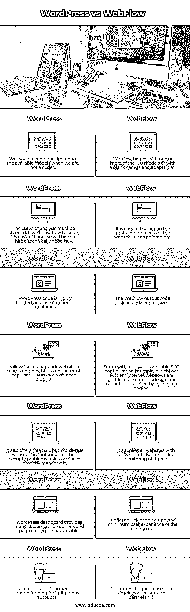

# WordPress vs WebFlow

> 原文：<https://www.educba.com/wordpress-vs-webflow/>

## WordPress 和 WebFlow 的区别

Webflow 和 WordPress 之间的比较将详细讨论这两个内容管理系统，以便您可以确定哪个平台适合您，使用起来有多简单，它们提供什么功能，以及它们的优缺点。Webflow 是一个基于云的网站构建器，让没有编码经验或专业知识的人也能创建一个可爱的网站。至于 webflow，它非常强大和个性化——你只能通过 HTML CSS 和 JavaScript 获得——不像 Square Space 和 Wix 等其他“网站构建器”平台。

### 什么是 WordPress？

WordPress 是一个免费的开源内容管理系统。它是用 PHP 编写的，与 MariaDB 或 MySQL 相关。它主要是作为一个博客工具开发的，但现在已经成为一个多功能的 CMS。可以使用网站、博客和智能手机应用程序。WordPress 插件经常被用来建立一个在线商店。WordPress 是内容管理(CMSs)最常用的解决方案之一。超过 6000 万个网站，截至 2019 年排名前 1000 万的网站中有 34%被使用。

<small>网页开发、编程语言、软件测试&其他</small>

### 什么是 WebFlow？

Webflow 是一家美国公司，提供网站建设和托管软件服务(SaaS)。其“视觉发布者”在线平台允许用户设计、创建、启动和发布网站。2013 年，弗拉德·马格达林、塞尔吉·马格达林和布莱恩特·周创造了它。Webflow 已经受到 web 设计人员的欢迎，因为它可以很好地个性化，但它非常适合任何想要轻松创建完全个性化的网站的人，而无需雇用设计人员或开发人员或摆弄自己的代码。

### WordPress 和 WebFlow 的面对面比较(信息图表)

以下是 WordPress 和 Webflow 的 7 大区别:

### WordPress 和 WebFlow 的主要区别

以下是 WordPress 和 WebFlow 的主要区别:

*   Webflow 给你最大的设计灵活性，而 WordPress 受制于模板或临时编码。wordpress 的代码可能会因为大量需要插件而受损，而 webflow 很干净，一致性也很好，webflow 很贵，取决于你选择的软件包，而 WordPress 是免费的，你只需要支付住宿费用。Webflow 有一个拖放页面生成器，而你需要一个插件来支持 wordpress
*   Webflow 还自带内置的电子商务引擎，允许用户创建高性能商店。该框架通过遵循从网上商店的开始到最后发布的所有步骤，使用户负责 web 创建的过程。虽然 CMS 没有集成的电子商务引擎，但它的增长潜力是通过使用特定的插件实现的
*   WordPress 在博客方面提供了更有效和更灵活的选择。这是系统综合集成选项的产物。Webflow 并不落后于 CMS，因为它的博客可能性。
*   WordPress 似乎是一个更经济的解决方案，使用该平台会导致更高的项目成本，尤其是如果你需要一个独特而强大的在线网站。在这种情况下，需要更多的优质插件和可靠的托管设施。

### WordPress 与 WebFlow 对比表

让我们看看 WordPress 和 WebFlow 的对比表。

| **WordPress** | **网络流量** |
| 当我们不是一个编码器时，我们将需要或限于可用的模型。 | Webflow 从 100 个模型中的一个或多个开始，或者从一个空白画布开始，并对其进行调整。 |
| 分析曲线必须是陡峭的。如果我们知道如何编码，就容易多了。如果没有，我们将不得不雇用一个技术好的家伙。 | 它很容易使用，在网站的制作过程中，这是没有问题的。 |
| WordPress 代码非常臃肿，因为它依赖于插件。 | Webflow 输出代码是干净的和语义化的。 |
| 它可以让我们的网站适应搜索引擎，但是要做最流行的 SEO 任务，我们确实需要插件。 | 在 webflow 中，使用完全可定制的 SEO 配置进行设置非常简单。现代互联网网络流是由搜索引擎产生的，移动设计和输出是由搜索引擎提供的。 |
| 它还提供免费的 SSL，但 WordPress 网站因其安全问题而臭名昭著，除非我们妥善管理它。 | 它为所有网站提供免费 SSL，并持续监控威胁。 |
| WordPress dashboard 提供了许多客户免费的选项，页面编辑不可用。 | 它提供了快速的页面编辑和仪表板的最小用户体验。 |
| 不错的出版合作关系，但没有土著帐户的资金。 | 客户收费基于简单的内容设计合作关系。 |

### 结论

在并排比较了 Webflow 和 WordPress 之后，很明显这两个平台对于任何一个建立网站的人来说都是一个很棒的选择。所以你可以根据自己的需求选择任意一个。我们希望这篇文章对您有所帮助。

### 推荐文章

这是 WordPress vs WebFlow 的指南。在这里，我们还讨论了 wordpress 和 webflow 在信息图表和比较表格方面的主要区别。您也可以看看以下文章，了解更多信息–

1.  [内联网 vs 外联网](https://www.educba.com/intranet-vs-extranet/)
2.  [静态网站 vs 动态网站](https://www.educba.com/static-website-vs-dynamic-website/)
3.  [PostgreSQL vs SQLite](https://www.educba.com/postgresql-vs-sqlite/)
4.  [Fluentd vs Logstash](https://www.educba.com/fluentd-vs-logstash/)

