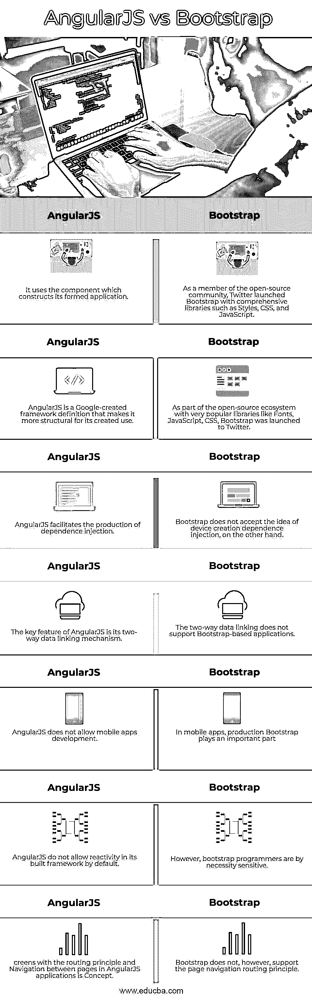

# AngularJS vs Bootstrap

> 原文：<https://www.educba.com/angularjs-vs-bootstrap/>

## AngularJS 与 Bootstrap 的区别

业界两种著名的前端成帧技术是 AngularJS 和 Bootstrap。AngularJS 是一个用于创建复杂 web 应用程序的结构化架构。它为 MVC 架构提供了数据模型绑定。然而，Bootstrap 使用 HTML 和 JavaScript 来相对加快应用程序的创建。

### 什么是自举？

Bootstrap 是一个庞大的 HTML、CSS 和 JavaScript 代码集，旨在帮助构建用户的 GUI。为许多开发者制作网站和 web 应用程序是免费的，根据官方 Bootstrap 网站的说法:这是开发 Web 最常见的 HTML、CSS 和 JavaScript 框架。Bootstrap 是一个免费的开源 web 开发框架。

<small>网页开发、编程语言、软件测试&其他</small>

### AngularJS 是什么？

AngularJS 是一个开放的 JavaScript 开源框架，主要用于为单个页面(SPAs)构建 web 应用。它是一个不断扩展的平台，为构建 web 应用程序提供了更简单的方法。这就把 JavaScript 变成了 JavaScript 动态。它将消除我们编写代码的需要，例如动态连接和依赖注入。AngularJS 正在快速扩展，这就是为什么我们有 AngularJS 的各种迭代，最近的稳定版是 1.7.7。还必须注意到 AngularJS 是独特的。

### AngularJS 与 Bootstrap 的面对面比较(信息图)

以下是 AngularJS 与 Bootstrap 的 7 大区别:

### AngularJS 和 Bootstrap 的主要区别

以下是 AngularJS 与 Bootstrap 之间的主要区别:

*   Bootstrap 包括现成的模块、CSS 模板和插件。因此，我们可以在代码中使用组件和样式，这将节省时间并有助于网站的快速发展。AngularJS 将其发送到 DOM，然后发送到带有基本 HTML 模板的 Angular JS 编译器。网上有几种现成的模型。
*   在其框架开发中，AngularJS 支持依赖注入。另一方面，Bootstrap 不允许依赖开发注入。
*   在手机 app 的制作上，AngularJS 无法支持手机应用。自举起着重要的作用。
*   如上所述，AngularJS 是一个基于 JavaScript 的框架，工作在 MVC 模型上。因为它的发展相对较慢。另一方面，Bootstrap 通常被称为 CSS 框架，因此很容易构建。
*   AngularJS 有一个更好的 bootstrap 仿真引擎，而 Bootstrap 中没有有效的模板引擎。
*   AngularJS 为开发者提供了一个强大的 MVC，让你几乎可以完全操纵 HTML 代码。因为不用写 MVC 再单独连接，所以很节省时间。如果你用一个相当简单的 web 应用程序创建一个小团队，而没有进一步改进或扩展你的应用程序的计划，AngularJS 的 MVC 设计可能看起来是多余的。Bootstrap 促进了敏感界面的创建，并极大地增加了饰面的一致性。12 列网格结构和 Flex 实用程序使之成为可能。这是可能的。
*   这是一个预制模块、JavaScript 插件、原型和主题的工具包。它不仅仅是一个网格框架。Bootstrap 提供了数百种预先设计好的、随时可用的用户界面组件，如形状、分页、航海导航、下拉菜单等。双向链接帮助您更改应用程序的配置，而无需根据用户填写的详细信息重新加载页面。例如，在“姓名”区域，你输入自己的姓名，然后应用程序会自动将它弹出到购物车旁边。
*   Bootstrap 不是一个前端框架，它允许应用程序或功能的结构，如路由、控制器、MVC 架构、模型等。而 AngularJS 不提供网格类、CSS 样式或 JavaScript 组件，如模型、导航栏、选项卡、下拉菜单等。

### AngularJS 与自举比较表

我们来看看 AngularJS vs Bootstrap 的对比表。

| **Sr 号** | **角型** | **自举** |
| One | 它使用构建其应用程序的组件。 | 作为开源社区的一员，Twitter 推出了包含 Styles、CSS 和 JavaScript 等综合库的 Bootstrap。 |
| Two | AngularJS 是 Google 创建的一个框架定义，使其在创建时更加结构化。 | 作为开源生态系统的一部分，Twitter 推出了非常受欢迎的库，如字体、JavaScript、CSS 和 Bootstrap。 |
| Three | AngularJS 促进了依赖注入的产生。 | 另一方面，Bootstrap 不接受设备创建依赖注入的思想。 |
| Four | AngularJS 的关键特性是它的双向数据链接机制。 | 双向数据链接不支持基于引导的应用程序。 |
| Five | AngularJS 不允许移动应用程序开发。 | 在移动应用中，生产引导起着重要的作用 |
| Six | 默认情况下，AngularJS 不允许在其构建的框架中进行反应。 | 然而，引导程序员必然是敏感的。 |
| Seven | AngularJS 应用程序中具有路由原则和页面间导航的屏幕是一个概念。 | 然而，Bootstrap 不支持页面导航路由原则。 |

### 推荐文章

这是 AngularJS vs Bootstrap 的指南。在这里，我们还讨论了 angularjs 与 bootstrap 的关键差异，并提供了信息图表和比较表。您也可以看看以下文章，了解更多信息–

1.  角度 2 相对于视图 JS
2.  [反应与角度](https://www.educba.com/reactjs-vs-angularjs/)
3.  [角度与自举](https://www.educba.com/angular-vs-bootstrap/)
4.  [角 js vs view js](https://www.educba.com/angular-js-vs-vue-js/)

