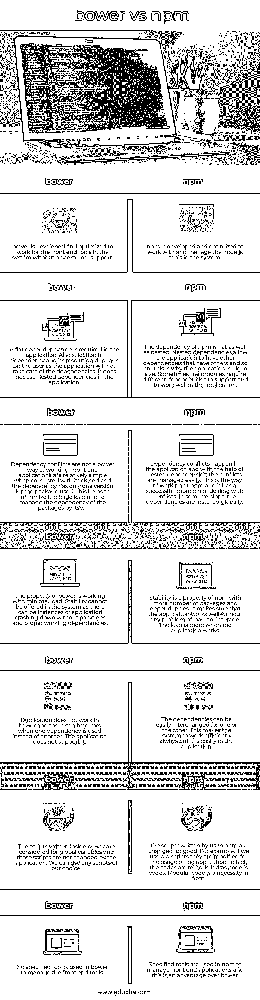

# 鲍尔 vs npm

> 原文：<https://www.educba.com/bower-vs-npm/>

## bower 与 npm 的区别

下面的文章提供了 bower vs npm 的概要。bower 用 JavaScript 编写，帮助维护网络上的任何包，或者正确地称为互联网。它是由 Twitter 构建的前端应用程序，用于解决任何开源或闭源项目中的问题。它管理 HTML、CSS 或 JavaScript 应用程序中内置的组件。它是市场上流行的工具之一。节点包管理器或 npm，顾名思义是一个用于 JavaScript 环境的包管理器。模块被放置以便节点可以找到它们，并且它在许多情况下支持配置。

### bower 与 npm 之间的直接比较(信息图表)

以下是 bower 和 npm 之间的 7 大区别:

<small>网页开发、编程语言、软件测试&其他</small>

### bower 与 npm 的主要区别

让我们讨论一下 bower 和 npm 之间的一些主要区别:

*   考虑到这两者，我们可以称之为依赖管理工具。两者的目的相同，但方式不同。使用 npm 时，在系统中安装 node js 非常重要。换句话说，只有在系统中安装了节点 js，npm 才能工作。Bower 不需要在系统中安装节点 js，因为 bower 是为了管理前端工具(如 HTML、CSS)而构建的，因此可以管理系统中的依赖关系。
*   在 bower 中，许多文件用于其工作。它可以是图像文件、word 文件或系统中运行的任何程序。但是 bower 以管理许多文件而闻名，它作为系统中的一个组件一起工作。因此，管理任何类型的文件格式都是已知的，只要它们在前端帮助系统工作。而另一方面，npm 没有被编程为一次运行许多文件，而是使用一些包来管理前端开发。这些包可以是 grunt、gulp 或 jshint。
*   npm 最初的用途仅限于管理 node.js 模块，而不是前端工具。所有的模块都由节点标识，并且在 JavaScript 的帮助下可以很好地管理配置。但是当与 Webpack 或任何其他捆绑器结合时，它也支持前端工具。bower 是为管理前端工具而开发的，它不需要任何其他工具的支持就能完成这个任务。
*   在比较两者的大小时，我们可以很容易地说 bower 的大小更小，因为它不需要安装任何 node js，并且在应用程序中使用较少的包就可以独立工作。所使用的包是为了支持应用程序在处理前端应用程序时工作。但是，npm 是一个非常大的应用程序，它支持系统中的存储库和许多包。它有 JavaScript，节点和许多功能。排序等功能有助于获取关于内置应用程序的信息，无论它是系统中的前端还是后端。
*   由于处理 CSS 是 bower 的一部分，它包括应用程序中的样式。但是在 npm 中，没有样式，因此需要某些包在应用程序中包含样式。我们也可以使用 sass 来设计 npm 中的脚本，而不是使用包。

### 鲍尔与 npm 对比表

让我们讨论一下 bower 与 npm 之间的顶级比较:

| **鲍尔** | **npm** |
| bower 的开发和优化是为了在没有任何外部支持的情况下为系统中的前端工具工作。 | npm 的开发和优化是为了在系统中使用和管理节点 js 工具。 |
| 应用程序中需要平面依赖关系树。此外，依赖性的选择及其解决方案取决于用户，因为应用程序不会处理依赖性。它不使用应用程序中的嵌套依赖关系。 | npm 的依赖关系是平面的，也是嵌套的。嵌套依赖项允许应用程序拥有其他依赖项，这些依赖项又拥有其他依赖项，依此类推。这就是为什么应用程序很大的原因。有时，模块需要不同的依赖关系来支持和在应用程序中正常工作。 |
| 依赖冲突不是一种更好的工作方式。与后端相比，前端应用程序相对简单，并且所使用的软件包只有一个版本。这有助于最小化页面负载，并管理包本身的依赖性。 | 依赖关系冲突发生在应用程序中，在嵌套依赖关系的帮助下，冲突很容易管理。这是国家预防机制的工作方式，它有处理冲突的成功方法。在某些版本中，依赖项是全局安装的。 |
| 鲍尔的特性是以最小的负载工作。系统无法提供稳定性，因为可能会有应用程序在没有软件包和适当的工作依赖关系的情况下崩溃的情况。 | 稳定性是 npm 的一个属性，它包含更多的包和依赖项。它确保应用程序运行良好，没有任何加载和存储问题。应用程序工作时负载更多。 |
| 复制在 bower 中不起作用，当使用一个依赖项代替另一个时，可能会出现错误。应用程序不支持它。 | 这些依赖关系可以很容易地相互交换。这使得系统总是有效地工作，但是在应用中成本很高。 |
| 在 bower 中编写的脚本被认为是全局变量，应用程序不会更改这些脚本。我们可以使用我们选择的任何脚本。 | 我们写给 npm 的脚本被永久修改了。例如，如果我们使用旧的脚本，它们会根据应用程序的用途进行修改。事实上，代码被重新建模为节点 js 代码。模块化代码在 npm 中是必要的。 |
| bower 中没有使用特定的工具来管理前端工具。 | npm 中使用指定的工具来管理前端应用程序，这是相对于 bower 的一个优势。 |

### 结论

尽管有一些相似之处和不同之处，但是有一些项目在他们的系统中同时使用了这两者来正常工作。因此，bower 用于系统中的前端应用程序，而 npm 用于后端应用程序以及系统中的软件包。

### 推荐文章

这是鲍尔 vs npm 的指南。在这里，我们用信息图和比较表来讨论 bower 和 npm 的主要区别。您也可以看看以下文章，了解更多信息–

1.  [JavaScript vs Node.js](https://www.educba.com/javascript-vs-node-dot-js/)
2.  [Node.js vs Go](https://www.educba.com/node-js-vs-go/)
3.  [Ruby vs Node](https://www.educba.com/ruby-vs-node/)
4.  [JavaScript vs Ruby](https://www.educba.com/javascript-vs-ruby/)

