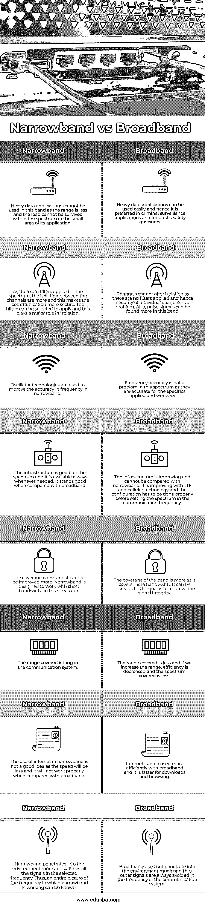

# 窄带与宽带

> 原文：<https://www.educba.com/narrowband-vs-broadband/>

## 窄带和宽带的区别

以下文章概述了窄带与宽带的区别。窄带和宽带在电信中被用作设置频带和在频谱中进行通信的工具。在窄带中，只考虑一组很窄的频率，通信只在这些频率上进行。使用较少数量的频率组，因为它被设计成仅在较少的频率下工作。宽带覆盖很宽的带宽，并在其频谱中使用不同的信号和频率。此外，宽带用于互联网服务，它在系统中提供高速互联网接入。在不同的信道中提供数据传输信道，这些信道可以被不同的用户访问。

### 窄带与宽带的直接比较(信息图表)

以下是窄带与宽带之间的 8 大区别:

<small>网页开发、编程语言、软件测试&其他</small>

### 窄带与宽带的主要区别

让我们讨论一下窄带和宽带之间的一些主要区别:

*   窄带不覆盖很宽的频率范围，因此窄带中的干扰会更多。必须应用高性能状态的滤波器，并使其工作在窄带中。在宽带领域，我们不会面临这些问题。它覆盖了很宽的频率范围，因此干扰会更小。滤波器不需要应用在宽带中，并且它们在所选频率中以最小的噪声和更多的信号工作得很好。
*   上述观点也有消极的一面。与窄带相比，宽带中的电路是复杂的。由于这种复杂的情况，效率和性能受到影响。因为，设计一个波段复杂的电路需要时间。这导致产量减少。因此，宽带中使用的放大器需要更多时间来汲取电流，从而导致低性能。这在窄带中是一个优势。窄带电路不太复杂，因此产量不受影响。性能和效率都不错。通常，宽带需要更多的放大器级来满足窄带的效率。
*   与宽带相比，窄带所需的功耗更少。因此，如果我们需要在远程系统中使用一个频段，最好使用窄带。这是因为当系统中需要更多的小区时，宽带成本更高。远程系统更关心成本、可靠性和用电量。因此，在所有这些情况下，宽带都很低。对于所有这三个因素都值得关注的系统，窄带是更好的选择。宽带是接入点和集线器位置的首选。
*   窄带在选定的通信区域有更多的信道，因此许多应用更喜欢窄带。这在选定的区域中有更多的通路和可靠性。因此，军事应用、传感器、报警系统都可以很好地使用窄带。它也有很好的范围。当大量信道必须在宽频谱范围内覆盖时，选择宽带。如果使用的应用中数据较多，最好使用宽带。
*   在宽带中需要更多的编码，因为它必须覆盖很宽的频谱范围，并且使用的频率更多。覆盖的信道将在编码部分考虑。它工作的速度和效率可以通过适当的编码来处理。这也增加了通信系统中的数据。窄带中较少的编码使得它对于通信方面更为可取。这对应用程序处理的数据来说是一个额外的优势。

### 窄带与宽带对照表

让我们讨论一下窄带与宽带之间的主要比较:

| **窄带** | **宽带** |
| 大数据量的应用不能用在这个频段，因为这个频段的范围比较小，负载不能在应用的小范围内承受。 | 大量数据应用程序易于使用，因此是犯罪监控应用和公共安全措施的首选。 |
| 由于在频谱中应用了滤波器，信道之间的隔离更大，这使得通信更安全。可以选择应用滤波器，这在隔离中起着重要作用。 | 通道不能提供隔离，因为没有应用滤波器，因此单个通道的安全性是一个问题。此外，噪声信号在该频段中更常见。 |
| 振荡器技术用于提高窄带频率的精度。 | 在这个频谱中，频率精度不是问题，因为它们对于所应用的细节是精确的，并且工作良好。 |
| 基础设施对频谱是有益的，并且它总是在需要时可用。与宽带相比，它还是不错的。 | 基础设施在完善，不能和窄带比。随着 LTE 和蜂窝技术的发展，这种情况正在改善，在设置通信频率的频谱之前，必须正确完成配置。 |
| 覆盖面少了，不能再提高了。窄带设计用于频谱中的短带宽。 | 频带的覆盖范围更大，因为它覆盖了更多的带宽。如果目标是改善信号完整性，则可以增加。 |
| 在通信系统中覆盖的范围很长。 | 覆盖的范围更小，如果我们增加范围，效率会降低，覆盖的频谱会更少。 |
| 在窄带中使用互联网不是一个好主意，因为与宽带相比，它的速度会更慢，也不能正常工作。 | 使用宽带可以更有效地使用互联网，下载和浏览速度也更快。 |
| 窄带更多地渗透到环境中，并捕捉所选频率中的所有信号。因此，可以知道窄带工作频率的全貌。 | 宽带不会过多地渗透到环境中，因此在通信系统的频率中总是避免其他信号。 |

### 结论

窄带是一种较老的技术，不适合数据通信。但由于技术的进步，窄带已经发展得很好，可以用更少的成本和更高的效率在很多应用中使用。可以比宽带更好地创建光谱图。有些应用程序是两者共有的，最好根据用途来选择。

### 推荐文章

这是窄带与宽带的对比指南。在这里，我们通过信息图和比较表来讨论窄带和宽带的主要区别。您也可以看看以下文章，了解更多信息–

1.  [编译时间与运行时间](https://www.educba.com/compile-time-vs-runtime/)
2.  [Scala vs Java](https://www.educba.com/scala-vs-java/)
3.  [CSS vs JavaScript](https://www.educba.com/css-vs-javascript/)
4.  [JavaScript 与安圭拉](https://www.educba.com/javascript-vs-angularjs/)

