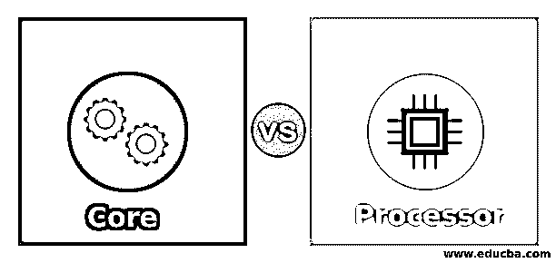
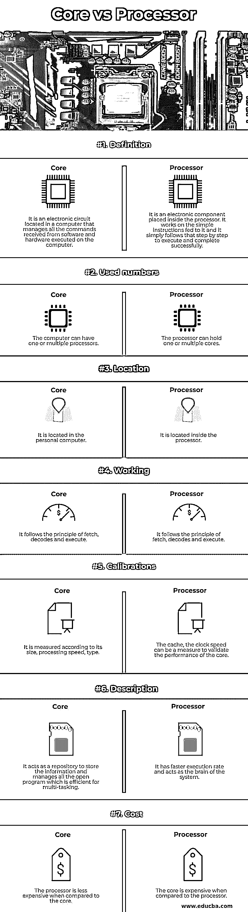

# 内核与处理器

> 原文：<https://www.educba.com/core-vs-processor/>

## 内核与处理器的区别

下面的文章提供了核心与处理器的概要。处理器是位于计算机中的电子芯片，其包括产生逻辑、算术控制和输出或输入变化的命令，而核心是位于处理器中的执行单元，其接收并遵循指令。处理器类似于计算机的心脏，管理着计算机正常工作所需的所有命令。它可以管理单核或多核。核心被放置在处理器中，处理器进行原始的执行。但是现代计算机中的多个内核可以同时执行许多指令，从而提高系统的性能。所有这些系统都有效地限制了功耗。

### 内核与处理器的直接对比(信息图表)

以下是酷睿和处理器之间的 7 大区别:

<small>网页开发、编程语言、软件测试&其他</small>

### 内核与处理器的主要区别

让我们讨论一下内核和处理器之间的一些主要区别:

内核和处理器之间的主要区别在于其定义、架构、时钟速度、类型、设备位置和服务质量。

*   **定义:**核是处理器最基本的处理单元，可以一次执行。它包括控制单元、具有几个寄存器的逻辑单元。而处理器包括一个内核，但是现在处理器具有多个内核。处理器与单元计算单元以及几个多核保持相同。处理器确保计算机中设备的所有功能都处于合适的状态。处理器的子系统是控制单元和逻辑单元。逻辑单元管理所有的逻辑和算术功能。它执行所有基本的算术运算，如除法、乘法、减法和加法。逻辑过程定义了隐藏的逻辑，如语句的真或假。
*   **架构:**多核处理器可以由四核、双核组成，这些处理器同时执行许多并行指令，其中同一个处理器包含其核心。但是使用超线程技术会使支持它的个人计算机的处理器数量增加一倍。内核可以被描述为处理器中的顶级元素，它被解释为人体的主干或神经系统。处理器中的控制单元同步并调节计算机的功能。处理器包括保存提取的命令和结果的寄存器。在 AKA 高速缓存的传输中，具有双重功能的内核更加有效。L1 的高速缓存像黄油和面包一样通过网络运行。这个 L1 高速缓存是处理器中最小和最快的。缓存 L2 提供快速交付，这是巨大的，但没有 L1 快。L1 和 L2 进程可以满足从 RAM 中保存信息以快速访问的要求。
*   **时钟速度:**处理器帮助 CPU 做 64 位或 32 位处理器。时钟的速度衡量了 CPU 中几个命令可以在几秒钟内处理的速度。处理器的执行速度和时间可以使用输入程序或指令来确定。它按照提取、解码和执行的顺序定义了程序指令中的思维能力和时钟速度。它以千兆赫为单位进行校准，思维能力可以在一秒钟内处理 25 亿次。
*   **类型:**多核处理器是计算机技术的进步。它具有一个单元计算组件，具有一个、两个或多个内核。在物理术语中，单个处理器与几个处理设备相连，称为核心。它可以与多个命令同时执行，以提高在程序上执行的速度。酷睿现在更新了许多不同的版本，如酷睿 i9、酷睿 i7、酷睿 i3、酷睿 i5。这个数字只是描述了下一级的核心，并解释了个人电脑的马力容量。core i3 位于个人台式机中，用于轻型用途，Core i3 专用于在价格和性能之间取得平衡的中端服务器。酷睿 i9 和酷睿 i7 是顶级产品，支持需要快速性能的专业人士。
*   **设备的位置:**处理器位于计算机上，而核心位于处理器内部。
*   **服务质量:**计算机可以拥有多个处理器，处理器也可以拥有一个或多个内核，以提高系统的性能和工作效率。

### 内核与处理器对照表

让我们来讨论一下酷睿与处理器之间的主要对比:

| **属性** | **核心** | **处理器** |
| **定义** | 它是放置在处理器内部的电子元件。它根据输入的简单指令工作，然后一步一步地执行并成功完成。 | 它是位于计算机中的电子电路，管理从计算机上执行的软件和硬件接收的所有命令。 |
| **已用号码** | 处理器可以容纳一个或多个内核。 | 计算机可以有一个或多个处理器。 |
| **地点** | 它位于处理器内部。 | 它位于个人电脑中。 |
| **工作** | 它遵循提取、解码和执行的原则。 | 它遵循提取、解码和执行的原则。 |
| **校准** | 高速缓存、时钟速度可以作为验证内核性能的一项指标。 | 它是根据它的大小、处理速度、类型来衡量的。 |
| **描述** | 它有更快的执行速度，充当系统的大脑。 | 它作为一个仓库来存储信息和管理所有的开放程序，这是有效的多任务。 |
| **成本** | 与处理器相比，内核非常昂贵。 | 与内核相比，处理器更便宜。 |

### 结论

与单核计算机的速度相比，多核处理器的速度非常快。但深入来说，一切都是基于执行的程序。大多数人认为多核处理器性能更好，但在某种程度上这是事实。如果拥有高效的内置程序，单核处理器的性能有时会胜过多核处理器。这是由于程序在逐步指令的帮助下并行执行，而不能分开运行。效率和速度取决于处理器内核的速度。

### 推荐文章

这是一个核心与处理器的指南。在这里，我们通过信息图和比较表来讨论核心与处理器的主要区别。您也可以看看以下文章，了解更多信息–

1.  [内核对线程](https://www.educba.com/cores-vs-threads/)
2.  [酷睿 i5 vs 酷睿 i7](https://www.educba.com/core-i5-vs-core-i7/)
3.  [。Net Core vs .Net Framework](https://www.educba.com/dot-net-core-vs-dot-net-framework/)
4.  [微处理器 vs 微控制器](https://www.educba.com/microprocessor-vs-microcontroller/)

