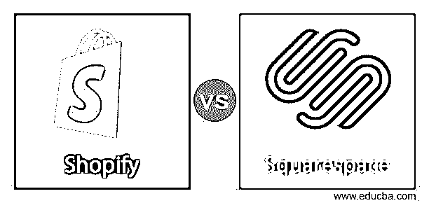
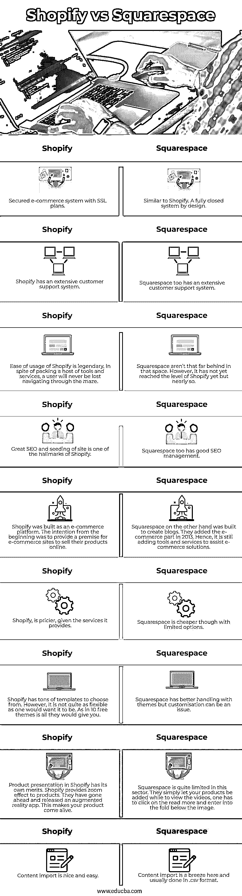

# Shopify vs Squarespace

> 原文：<https://www.educba.com/shopify-vs-squarespace/>

## **Shopify 与 Squarespace 的区别**

在智能手机和移动时代，最大的受益者是电子商务。它们改变了我们的生活方式。从食物到衣服，从电器到书籍，一切都在网上订购。和艾兰一起送来的。电子商务公司已经多元化地提供商业解决方案，随着技术的出现，这些过程变得更加复杂。还有一大部分人通过利用技术变革积累了大量财富和知识。那些为电子商务公司提供平台来维护网站的公司。网站建设者是最重要的齿轮。没有他们的专业知识和支持，电子商务行业不可能发展得如此之快。

由于不断变化的行业动态，网站建设者确实有创新的方法来为他们的客户提供更多。在网站建设领域最受尊敬的两个名字是 Shopify 和 Squarespace。就服务质量和技术成熟度而言，它们都名列前茅，而且都在呈指数级增长。让我们来看看他们彼此相比的情况。

<small>网页开发、编程语言、软件测试&其他</small>

**Shopify**

作为网站建设领域的早期进入者之一，Shopify 是严肃卖家的天堂。其强大的电子商务引擎帮助大型组织实现其销售活动和趋势的全部潜力。Shopify 已经能够构建足够多的子工具，这使其成为电子商务的理想平台。

**平方空间**

Squarespace 是 Shopify 的竞争对手之一，而且是一个相当强大的竞争对手。Squarespace 的客户所信赖的组成部分之一是设计的范围。它可以被恰当地称为设计之王。然而，尽管 Squarespace 加入了许多有助于电子商务的功能，但它并不像 Shopify 那样强大。这是电子商务初创企业的理想选择，他们希望开始自己的旅程，但不要太奢侈。

现在我们对这两个庞然大物有了一个基本的概念，让我们再深入一点。

**易用性:**

Shopify 加载了许多功能。从产品处理到模板、税务计算器、直接运输安排，应有尽有。Shopify 有。这并不是说 Squarespace 没有。它也装载了特性。问题是浏览这些功能有多容易。我赌的是 Shopify。

**模板和设计灵活性:**

Squarespace 是这个领域的一个传奇，虽然我不希望破坏 Shopify 的努力，但它的胜算似乎不大。

**产品展示:**

Shopify 是为大型企业打造的。因此，它的产品展示优于 Squarespace。

支持的支付选项:Shopify 有自己的支付选项，Shopify 支付。人们也可以选择集成他们自己选择的支付处理器。

**运费和整合:**

Shopify 比 Squarespace 贵一点，因为它能带来更大的吸引力。运输的整合对 Shopify 和 Squarespace 来说都非常有效。

**税收设置和计算:**

这是 Shopify 开始腾飞的领域之一。Squarespace 最终会简化这些方法，但截至目前，还没有停止 Shopify。根据记录，Shopify 会自动计算美国税收。对于世界其他地方的税收计算，可以很容易地集成 TaxJar。TaxJar 也可以集成到 Squarespace，但仅此而已。如果 Squarespace 是推荐给你的，就必须使用旧的计算器。

**SEO 和播种:**

对于想要在数字空间留下印记的网站来说，SEO 是一个圣杯。当 Squarespace 慢慢达到标准时，Shopify 做得很对。

### Shopify 和 Squarespace 的直接比较

以下是 Shopify 和 Squarespace 的 9 大对比。

### Shopify 与 Squarespace 的对比表

以下是 Shopify 和 Squarespace 的对比表:

| 具有 SSL 计划的安全电子商务系统 | 类似于 Shopify。一个完全封闭的设计系统。 |
| Shopify 拥有广泛的客户支持系统。 | Squarespace 也有广泛的客户支持系统。 |
| Shopify 的易用性是出了名的。尽管打包了大量的工具和服务，用户永远不会在迷宫中迷路。 | Squarespace 在这一领域并不落后。然而，它还没有达到 Shopify 的水平，但也差不多了。 |
| 伟大的搜索引擎优化和网站的播种是 Shopify 的标志之一 | Squarespace 也有很好的 SEO 管理。 |
| Shopify 是一个电子商务平台。一开始的意图是为电子商务网站提供一个在线销售产品的前提。 | 另一方面，Squarespace 是用来创建博客的。他们在 2013 年加入了电子商务部分。因此，它仍在添加工具和服务来辅助电子商务解决方案。 |
| 鉴于 Shopify 提供的服务，它的价格更高。 | Squarespace 虽然选择有限，但更便宜。 |
| Shopify 有大量的模板可供选择。然而，它并不像人们希望的那样灵活。因为他们会给你 10 个免费主题。 | Squarespace 在主题方面处理得更好，但定制可能是个问题。 |
| Shopify 中的产品展示各有千秋。Shopify 为产品提供缩放效果。他们已经发布了一款增强现实应用。这让你的产品活了起来。 | 平方空间在这方面相当有限。他们只是让你的产品被添加，而观看视频，一个人必须点击阅读更多，并进入图像下方的文件夹。 |
| 内容导入既好又简单 | 在这里，内容导入轻而易举，通常在中完成。csv 格式。 |

### 结论

Shopify 是电子商务网站建设领域的首批进入者之一。多年来，他们完善了自己的服务，并增加了一系列新兴的工具，许多电子商务公司发现这些工具非常有用。另一方面，Squarespace 是一个新进入者。它们最初是为创建博客而设计的。电子商务部分是后来加上的。这些年来，他们也慢慢地建立了自己的技能，并且在他们的领域里很熟练。

### 推荐文章

这是对 Shopify 和 Squarespace 之间的差异的一个有用的指导。在这里，我们讨论了它们的含义、直接比较和结论。您也可以阅读以下文章，了解更多信息——

1.  [Bigcommerce vs Shopify](https://www.educba.com/bigcommerce-vs-shopify/)
2.  [WordPress vs Shopify](https://www.educba.com/wordpress-vs-shopify/)
3.  [Magento vs WooCommerce](https://www.educba.com/magento-vs-woocommerce/)
4.  [比特巴克 vs 去](https://www.educba.com/bitbucket-vs-git/)

