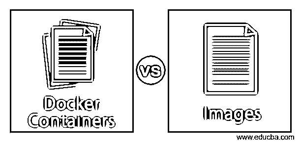
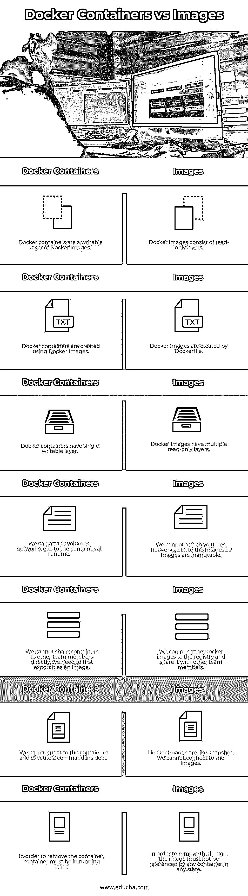
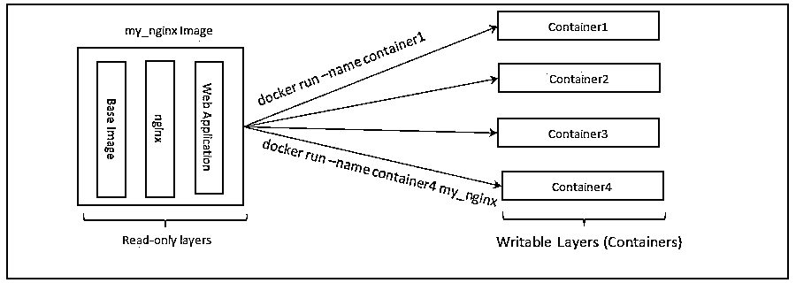
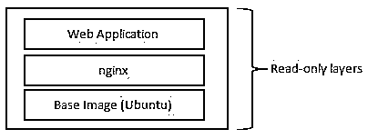

# Docker 容器与图像

> 原文：<https://www.educba.com/docker-containers-vs-images/>

## Docker 容器与图像的区别

下面的文章提供了 Docker 容器和图像的概要。Docker 容器是可写的图像，而图像是不可变的，这意味着要对图像进行更改，我们需要重写 docker 文件，或者对正在运行的容器进行更改，然后将其导出为图像。换句话说，容器是图像的运行实例，而图像是具有创建 Docker 容器的指令的只读模板。映像包括核心应用程序及其依赖项。

### Docker 容器与图像之间的直接比较(信息图)

以下是 Docker 容器和图像之间的 7 大区别:

<small>网页开发、编程语言、软件测试&其他</small>

### Docker 容器与图像的主要区别

让我们讨论一下 Docker 容器和图像之间的一些主要区别:

*   **建筑图:**

**码头集装箱:**

**Docker 图片:**

*   ****存储库:**** 我们无法将 Docker 容器存储到任何存储库中，因为 Docker 容器正在像 VM 一样运行实例，但它与 VM 不同，因为 Docker 容器没有成熟的操作系统。我们可以把图像储存在一个储存库中。我们有 Docker 自己提供的 hub.docker.com 公共存储库，但是我们可以在 hub.docker.com 上创建我们自己的存储库，并且如果我们愿意，可以保留我们的图像。我们也可以创建自己的私有注册表。
*   ****命令:****

| **Below are the commands to manage Docker containers:**1.要列出正在运行的 Docker 容器:**docker ps**码头集装箱 ls使用-a 标志列出所有容器2.要创建 Docker 容器:**docker 容器创建<name _ of _ the _ image>T1】**上面的命令只会创建一个容器，要运行一个容器我们需要运行:**docker 容器运行<name _ of _ the _ image>T1】**3.要停止 Docker 容器:**码头集装箱停靠<集装箱 _ 名称>T1】**我们也可以使用容器 ID 来代替 container_name。4.要移除容器，请执行以下操作:**码头集装箱 rm <集装箱 _ 名称>T1】**5.要删除所有未运行的容器:**码头集装箱修剪**

6.要检查任何 Docker 容器的日志:

**docker 集装箱日志<集装箱 _ ID>T1】**

7.要检查任何 Docker 容器的所有详细信息:

**码头工人集装箱检查<集装箱 _ ID>T1】**

8.要获得关于 Docker 容器命令的帮助:

**docker 容器–帮助**

 | **Below are the commands to manage Docker Images:**1.要列出 Docker 图像:**坞站图像 ls**使用-a 标志列出所有图像，它包括在构建新图像时创建的无标记中间图像。2.要使用 Dockerfile 创建或构建映像:**docker build-t<image _ name>T4【docker file _ loc>T1】**3.要删除 Docker 图像:**docker Image RM<Image _ ID>T1】**

我们也可以使用图像名称来代替 Image_ID。

4.要删除所有图像，包括悬挂图像:

**docker 图像修剪**

5.要了解任何特定 Docker 图像的更多信息:

**坞站图像检查< image_ID >**

6.要检查任何 Docker 图像的图层:

**docker 图像历史<image _ ID>T1】**

7.要获得关于 Docker 图像命令的帮助:

**docker 图像-帮助**

 |

*   **创建:**我们需要 Docker 图像来创建 Docker 容器。当我们创建一个容器 Docker 守护进程时，实际上只是在 Docker 映像之上添加了一个新的可写层。我们可以在其中进行更改，但是如果我们不使用任何永久存储或卷，更改将不会持久，因为如果容器被移除或销毁，数据将会丢失。我们需要 Dockerfile 来建立我们自己的 Docker 形象。Docker 文件有一组创建 Docker 图像的指令。每个指令创建一个层，因此，Docker 映像由多个层组成，这些层是只读的，一旦创建了 Docker 映像，我们就不能对其进行更改。我们需要更新 Docker 文件并重新创建 Docker 映像。
*   **惟一标识符:**每当我们创建一个 Docker 容器时，Docker 守护进程都会给它分配一个惟一的 ID，称为容器 ID。我们可以使用这个 ID 来管理 Docker 容器。为了方便起见，我们还可以给 Docker 容器起一个名字，但是在创建容器时这是可选的。如果我们没有给容器指定任何名称，Docker 守护进程会自动选择任何名称并分配给它。每当我们创建一个 Docker 映像时，Docker 守护进程都会给它分配一个惟一的 ID，称为映像 ID。在构建 Docker 图像时，我们必须强制命名 Docker 图像。
*   **共享:**我们无法共享 Docker 容器，因为它是 Docker 映像的运行实例。如果我们想要共享我们对 Docker 容器所做的更改，首先我们必须将 Docker 容器导出为 Docker 映像。我们可以轻松地与队友分享 Docker 图像，因为 Docker 图像是不可变的。我们可以将 Docker 图像推送到注册中心(存储库),以便其他人可以在需要时获取它。

### Docker 容器与图像比较表

让我们讨论一下 Docker 容器和图像之间的主要比较:

| **Sr 号** | **码头集装箱** | **图像** |
| 1. | Docker 容器是 Docker 图像的可写层。 | Docker 图像由只读层组成。 |
| 2. | Docker 容器是使用 Docker 图像创建的。 | Docker 图像由 Dockerfile 创建。 |
| 3. | Docker 容器只有一个可写层。 | Docker 图像有多个只读层。 |
| 4. | 我们可以附加卷、网络等。在运行时添加到容器中。 | 我们无法附加卷、网络等。因为图像是不可改变的。 |
| 5. | 我们不能直接与其他团队成员共享容器，我们需要首先将其导出为图像。 | 我们可以将 Docker 图像推送到注册表，并与其他团队成员共享。 |
| 6. | 我们可以连接到容器并在里面执行命令。 | Docker 图像就像快照，我们无法连接到图像。 |
| 7. | 为了移除容器，容器必须处于运行状态。 | 为了移除该图像，该图像在任何状态下都不能被任何容器引用。 |

### 结论

Docker 容器和图像是 Docker 最重要的两个对象。Docker 容器为运行任何应用程序提供了一致性，这意味着它将在任何环境中以相同的方式运行。Docker 映像使用多层文件系统，这使得它很轻量级，因为每一层只保留与其他层的差异，并且它还将应用程序的大小从千兆字节减少到兆字节。

### 推荐文章

这是 Docker 容器与图像的指南。在这里，我们讨论了 Docker 容器与图像的主要区别，包括信息图和比较表。您也可以看看以下文章，了解更多信息–

1.  [open hift vs docker](https://www.educba.com/openshift-vs-docker/)
2.  [LXD vs 码头](https://www.educba.com/lxd-vs-docker/)
3.  [坞站 vs VM](https://www.educba.com/docker-vs-vms/)
4.  [市场 vs 码头](https://www.educba.com/rkt-vs-docker/)

