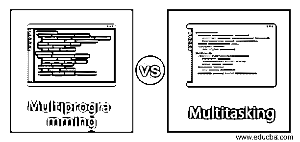
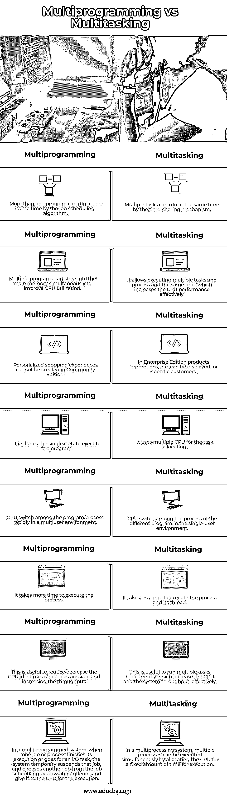

# 多道程序与多任务

> 原文：<https://www.educba.com/multiprogramming-vs-multitasking/>

## 多道程序与多任务的区别

多道程序设计是系统的一种能力，它允许一个以上的用户使用一个 CPU 同时使用计算机。这种思想是为了有效地优化单处理器的处理时间。通过属于同一系统的不同用途的每个进程来创建多个进程。它使 CPU 保持忙碌，从而增加了系统的吞吐量。

多任务处理是指一个用户在同一台计算机上并行/并发执行多个进程，该计算机可能使用单个或多个 CPU 进行处理。例如，在一个多任务操作系统中，我们可以在听音乐和使用网络浏览器或其他应用程序上网时处理 word 文档或演示文稿。

<small>网页开发、编程语言、软件测试&其他</small>

### 多道程序与多任务的直接比较(信息图)

以下是多道程序与多任务之间的 8 大区别:

### 多道程序与多任务的主要区别

以下是多道程序与多任务之间的主要区别:

*   术语“多道程序设计”是指进程的并行执行，这意味着多个进程可以通过同时使用单个处理器来并发执行，这增加了系统的吞吐量，其中操作系统负责有效地管理所有进程。
*   尽管多任务指的是操作系统使用单个或多个处理器同时执行多个任务的能力，但是系统的实现使用单个系统内的两个或更多个 CPU 或多核 CPU 来按照共享包括 CPU、存储器和 I/O 在内的公共资源的作业调度顺序分配和执行任务
*   多道程序设计依赖于上下文切换的概念，该术语指的是 CPU 在多个进程之间的切换——从一个进程或线程切换到另一个进程或线程，以实现单个 CPU 的更高程度的利用率。
*   通过使用程序控制块来实现上下文切换，程序控制块存储进程的 id、活动进程的当前状态、进程的存储器地址/数据、程序计数器、进程的寄存器；以便进程可以从切换的同一状态继续执行。而在多任务处理中，另一方面，依赖于时间/资源共享的概念，其基于任务的优先级及其调度算法在每个任务之间共享 CPU 时间，分时系统的一部分中的操作系统允许 CPU 在用户之间同时共享相同的资源。它是多道程序设计的扩展。
*   这两个术语都很常见，指的是现代操作系统中使用的几乎相同的含义，但具有不同的目标。多道程序设计的概念是基于系统存储程序或指令更长时间的能力，以便通过在 CPU 核心之间分配执行负载来同时执行程序或指令，这为多道程序设计系统创造了假象，CPU 根据优先级或程序/作业调度算法被分配用于程序的执行，OS 负责管理一次一个程序部分的执行，然后是另一个程序和进程的一部分，等等。而在多任务系统中，CPU 允许通过分时机制同时运行多个进程及其相应的线程，并根据给定的指令执行它们。
*   多道程序操作系统在用户之间提供了完全的透明性，因为系统同时被多个用户共享，其中多个用户同时共享同一个 CPU，CPU 从一个用户到另一个用户的切换非常迅速，这提高了 CPU 的利用率。它能够自动有效地分配资源，无需用户与系统进行交互和手动分配。操作系统执行程序的一个程序块，然后执行另一个程序的程序块/部分，但这造成了所有程序同时执行的假象。而在多任务操作系统中，多个程序或进程或线程交换多个用户，并且每个进程占用 CPU 的少量执行时间(这里，作业执行基于分时和资源机制)来执行自身及其相关进程。该过程发生得很快，因此看起来不同程序的多个任务同时/并发执行。

### 多道程序与多任务比较表

让我们看看多道程序与多任务的比较表。

| **多道程序** | **多任务处理** |
| 通过作业调度算法，可以同时运行多个程序。 | 通过分时机制可以同时运行多个任务。 |
| 它基于上下文切换机制。 | 它基于分时机制。 |
| 多个程序可以同时存储到主存中，以提高 CPU 的利用率。 | 它允许同时执行多个任务和进程，有效地提高了 CPU 的性能。 |
| 它包括执行程序的单个 CPU。 | 它使用多个 CPU 进行任务分配。 |
| 在多用户环境中，CPU 在程序/进程之间快速切换。 | CPU 在单用户环境中不同程序的进程间切换。 |
| 执行该过程需要更多时间。 | 执行进程及其线程花费的时间更少。 |
| 这有助于尽可能减少 CPU 空闲时间，提高吞吐量。 | 这对于并发运行多个任务非常有用，可以有效地增加 CPU 和系统吞吐量。 |
| 在一个多程序系统中，当一个作业或进程完成它的执行或去执行一个 I/O 任务时，系统临时挂起那个作业，并从作业调度池(等待队列)中选择另一个作业，交给 CPU 执行。 | 在多处理系统中，通过将 CPU 分配给固定的执行时间，可以同时执行多个进程。 |

### 结论

在多程序系统中，系统不会浪费 CPU 时间来等待新进程的执行。在多任务系统中，CPU 使进程共享时间片或在进程之间分配 CPU，并根据进程的优先级相应地执行它们。当一个进程的量程执行时间结束时，该进程被 CPU 临时挂起(进程过期),直到下一次轮到它执行，另一个进程由分配的 CPU 开始执行。

### 推荐文章

这是多道程序与多任务的指南。在这里，我们还将通过信息图和比较表来讨论多道程序与多任务的主要区别。您也可以看看以下文章，了解更多信息–

1.  [数据库管理系统 vs 文件系统](https://www.educba.com/dbms-vs-file-system/)
2.  [AngularJS vs Bootstrap](https://www.educba.com/angularjs-vs-bootstrap/)
3.  [元数据库与表格](https://www.educba.com/metabase-vs-tableau/)
4.  [WordPress vs WebFlow](https://www.educba.com/wordpress-vs-webflow/)

