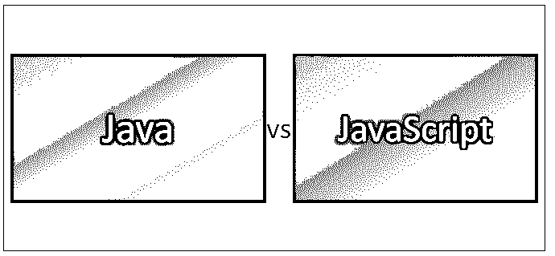
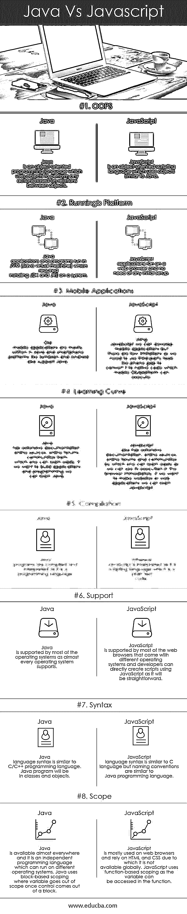

# Java vs JavaScript

> 原文：<https://www.educba.com/java-vs-javascript/>

## Java 和 JavaScript 的区别

Java 是 1995 年开始使用的面向对象编程语言。Java 是由后来被甲骨文收购的太阳微系统公司开发的。用 Java 开发的程序或应用程序将在 JVM (Java 虚拟机)中执行，通过 JVM，我们可以在多个平台和系统/设备等上运行相同的程序。JavaScript 是一种面向对象的脚本语言，允许您在网页中创建具有交互式效果的动态 HTML 页面。在谷歌 chrome 发布其 JavaScript 引擎“node.js”之前，浏览器中一直有 JavaScript。

### Java 和 JavaScript 的直接比较

以下是 Java 与 JavaScript 之间的 8 大对比:

<small>网页开发、编程语言、软件测试&其他</small>

### Java 和 Java-Script 的主要区别:

下面是描述 Java 和 JavaScript 区别的要点列表:

*   Java 是一种强类型语言，而 JavaScript 是一种松散类型语言，也就是说，我们需要在使用变量之前使用 set 对象来声明变量，而在 JavaScript 中，我们可以灵活地使用变量。
*   Java 是一种编译和解释的编程语言，在 JVM 上执行，需要 JDK 和 JRE，而 JavaScript 是解释的，在浏览器上执行，是纯文本。
*   Java 与字节码是平台无关的，而 JavaScript 代码是基于浏览器兼容性编写的。有些代码可能适用于特定的浏览器版本，但不适用于同一浏览器的不同版本。
*   Java 有静态类型语言，而 JavaScript 是动态类型语言，是在编译时用数据类型声明的变量，JavaScript 可以接受不同类型的数据类型。
*   在 Java 中，我们有构造函数的支持，而在 JavaScript 中，构造函数是一个函数，在 JavaScript 中没有像在 Java 中那样的构造函数规则。
*   Java 是基于类的编程语言，而 JavaScript 是基于原型的，尽管它具有面向对象的编程能力。
*   Java 以分号结束非块语句，而 JavaScript 在某些行的末尾使用分号。
*   Java 有一个隐式的类作用域，而 JavaScript 有一个隐式的全局作用域。
*   Java 支持不同的数字数据类型，而 JavaScript 主要处理浮点数据类型。
*   Java 有一个只接受常量的开关结构，而 JavaScript 也有一个接受任何值的开关结构。
*   Java 支持对类的注释，而 JavaScript 在相同的声明上用不同的语义来修饰。
*   JavaScript 支持闭包，我们可以将一个函数作为参数传递给另一个函数，而 Java 没有这种支持，但可以使用匿名类来实现。
*   Java 支持 Enum 数据类型，通过它我们可以声明一组常量，而 JavaScript 没有常量声明集。
*   Java 和 JavaScript 语言本质上都是开源的，因为我们可以编辑或修改实际代码并使用。Java 使用基于线程的方法实现并发，而 JavaScript 使用基于事件的机制。
*   JavaScript 在 GitHub developer 上最近 5 年创建的项目中更受欢迎。

### Java 与 JavaScript 的比较表

以下是 Java 与 JavaScript 的对比表:

| **比较的基础** | **Java** | **JavaScript** |
| **哎呀** | Java 是一种面向对象的编程语言，它使用对象来执行基于对象之间关系的任何操作。 | JavaScript 是一种面向对象的脚本语言，使用类似于 Java 的对象。 |
| **运行平台** | Java 应用程序和程序在 JVM (Java 虚拟机)中运行，这需要在系统上安装 JDK 和 JRE。 | JavaScript 应用程序在网络浏览器上运行，不需要任何初始设置。 |
| **移动应用** | 旧的移动应用程序大多是用 Java 编写的，像 Symbian 和 Android 这样的智能手机平台也支持 Java。 | 使用 JavaScript，我们可以开发移动应用程序，但限制很少，因为我们需要使用第三方工具，如 phone gap，将它们转换为移动操作系统/平台可以执行的本机代码。 |
| **学习曲线** | Java 有大量的文档、在线资源、在线论坛和社区，人们可以从中轻松学习。如果我们想构建应用和编程，我们可以学习 Java。 | JavaScript 也有大量的文档、在线资源、在线论坛和社区，人们可以很容易地学习，因为我们可以立即在浏览器中看到它的执行。如果我们想做网站或者 web 应用，可以学习 JavaScript。 |
| **编译** | Java 程序被编译和解释，因为它是一种编程语言。 | 而 JavaScript 被解释为是一种纯文本代码的脚本语言。 |
| **支持** | 大多数操作系统都支持 Java，因为几乎每个操作系统都支持它。 | 不同操作系统的大多数 web 浏览器都支持 JavaScript，开发人员可以使用 JavaScript 直接创建脚本，因为这很简单。 |
| **语法** | Java 语言语法类似于 C/ [C++编程语言](https://www.educba.com/c-programming-language-basics/)。Java 程序将在类和对象中。 | JavaScript 语言语法类似于 C 语言，但命名约定类似于 Java 编程语言。 |
| **范围** | Java 几乎随处可见，它是一种独立的编程语言，可以运行在不同的操作系统上。Java 使用基于块的作用域，一旦控制脱离块，变量就脱离了作用域。 | JavaScript 主要用在网络浏览器上，依赖于 HTML 和 CSS，因此它并不是全球通用的。JavaScript 使用基于函数的作用域，因为变量可以在函数中访问。 |

### 结论

最后，是对 Java 和 JavaScript 之间的比较的概述。我希望你能很好地理解这两种语言。学习 Java 和 JavaScript 都有好处，因为如果我们掌握了，我们可以成为全栈开发人员。由于它们几乎是不同的语言，一种将用于大多数应用程序和后端程序，而另一种将用于制作 web 应用程序，使用它的交互式效果/功能，可以在不同的浏览器上运行。

### 推荐文章

这是 Java 和 JavaScript 的有用指南；我们已经讨论了它们的含义、直接比较、主要差异和结论。您也可以阅读以下文章，了解更多信息——

1.  [节点 JS vs Java](https://www.educba.com/java-vs-node-js/)
2.  [Java vs Python](https://www.educba.com/java-vs-python/)
3.  [Java vs PHP](https://www.educba.com/java-vs-php/)
4.  [Java vs Java EE](https://www.educba.com/java-vs-java-ee/)

