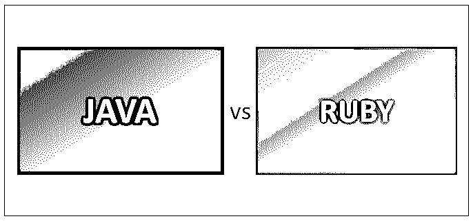
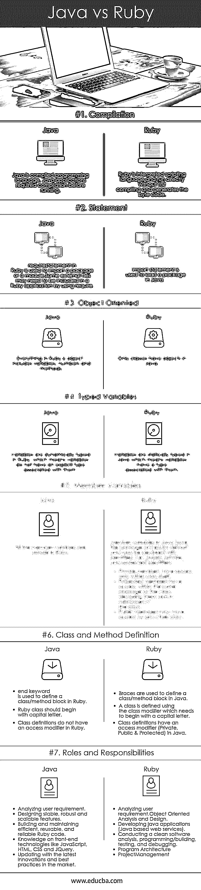

# Java vs Ruby

> 原文：<https://www.educba.com/java-vs-ruby/>

## Java 和 Ruby 的区别

Java 是一种编程语言，language.Java 是一种独立于平台的语言。这意味着 java 不特定于任何处理器，也不运行在大多数操作系统上，包括 Mac OS、Windows 和 Linux。如前所述，Java 也是一个计算平台。Java 平台是帮助开发和运行用 Java 编程语言编写的程序的程序集合。Java 平台还包括一个执行引擎、编译器和一组库。Ruby 是一种脚本语言。Ruby 是一种面向对象的编程语言，是一种强大的、动态的、灵活的、解释的、反射的、面向对象的和通用的编程语言，具有复杂但同时又富有表现力的语法。它还拥有核心类库和丰富而强大的 API。

### Java 语言(一种计算机语言，尤用于创建网站)

Java 是一种编程语言，也是一种用于应用程序开发的计算平台，最初由 Sun Microsystems 发布，后来被 Oracle Corporation 在 2009 年收购。如今，Java 平台通常被用作在 web 上开发和交付内容的基础。Java 非常快速、健壮、可靠和安全。它是一种通用编程语言，具有许多特性，这使得它适合在 WWW(万维网)上使用。

<small>网页开发、编程语言、软件测试&其他</small>

### 红宝石

Ruby 是由 Yukihiro Matsumoto 在 20 世纪 90 年代中期设计和开发的一种脚本语言。Ruby 是开源的，也可以在网上免费获得，但需要许可。Ruby 拥有许多 Python 和 Perl 脚本语言所拥有的相似特性。Ruby 编程语言主要关注简单和更高的生产率，具有优雅的语法，易于阅读和编写。Ruby 中的每一个代码都有自己的属性和动作。这里属性意味着变量，动作意味着方法。Ruby 遵循 POLA 原则—**最小惊讶原则**,这意味着 Ruby 语言的行为方式是为了尽量减少有经验用户的困惑。

### Java 和 Ruby 的面对面比较(信息图表)

下面是 Java 和 Ruby 的 7 大对比:

### Java 和 Ruby 的主要区别

以下是要点列表，描述了主要区别:

1.  Java 需要在运行应用程序之前编译，而 Ruby 不需要编译代码。
2.  只有类是对象，而 Ruby 中的一切都是对象。
3.  Java 中的变量是静态类型的，而在 Ruby 中，变量是动态类型的。
4.  在 Java 中，成员变量有访问标识符(Private、Public 和 Protected ),而在 Ruby 中，默认情况下所有成员变量都是私有的。
5.  空值声明在 Java 和 Ruby 中是不同的，它们使用不同的关键字进行声明，例如，在 Java 中用“Null”来声明空值，而在 Ruby 中用“nil”关键字来声明空值。
6.  Java 和 Ruby 中的造型也不同。在 Java 中，如果被强制转换的对象是被强制转换到的对象的类型，则对象可以被强制转换到其他对象。但是在 Ruby 中，不使用强制转换，因为变量是动态类型的，也可以赋给任何其他类型。
7.  在 Java 中，方法在默认情况下拥有包访问权限，并且需要返回类型，而 Ruby 中的方法以 **def** 开始，以**end**结束。
8.  在 Java 中，方法调用中的括号是强制性的。例如，通过下面的程序定义一个返回 hello 消息的方法 Hello。

`public class Hello {
public String hello(String name){
return "Hello "+ name;
}
}`

但是在 Ruby 中，方法调用中的括号不是强制的，而是可选的。例如，定义一个方法 hello，它接受一个名称参数并返回一条 Hello 消息。

`class Hello
def hello(name)
return "Hello " +name
end
end`

9.  在 Java 和 Ruby 中，一个类可以扩展到另一个类。在 java 中，可以使用关键字–**扩展**来扩展类，如下所示:

`public class LinkedHashSet extends HashSet{}`

但是在 Ruby 中，一个类可以使用 ***' < '*** 扩展到另一个类。例如，Catalog 类扩展了 ActiveRecord::基类。

`class Catalog < ActiveRecord::Base
end`

使用 Java 中的 **try-catch-finally** 构造来处理异常，该构造由一个 try 块、一个或多个 catch 块组成，后面可选地跟着一个 final 块。而在 Ruby 中，通过使用**begin-rescue-assure-end**构造来处理异常。

### Java 与 Ruby 对照表

下面是 Java 和 Ruby 的对比表

| **比较
的依据** | **Java** | **红宝石** |
| **编译** | Java 是编译型编程语言。Java 应用程序在运行前需要编译。 | Ruby 已经解释了脚本语言，不需要先编译就可以直接运行并生成字节码。 |
| **声明** | ***require***a statement in Ruby is used to import a package or a module.一些外部文件可能需要包含在 Ruby 应用程序中，通过使用 ***要求*** 。 | ***导入*** 语句用于加载 Java 中的一个包。 |
| **面向对象** | Ruby 中的一切都是对象——包括变量、数字和方法。 | 在 Java 中只有类有对象。 |
| **类型化变量** | 在 Ruby 中，变量是动态类型的，这意味着变量没有与之相关联的显式类型。 | 变量在 Java 中是静态类型的，这意味着变量有一个与之相关的类型。 |
| **成员变量** | 所有的成员变量在 Ruby 中都是私有的。 | 默认情况下，Java 中的成员变量具有包访问权限，并且可以用标识符(即公共、私有和受保护的标识符)来声明。私有成员只能在类本身内部访问。*   Public members can be accessed through any other class.*   Protected members have access rights in the same package as the class in which they are declared and in subclasses of that class. |
| **Class and Method Definition** | 

*   ***end*** ***keyword*** is used to define a class/method block in Ruby.
*   Ruby class should start with a capital letter. Class definitions in Ruby have no access modifiers.

 | 

*   ***curly braces*** are used to define a class/method block in Java. Use the class modifier to define a class, which needs to start with an uppercase letter.
*   A class definition has an access modifier (Private, Public & Protected) in Java.

 |
| **角色和职责** | 

*   分析用户需求。
*   设计稳定、健壮和可扩展的特性。
*   构建和维护高效、可重用和可靠的 Ruby 代码。
*   了解前端技术，如 JavaScript、HTML、CSS 和 JQuery。
*   利用市场上最新的创新和最佳实践进行更新。

 | 

*   分析用户需求。
    面向对象的分析与设计。
*   开发 Java 应用程序(基于 Java 的 web 服务)。
*   进行干净的软件分析、编程/构建、测试和调试。
*   程序体系结构
*   项目管理

 |

### 结论

Java 和 Ruby 都很相似，有很多相似的特性。同时，它们都有自己的特定功能，有助于满足特定的需求。但可以肯定的是，Ruby 不是 Java 的替代品。Java EE 是用 Java 和 Ruby 开发模型-视图-控制器应用程序的企业框架；Ruby on Rails 是模型-视图-控制器框架。

### 推荐文章

这是一本关于 Java 和 Ruby 的区别、它们的意义、直接比较、关键区别、比较表和结论的指南。您也可以阅读以下文章，了解更多信息——

1.  [Java 和 JavaScript](https://www.educba.com/java-and-javascript/)
2.  [Java vs Python](https://www.educba.com/java-vs-python/)
3.  [Java vs PHP](https://www.educba.com/java-vs-php/)
4.  [Java vs Java EE](https://www.educba.com/java-vs-java-ee/)

