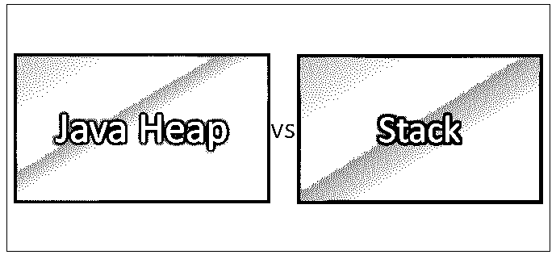
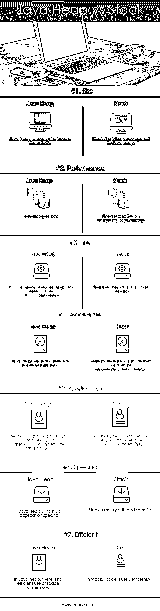

# Java 堆与栈

> 原文：<https://www.educba.com/java-heap-vs-stack/>

## Java 堆和栈的区别

Java 虚拟机(JVM)从操作系统中分配一些内存，JVM 使用这些内存来创建对象和实例，这些内存称为 Java 堆。Java 堆用作动态内存分配。它主要位于地址的底部，当堆大小变满时垃圾被收集。将要存储的局部变量和方法调用存在于称为堆栈的指定内存中。堆栈内存遵循后进先出(LIFO)的规则。堆栈被称为静态内存分配。与堆内存大小相比，内存堆栈的大小[更小。](https://www.educba.com/what-is-heap-memory/)

**让我们更详细地研究一下 Java 堆和栈:**

<small>网页开发、编程语言、软件测试&其他</small>

*   Java 堆分为两个主要部分，年轻空间和老空间。年轻空间是 Java 堆内存的一部分，它是为存储新对象创建而分配或保护的。当这个空间在一定时期内变满并且有效，并且现在这些空间没有被使用时，它被移动到其他部分，这些部分是保留用于放置旧对象的旧空间。
*   在 java 堆中，垃圾收集是清除死的或不使用的对象的过程，这有助于从堆中释放空间，为新的对象或实例腾出空间。
*   当方法被调用时，它的堆栈框架将被放在调用堆栈的顶部。堆栈框架保存一个方法的状态，该方法包含正在执行的特定代码行和所有局部变量。堆栈的当前运行方法总是位于堆栈顶部的方法。
*   当调用方法来保存方法的值和对象引用时，已经在堆栈中创建了块。在一个方法执行后，该块不再被使用，并成为空闲，可用于下一个方法。
*   堆栈用于执行线程。每个线程都有 Java 虚拟机堆栈，JVM 堆栈存储帧。这些方法被分配给堆栈内存，对内存的访问非常快。我们不能改变 Java 虚拟机堆栈；只能通过 java 栈上的 push 和 pop 来完成。随着 push 和 pop 对局部变量的处理，Java 栈变得越来越大，越来越小。JVM 在方法调用和返回中扮演自己的角色。简单来说，Java 栈就是存储方法和变量。

### Java 堆和栈的直接比较(信息图)

下面是 Java 堆与栈的 7 大比较:

### Java 堆和栈的主要区别

下面解释了一些要点，展示了 Java 堆与栈之间的区别:

1.  Java 堆是内存的一部分，其中的元素可以以任何顺序存储和移除。在堆栈中，元素可以按照后进先出(LIFO)的规则存储和移除。
2.  当 Java 堆被占满时，抛出内存错误或 Java 堆空间错误。当堆栈内存被占用时，它会抛出一个堆栈溢出错误。
3.  对于 Java 堆， *Xms 和 Xmx* java 虚拟机选项可以用来定义起始大小和最大大小。对于 Java 堆栈， *Xss* JVM 可以用来定义堆栈内存的大小。
4.  当新对象被创建后，它被简单地存储在 Java 堆内存中。新对象的引用已经存储在堆栈内存中。
5.  当用户对运行时所需的数据量没有任何概念时，可以使用 Java 堆。当用户确切知道编译前所需的数据量时，可以使用堆栈。
6.  在堆中，不依赖任何元素来访问其他元素。任何元素都可以在任何时候随机访问。在堆栈中，访问元素有特定的顺序。
7.  堆更复杂，因为有时它不知道内存是被占用还是空闲。在堆栈中，它是简单而容易的。

### Java 堆与堆栈比较表

下面是 Java 堆和栈的对照表:

| **BASIS FOR****比较** | **Java 堆** | **堆栈** |
| **尺寸** | Java 堆内存的大小超过了一个堆栈。 | 与 Java 堆相比，堆栈的大小较小。 |
| **性能** | Java 堆慢。 | 与 java 堆相比，堆栈非常快。 |
| **人生** | Java 堆内存有很长的寿命，从应用程序的开始到结束。 | 堆栈内存寿命较短。 |
| **可访问** | 存储的 Java 堆对象是全局可访问的。 | 存储在堆栈内存中的对象不能跨线程访问。 |
| **应用** | Java 堆内存由应用程序的每个部分在执行时使用。 | 部分使用的堆栈内存意味着在执行一个线程时一次使用一个。 |
| **具体的** | Java 堆主要是特定于应用程序的 | 堆栈主要是特定于线程的。 |
| **高效** | 在 Java 堆中，没有有效利用空间或内存。 | 在堆栈中，空间得到有效利用。 |

### 结论

Java 堆和栈都是系统内存管理的一部分。它在设计和实现应用程序时起着至关重要的作用。对于一个人来说，在从事现场项目工作之前，内存管理知识是必要的。这使得您的应用程序更快，更容易管理。

堆栈在异常处理和线程执行中非常重要。堆栈的值主要存在于创建它们的方法或函数的范围内；如果该函数返回任何值或被执行，则堆栈块已被移除。Java 只在堆栈上存储局部变量原语。Java 堆和栈的主要区别在于值的生命周期意味着变量如何分配给内存以及如何为特定的应用程序释放。

### 推荐文章

这是 Java 堆和栈之间区别的有用指南；我们讨论了它们的含义、直接比较、主要差异和结论。您也可以阅读以下文章，了解更多信息——

1.  [JavaScript 应用或调用](https://www.educba.com/javascript-apply-vs-call/)
2.  [JavaScript vs Ruby](https://www.educba.com/javascript-vs-ruby/)
3.  [MapReduce vs Spark](https://www.educba.com/mapreduce-vs-spark/)
4.  [Java vs JavaScript](https://www.educba.com/java-vs-javascript/)

