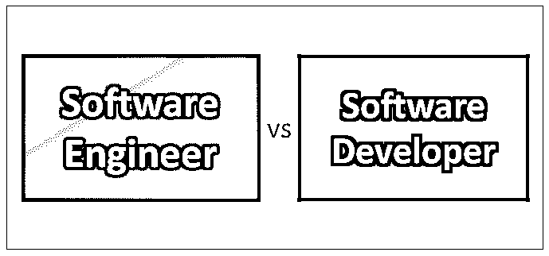
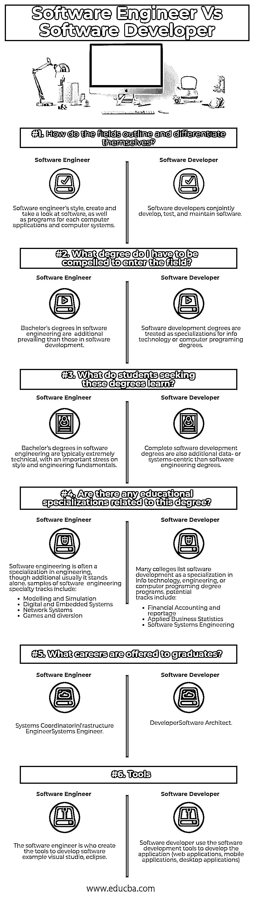

# 软件工程师 vs 软件开发人员

> 原文：<https://www.educba.com/software-engineer-vs-software-developer/>

## 软件工程师和软件开发人员的区别

在商业中，术语软件工程师和软件开发人员可以互换使用。软件工程被描述为“对软件的事件、操作和维护的科学的、有纪律的、定量的方法的应用；那就是，把工程学应用到软件中”。软件开发人员大部分时间都是像编码员或程序员一样写代码。他们是通才，将在软件开发方法中从事不同任务的传播工作。

### 什么是软件工程？

软件工程包括需求收集和分析。它包括对现有软件程序的研究，并确定需要改进的领域。毫无疑问，[计算机程序员](https://www.educba.com/computer-programming-language/)不仅仅是简单地编码，而是在软件风格中使用工程原理的人，这意味着他们必须了解工程，为什么以及如何与软件创作相关。

<small>网页开发、编程语言、软件测试&其他</small>

软件工程包括:-

1.  需求收集和分析。
2.  研究现有的软件程序并确定需要改进的地方
3.  评估消费者的节目需求
4.  监视计算机程序员编写程序代码
5.  看一看代码，以创建积极的，它正常工作
6.  但是，要核实新软件将被放入
7.  进行系统设计。
8.  原型制作。
9.  软件开发和编码部分。
10.  与购买者的讨论。
11.  解决纷争
12.  部署
13.  后续行动
14.  通常一起处理硬件和网络部分
15.  进行演示
16.  更像是测试，团队领导等。

基本上，它包含每个不同的因素软件方法以及事件。

### 什么是软件开发？

软件开发人员编写代码，并在不同软件开发任务的范围内工作。随着系统和编码语言的普及，软件开发人员将所有这些东西放在一起以满足需求。

软件开发商将:-

1.  产生后端和信息
2.  开发前端应用程序
3.  与采购员和不同的开发人员合作制作程序
4.  然而，确定所需的软件应该运行
5.  评估现有软件并倡导升级
6.  开发能够构建正常工作的计算机应用程序的软件
7.  给程序员一个图表，这样他们就可以编写并查看代码。
8.  生产软件的中间层
9.  针对软件的不当使用向用户提供建议
10.  为用户需求提供更高的选择
11.  与第三方程序集成
12.  部署应用程序

### 软件工程师和软件开发人员(信息图表)

下面是软件工程师和软件开发人员的 6 大对比

### 软件程序员和软件工程师的工作前景？

雇主可以选择使用完全不同的头衔。无论你所在的地理区域流行什么，记住责任市场的现实是至关重要的。在接下来的几年里，拥有专业的、全面的信息的软件专业人员的工作前景将会比那些拥有编程经验的人好得多。劳工统计局预计，在 2008 年至 2018 年期间，软件工程师的工作岗位将增加 32%。在这些年里，程序员的工作被认为会在三年前说不。根据 BLS，软件工程职位不太可能被外包。

### 软件工程师与软件开发人员对照表

以下是积分列表；描述这些比较:

| **基础比较** | **软件工程师** | **软件开发商** |
| 这些领域是如何勾勒出自己的轮廓并区分开来的？ | 软件工程师的风格是创建并查看软件，以及每个计算机应用程序和计算机系统的程序。 | 软件开发人员共同开发、测试和维护软件。 |
| 我要被逼到什么程度才能进入这个领域？ | 软件工程学士学位比软件开发学士学位更受欢迎。 | 软件开发学位被视为信息技术或计算机编程学位的专门化。 |
| 寻求这些学位的学生学到了什么？ | 软件工程学士学位通常技术性很强，强调风格和工程基础。 | 完整的软件开发学位也是比软件工程学位更以数据或系统为中心的学位。 |
| 有没有与这个学位相关的教育专业？ | 软件工程通常是工程中的一个专业，虽然是附加的，但通常是独立的。软件工程专业赛道样本有:

*   Modeling and simulation
*   Digital and embedded system
*   network system
*   Games and entertainment

 | 许多大学将软件开发列为信息技术、工程或计算机编程学位项目中的一个专业。潜在的轨迹包括:

*   Accounting and reportage
*   Applied business statistics
*   Software system engineering

 |
| 毕业生可以从事哪些职业？ | Systems Coordinator基础设施工程师系统工程师 | Developer软件架构师 |
| **工具** | 软件工程师是创建工具来开发软件的人。 | 软件开发人员使用软件开发工具来开发应用程序(web 应用程序、移动应用程序、桌面应用程序) |

### 结论

因为这些术语经常被混淆，所以很难理解谁是计算机程序员，谁精通软件开发方法的某一部分——举例说明编码。软件工程师和软件开发人员是网状术语；然而，它们并不意味着完全相似的因素。一个计算机程序员从事软件开发；然而，并不是所有的软件开发者都是工程师。软件工程建议将工程原理应用于软件创作。谈论一个没有质量或不占用空间的工程事物会显得很奇怪；然而，软件是嵌入有质量的东西中的。

该软件将从分发我们的药物到管理大量的工具。我们中的许多人共同接受软件来执行工作职责，不管它们是否增加了工作场所或远程办公。众所周知，软件应用程序会出现故障。这不仅仅是弥合那场崩溃…也不仅仅是需要一个良好基础的桥梁。软件工程师从对必需品的深入研究开始。他们以系统的方式经历事件方法；这可以被称为软件开发生命周期。

### 推荐文章

这是软件工程师和软件开发人员之间的区别、他们的意义、直接比较、关键区别、比较表和结论的指南。你也可以看看下面的文章来了解更多。

1.  [数据科学家 vs 软件工程师](https://www.educba.com/data-scientist-vs-software-engineer/)
2.  [数据科学 vs 软件工程](https://www.educba.com/data-science-vs-software-engineering/)
3.  [数据科学家 vs 数据工程师](https://www.educba.com/data-scientist-vs-data-engineer/)
4.  [机器学习 vs 人工智能](https://www.educba.com/machine-learning-vs-artificial-intelligence/)

