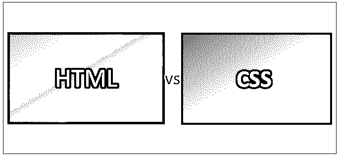
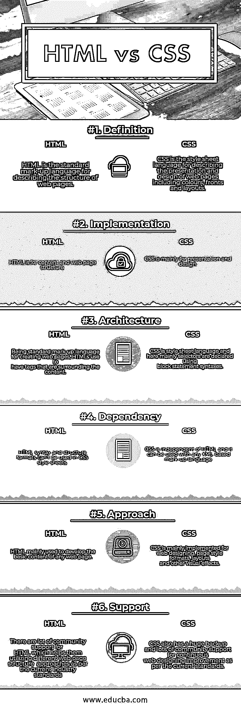

# HTML 与 CSS

> 原文：<https://www.educba.com/html-vs-css/>

## HTML 和 CSS 的区别

HTML(超文本标记语言)和 CSS(级联样式表)是用于构建网页和 web 应用程序的两种核心 web 脚本语言。HTML 提供网页的结构，而 CSS 主要用于控制网页的样式和布局(视觉和听觉)。HTML 提供了围绕任何网页元素内容的标签。TML 标记由不同类型的组件组成，包括标签、实体引用、基于字符的类型和引用。CSS 是一种样式表语言，用于描述网页的表示和设计，包括颜色、字体和布局。它主要是为了区分外观和内容，包括颜色、布局和正面。

在这里，我们将详细讨论 HTML 和 CSS 之间的区别。

<small>网页开发、编程语言、软件测试&其他</small>

HTML 基本上是描述网页结构的标准标记语言。这样，可以实现网页的标题和内容结构。HHTML 文档类型声明是 HTML 的另一个组成部分。它用于触发标准模式渲染。HTML 文档通常由嵌套的 HTML 元素结构组成。HTML 元素的一般格式可以描述如下:

### HTML 和 CSS 的例子

例如:<tag attribute1="“value1”" attribute2="”value2”">【内容】</tag>。这里，

*   HTML 元素定义了网页的特定部分。
*   开始标签:<tag attribute1="“value1”" attribute2="”value2”">(用于定义元素的开始)</tag>
*   内容:可以是文本、链接、图像和网页上的其他信息。
*   结束标签:(用于声明 HTML 元素的结束)

CSS 可以用在不同类型的设备上，像大或小的屏幕和打印机。它独立于 HTML，可以用于任何基于 XML 的标记语言。万维网联盟主要维护 CSS 规范。CSS 规则集由选择器和声明块组成。可以描述如下:

例如:h1 {颜色:白色；字体样式:斜体}。这里，

*   **选择器:** h1(表示需要样式化的 HTML 元素)
*   **属性:**“颜色和字体样式”(定义元素需要改变的方面)
*   **声明块:**“颜色:白色；font-style: italic”(它描述了一个或多个由分号分隔的声明)
*   **值:**“白色和斜体”(表示所选属性的参数。

就像硬币的两面，HTML 和 CSS 都有一些优点和缺点。

### 利弊

以下是 HTML 和 CSS 的一些优缺点:

**HTML(优点)**

*   易于学习和编码
*   它可以免费使用，不需要许可证
*   由浏览器正确解释
*   它支持多种语言
*   轻量级，支持多种平台
*   大型社区支持

**HTML (Cons)**

*   它的安全功能有限
*   缓慢的技术进步
*   作为一种静态语言，它不能产生动态输出

**CSS (Pros)**

*   它拥有比 HTML 更广泛的属性
*   它提高了网站速度，网页正确加载的时间也更少了
*   它支持离线浏览
*   它与多种设备兼容
*   它很容易维护
*   良好的社区支持
*   它提供了比 HTML 更好的网页风格格式

**CSS (Cons)**

*   它有一个碎片问题，因此，它在两个浏览器之间有一个性能[差异。](https://www.educba.com/variance-vs-standard-deviation/)
*   作为一个开放的基于文本的系统，它没有任何内置的安全性
*   它有时会变得混乱，并且会使代码变得复杂。

### HTML 和 CSS 的直接比较(信息图表)

以下是 HTML 和 CSS 之间的 6 大区别:

### HTML 和 CSS 的主要区别

HTML 和 CSS 之间的主要区别可以从以下几点来解释:

1.  HTML 基本上是用于描述网页结构的标准标记语言，而 CSS 是用于描述网页表现和设计的样式表语言
2.  HTML 易于学习，语法清晰，而 CSS 有时会变得混乱，会使代码复杂化。
3.  CSS 是独立于 HTML 的，它可以用于任何基于 XML 的标记语言，而 HTML 就不一样了
4.  HTML 文件可以包含 CSS 代码，但另一方面，CSS 不能包含 HTML 代码。
5.  HTML 提供了包围任何网页元素内容的标签，而 CSS 由被声明块包围的选择器组成
6.  CSS 有碎片化，HTML 不产生任何这样的问题。
7.  CSS 比 HTML 使用更少的代码，从而产生更少的网页加载时间

### HTML 和 CSS 对照表

以下是要点列表，描述 HTML 和 CSS 之间的比较。

| **比较依据** | **HTML** | **CSS** |
| **定义** | HTML 是描述网页结构的标准标记语言 | CSS 是一种样式表语言，用于描述网页的表示和设计，包括颜色、字体和布局 |
| **实施** | HTML 用于内容和网页结构 | CSS 主要用于展示和设计 |
| **架构** | 作为创建网页的标准标记语言，HTML 过去常常有围绕内容的标签。 | CSS 是样式表语言，这里主要使用块语句语法声明选择器 |
| **依赖关系** | HTML 语法和结构格式不能在 CSS 样式表中使用 | CSS 独立于 HTML，它可以用于任何基于 XML 的标记语言 |
| **接近** | HTML 主要用于开发任何网页的基本内容。 | CSS 主要用于网页设计、页面风格格式、布局和其他视觉效果。 |
| **支持** | HTML 有很多社区支持，这有助于他们根据当前的行业标准利用不同的网页结构方法。 | CSS 也有一个巨大的备份和大量的社区支持，按照当前的标准不断改进网页设计 |

### 结论

在比较了 HTML 和 CSS 的一系列因素后，可以得出结论，这是两种用于网页开发的核心 web 脚本语言，但在同一时间点上，每种语言都有自己的优点和缺点。所以，在选择任何一种语言之前，开发者应该学习和分析 HTML 和 CSS 语言的不同方面。因此，基于项目需求的类型、工作时间和其他讨论的方面，应该选择这些 web 脚本语言来达到期望的目标。

### 推荐文章

这是 HTML 和 CSS 之间区别的指南。这里我们已经讨论了 HTML 和 CSS 的直接比较、关键差异、信息图和比较表。您也可以阅读以下文章，了解更多信息——

1.  [角度与自举](https://www.educba.com/angular-vs-bootstrap/)
2.  [HTML 和 XML](https://www.educba.com/html-vs-xml/)
3.  [HTML vs HTML5](https://www.educba.com/html-vs-html5/)
4.  [Angular vs JQuery](https://www.educba.com/angular-vs-jquery/)

