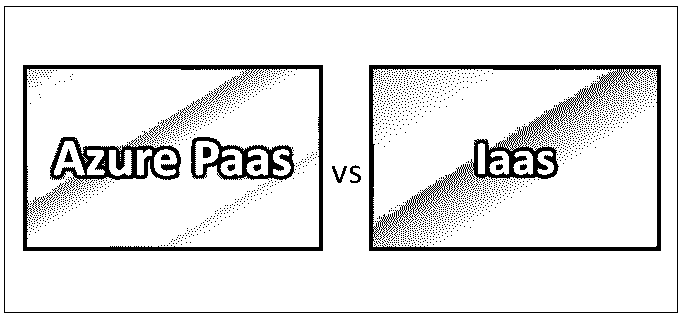
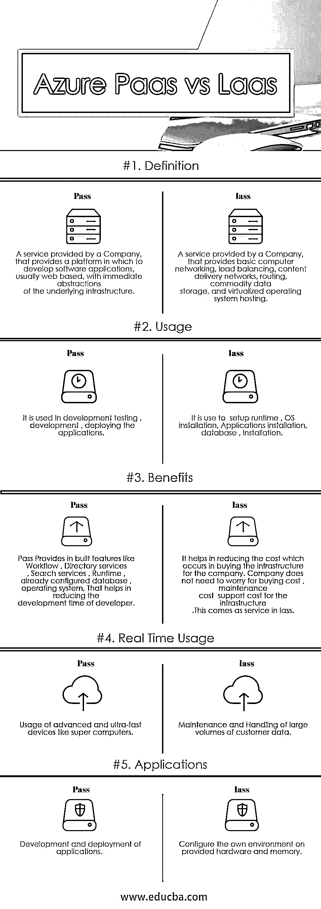

# Azure Paas vs Iaas

> 原文：<https://www.educba.com/azure-paas-vs-iaas/>

## Azure Paas 与 Iaas 的区别

Paas 代表平台即服务。它已经为 web 应用程序提供了一个内置的基础设施；它管理 web 应用程序的整个生命周期，从开发、测试、部署到支持。可以轻松地远程为应用程序提供持续支持。IaaS 代表基础设施即服务，在这种服务中，公司不需要担心硬件、内存、处理器、Ram 等基础设施。该公司必须只关注安装运行时、[操作系统](https://www.educba.com/functions-of-operating-system/)的安装。这样，it 部门最大限度地降低了购买自己的基础架构和管理的成本。

### 蓝色的 Paas

*   Paas 平台即服务建立在 Iaas 之上，因此它提供 Iaas 的所有功能以及自己的功能，如[商业智能 BI 服务](https://www.educba.com/business-intelligence-interview-questions/)、中间件、开发工具；它管理 web 应用程序项目的整个生命周期，企业应用程序是目前市场上更多的移动应用程序。
*   Paas 平台即服务有助于公司削减成本。公司不需要担心购买软件许可证、安装、配置、基础设施、硬件或内存；这些特征都通过了；除此之外，它还提供安全性、工作流和目录服务。

### Iaas

*   在 Iaas 中，[云计算服务](https://www.educba.com/cloud-computing-services/)提供商管理基础设施，同时购买、安装、配置和管理我们自己的[软件操作系统](https://www.educba.com/software-engineering-interview-questions/)、中间件和应用。它也被称为云中的服务器；它提供了服务器、网络、操作系统、存储等基础设施。
*   它提供了一个我们可以完全控制的虚拟机。事实证明，它非常类似于[传统的 web 托管](https://www.educba.com/what-is-web-hosting/)，企业将使用托管环境作为内部数据中心的逻辑扩展。
*   在 Iaas 基础设施即服务中，我们只需为我们使用的东西付费；它可以轻松地根据需求进行扩展，也可以根据互联网上的请求进行缩减。

### Azure Paas 和 Iaas 之间的直接比较(信息图)

以下是 Azure Paas 和 Iaas 之间的 5 大区别:

<small>网页开发、编程语言、软件测试&其他</small>

### Azure Paas 和 Iaas 之间的主要区别

以下是要点列表，描述了 [Azure](https://www.educba.com/what-is-azure/) Paas 和 Iaas 之间的主要区别:

1.  [pass 是一个平台](https://www.educba.com/what-is-paas/)即服务，它提供了一个平台，您可以在此平台上开发和部署您的 web 应用程序或任何其他类型的应用程序开发，而无需担心基础架构和运行时环境管理。
2.  pass 是一个提供基本基础设施的平台，在这个平台上，您可以配置自己的运行时数据库和操作系统，而不用担心硬件成本和内存成本。
3.  通行证包含 Iass 特性以及运行时、数据、操作系统，因此您只需处理您的应用程序开发和部署。
4.  Iass 不包含运行时、操作系统、类似数据库的特性，这些特性你必须在给定的基础设施上设置。
5.  Pass 在不增加公司新员工的情况下提高了开发速度，因为它提供了一个内置的平台，在这个平台上你不需要担心如何配置运行时，如何设置操作系统，如何设置数据库。你只需要专注于开发工作。这样；我们可以在不增加公司人力的情况下加快开发工作。目前，在一个市场中，有许多服务提供商。为许多平台提供服务，如 [web 应用](https://www.educba.com/course/web-application-development-flask-angular-js/)、企业应用、[移动应用](https://www.educba.com/mobile-applications/)等。
6.  Iaas 对于快速建立创新想法的基础设施非常有用；在没有 IASS 的情况下，公司不得不购买基础设施、硬件、内存、空间，然后不得不配置所有可能需要很长时间才能安装的东西。有了 Iaas，这些东西可以很容易地作为一项服务购买，公司只需要专注于其开发工作和创新理念。
7.  在全球可用的 Iass 支持中，开发人员可以通过互联网访问并进行开发，因为其位置偏远。由于该平台位置偏远，多个开发人员可以在此平台上一起工作。
8.  在 Iaas 中，基础设施的一切都将由服务提供商公司管理，如升级 ram、维护、[网络问题](https://www.educba.com/networking-strategies/)；在公司收购的情况下，这个基础设施公司必须自己做所有的事情。在 IASS 公司，它只需支付服务费。
9.  PaaS 有助于非常高效地管理应用程序的生命周期；Pass 为 web 应用程序项目、企业应用程序提供了所有必需的功能和运行时。它管理应用程序从开发到项目部署结束的整个生命周期。，它还支持项目的更新。
10.  在由服务提供商公司提供的 Iaas 更好的安全性中，购买 Iaas 的公司并不担心应用程序。他们部署在 Iaas 平台上。

### Azure Paas 和 Iaas 对照表

下面是 Azure Paas 和 Iaas 的对比表。

| **BASIS FOR****比较** | **通过** | **Iass** |
| **定义** | 由公司提供的一种服务，它提供了一个开发软件应用程序的平台，通常是基于 web 的，具有底层基础设施的即时抽象 | 由一家提供[基本计算机网络](https://www.educba.com/computer-network-vs-data-communication/)、负载平衡、内容交付网络、路由、商品数据存储和虚拟化操作系统托管的公司提供的[服务。](https://www.educba.com/what-is-iaas/) |
| **用途** | 它用于开发测试、开发和部署应用程序。 | 它用于设置运行时、操作系统安装、应用程序安装、数据库安装。 |
| **好处** | Pass Provides inbuilt features like Workflow, Directory services, Search services, Runtime, already configured database, operating system,这有助于减少开发人员的开发时间。 | 它有助于降低为公司购买基础设施的成本。公司不需要担心购买成本；基础设施的维护成本和支持成本。这是 IAS 中的服务。 |
| **实时使用量** | 使用先进的超高速设备，如超级计算机 | 维护和处理大量客户数据 |
| **应用程序** | 应用程序的开发和部署 | 在提供的硬件和内存上配置自己的环境 |

### 结论

Azure Pass 和 IAS 都有自己的导入。其用途取决于最终用户的要求；我们可以使用 Pass 或 IAS。要看项目大小，团队实力，公司资金等等很多东西。

如果我们的公司不想在提供的基础设施上处理操作系统安装、数据库设置、运行时设置，只想处理应用程序的开发、应用程序的部署，那么我们应该选择 Pass。

如果我们想在提供的基础设施上完成操作系统安装、运行时设置、数据库安装的所有基本设置，那么我们应该使用 IAS。

### 推荐文章

这是 Azure Paas 与 Iaas 之间差异的指南。在这里，我们讨论了 Azure Paas 与 Iaas 的直接比较、主要差异，以及信息图和比较表。您也可以阅读以下文章，了解更多信息——

1.  [HTML 和 XML 有什么好处？](https://www.educba.com/html-vs-xml/)
2.  [HTML5 与 Flash 8 之间有用的区别](https://www.educba.com/html5-vs-flash/)
3.  [节点 JS](https://www.educba.com/java-vs-node-js/) [vs Java 差异](https://www.educba.com/java-vs-node-js/)
4.  [Selenium vs PhantomJS–7 个有用的区别](https://www.educba.com/selenium-vs-phantomjs/)
5.  [HTML vs HTML 5–比较学习](https://www.educba.com/html-vs-html5/)
6.  [HTML5 与 JavaScript——你应该知道的区别](https://www.educba.com/html5-vs-javascript/)
7.  [角度 JS 与节点 JS——哪个有利](https://www.educba.com/angular-js-vs-node-js/)

