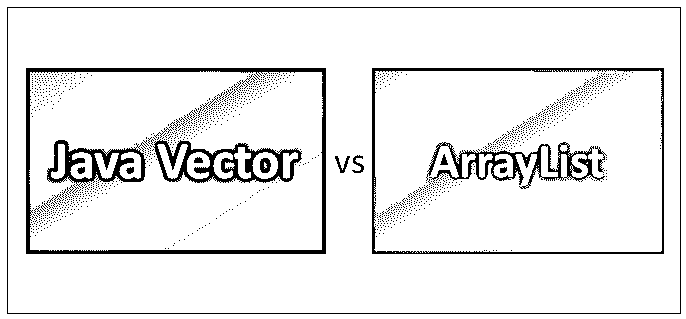
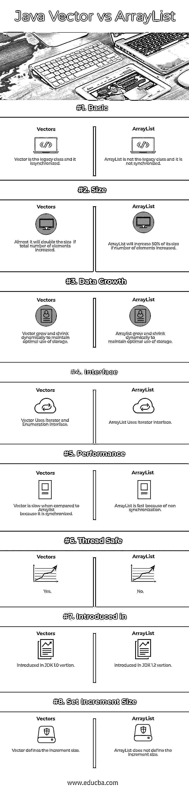

# Java Vector vs ArrayList

> 原文：<https://www.educba.com/java-vector-vs-arraylist/>

## Java Vector 和 ArrayList 的区别

Java Vector 和 ArrayList 都保存对象引用。如果数组被完全占用，如果我们想在完全占用后添加一个新的对象，现在在这两种情况下，大小都会增加，但主要的区别在于 ArrayList 中的大小。如果没有指定大小，它可以增加当前数组的一半，但一个向量可以增加一倍的大小，增量值没有指定。我们可以用初始大小或者默认的初始大小创建一个向量。

我们将看到默认初始大小或初始大小的代码:

<small>网页开发、编程语言、软件测试&其他</small>

*   创建一个具有默认初始大小的矢量
    Vector v = new Vector()；
*   创建具有初始大小的向量
    向量 v =新向量(300)；

### 常用方法

以下是常见的矢量方法:

*   添加(o)
*   清除()
*   第一个十一月
*   列表迭代器()
*   大小()
*   toArray(对象[])

Java ArrayList 是 Java API 库的实现类中最简单和最常用的数据结构之一。最重要的是[使用一个动态数组](https://www.educba.com/dynamic-array-in-java/)来存储元素。我们应该记住，在创建数组时，它们是固定长度的；一旦这些被创建，我们不能做任何修改。

以下是构造函数:

*   ArrayList( ): 它有助于构建空数组列表。
*   **ArrayList(集合 c):** 它有助于在预先指定的集合中构建一个构造元素列表。
*   ArrayList(int capacity): 它有助于构建一个空列表。

以下是最常用的方法:

*   布尔加法
*   void add(int index，E obj)
*   E get(int index)
*   布尔包含(对象对象)
*   布尔型 isEmpty()

Java 在 Java 2.0 中引入了一组新的 [API 来提供统一的结构化类。当一个新的 API 引入时，方法会有变化。现在，我们将看到一些新旧方法在 API 更改时发生了变化。](https://www.educba.com/what-is-api-in-java/)

| **老方法** | **新方法** |
| Object elementAt(int) | Object get(int) |
| void insertElementAt(Object，int) | void add(索引，对象) |
| void addElement(对象) | 布尔加法(对象) |
| void setElementAt(int) | 对象集(int，Object) |
| void removeElementAt(int) | void remove(int) |
| void removeAllElements() | 空清除() |

### Java Vector 和 ArrayList 的直接比较(信息图)

下面是 Java Vector 和 ArrayList 的 8 大对比:

### Java Vector 和 ArrayList 的主要区别

以下是要点列表，描述 Java Vector 和 ArrayList 的主要区别:

*   ArrayList 是非同步的，也不是线程安全的，但是 Vector 是同步的，每次只有一个线程调用方法。但是当安全是单线程的情况下，数组列表是唯一的选择，但是如果我们正在处理多线程，我们需要优先选择向量。如果我们对数据有任何疑问或困惑，那么我们可以选择向量，因为在向量中，我们可以设置增量值。
*   vector 可以使用枚举和迭代器接口来遍历元素，但是 ArrayList 只能使用迭代器接口来遍历。在 vector 中，如果使用整数包装器，将无法更改整数值。在 vector 中，最常用的两个方法有 next()和 Next()。数组列表是用初始大小创建的，因为如果对象被添加，它将增加大小，而对象被删除，大小将自动减少。
*   Java 中的 vector 类实现了对象的动态数组。它与数组完全相同；它包含可使用简单整数索引访问的元素。但是，Vector 的大小可以根据需要增加或减少，以适应项目的添加和删除。
*   Java Vector 和 ArrayList 都提供了可调整大小的数组，这意味着数组可以增加空间。Java 提供了 vector 类来提供动态大小、通用和有用的预定义方法(我们已经在第 1 页看到了这些方法)。如果大小固定，则使用数组；如果大小可能会改变，请使用矢量。Java Vector 和 ArrayList 都是基于索引的，在内部使用数组，Java Vector 和 ArrayList 都维护元素的插入顺序。Java 提供了一个 ArrayList 类来提供类似于向量动态、通用和有用的预定义方法的特性。
*   Java Vector 和 ArrayList 这两个类都用于动态使用数组。Class ArrayList <e>— E 指定一个数组可以容纳的对象类型。这里创建的数组是一个可变数组，它可以根据对象的分配而增加或减少。Vector:: class Vector <e>— E 表示将存储在数组中的对象的类型。</e></e>

### Java 向量和数组列表对照表

下面是 Java Vector 和 ArrayList 的对照表。

| **比较的基础** | **矢量** | **阵列列表** |
| **基础** | Vector 是遗留类，它是同步的 | ArrayList 不是传统类，也不是同步的。 |
| **尺寸** | 它几乎将元素总数的大小增加了一倍。 | 如果元素数量增加，ArrayList 的大小将增加 50%。 |
| **数据增长** | 向量动态增长和收缩，以保持存储的最佳使用 | 数组列表动态地增长和收缩，以保持存储的最佳使用 |
| **界面** | Vector 使用迭代器和枚举接口 | ArrayList 使用迭代器接口 |
| **性能** | 与 ArrayList 相比，Vector 速度较慢，因为它是同步的 | 由于非同步，ArrayList 很快 |
| **线程安全** | 是 | 不 |
| 中介绍的 | 在 JDK 1.0 版本中引入 | 在 JDK 1.2 版本中引入 |
| **设定增量大小** | 向量定义增量大小 | ArrayList 没有定义增量大小 |

### 结论

Java vector 和 ArrayList 各有优缺点。两者在市场上都非常成功。如果和 Vector 比较，ArrayList 是最近的一次。如果不需要同步，则首选 ArrayList。当使用 Vector 或 ArrayList 时，总是尝试初始化程序需要的最大容量，因为扩展数组的代价很高。

我最后总结说，我总是更喜欢使用数组列表。为什么？因为与 Vector 相比，ArrayList 执行得更快更好。

### 推荐文章

这是 Java Vector vs ArrayList 的指南。在这里，我们还将讨论它们的意义、主要区别以及信息图和比较表。您也可以阅读以下文章，了解更多信息——

1.  [Java 性能 vs Python](https://www.educba.com/java-performance-vs-python/)
2.  [Scala vs Java 性能](https://www.educba.com/scala-vs-java-performance/)
3.  [Java vs JavaScript](https://www.educba.com/java-vs-javascript/)
4.  [Java vs Python](https://www.educba.com/java-vs-python/)

