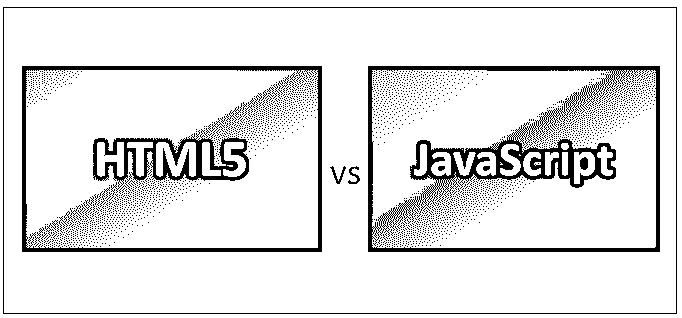
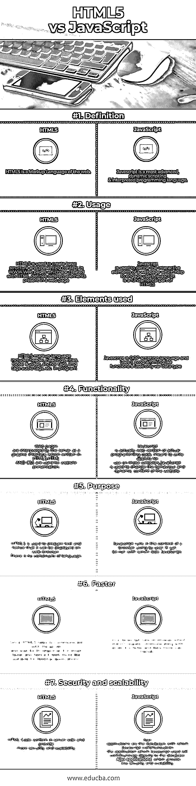

# HTML5 与 JavaScript

> 原文：<https://www.educba.com/html5-vs-javascript/>

## HTML5 和 JavaScript 的区别

HTML5 是最新的(即，第五个和当前的主要版本)和最增强的版本，用于在 WWW(万维网)上构建和呈现内容。

W3C(万维网联盟)于 2014 年 10 月发布的 HTML5。它的发布是为了通过替换 [HTML 版本](https://www.educba.com/versions-of-html/)–HTML 4.01、XHTML 1.0 和 XHTML 1.1 来改进语言以支持多媒体特性。对 HTML5 有一种误解，因为它是一种编程语言，但它更像是一种在 WWW 上构建和呈现 web 内容的标记语言。

<small>网页开发、编程语言、软件测试&其他</small>

新标准结合了 HTML5 的特性。一些重要的功能是视频录制和播放以及拖放选项，这些功能依赖于第三方浏览器插件，如微软 Silverlight、 [Adobe Flash](https://www.educba.com/course/adobe-flash-professional-cs6-module-1-basic/) 和谷歌 Gears。

几乎所有版本的浏览器都支持 HTML5 的功能，如谷歌 Chrome、Mozilla Firefox、苹果 Safari 和 Opera。

### 优势

以下是 HTML5 的一些优势:

*   HTML5 非常简单，语法清晰，
*   它支持多媒体元素，
*   它具有访问用户地理位置的功能，
*   它允许客户端存储和客户端-服务器通信等。

[Javascript 是动态](https://www.educba.com/what-is-javascript/)脚本&解释型编程语言来构建网页的行为。Javascript 是一种轻量级、原型化和多功能的语言。

Javascript 于 1995 年 12 月首次向世界亮相，它的名字叫做“LiveScript”。由于 Java 在当时非常繁荣和流行，后来，LiveScript 在 Netscape Navigator 中部署时被重命名为“Javascript”。

Javascript 是一种具有面向对象能力的解释型高级编程语言。

Javascript 语言中使用的程序被称为脚本。这些可以写在 HTML 页面上，并且在页面加载时自动执行——这是嵌入在 Internet Explorer、Netscape 和许多其他网络浏览器中的语言的目的。

Javascript 以纯文本的形式提供和执行。运行它不需要任何特殊的准备。Javascript 是 web 应用程序的重要组成部分之一。它是万维网的三大核心技术之一。

以下是 Javascript 的一些优势:

*   它与服务器的交互很少
*   如果用户错过输入某些信息，它会向用户/访问者提供即时反馈。
*   它提供创建界面来增加用户的交互性。
*   提供许多功能，如更丰富的界面，如滑块、拖放选项等。
*   浏览器检测、Cookies、控制浏览器和验证表单等。

### 【HTML5 与 JavaScript 的正面比较

以下是 HTML5 和 JavaScript 的 7 大对比:

### HTML5 和 JavaScript 的主要区别

以下是积分列表；描述 HTML5 和 JavaScript 之间的主要区别:

1.  HTML 是一种网络标记语言，而 Javascript 是一种最先进的动态脚本解释编程语言。
2.  HTML5 用于在 WWW 中创建基本结构和呈现内容，但是 Javascript 是 HTML5 的基础部分。
3.  用 HTML 创建的网页定义了网页中存在的不同元素，而 Javascript 用于定义网页的交互式元素，这有助于吸引用户。
4.  服务器将网页解释为用 HTML5 编写的图形界面。但 Javascript 实际上是实际编程代码的网络版本，意在编写在这些网站上使用的小程序。
5.  HTML5 用于准备文本，因此它可以在 web 浏览器上显示。语言没有结构。但是 Javascript 是在用户使用的浏览器环境中运行的。可以用服务器端 JavaScript 运行。
6.  与 HTML5 相比，Javascript 更快，因为它不需要与服务器通信并等待服务器的响应，而 HTML5 需要与服务器通信并等待其响应。
7.  与 Javascript 相比，HTML5 更加安全和可伸缩，因为应用程序的代码将在服务器端编写，而在 [Javascript 中，编写的代码将在一个称为 Ajax 应用程序的数据库中。](https://www.educba.com/ajax-interview-questions/)

**推荐课程**

*   [R 工作室方差分析技术培训](https://www.educba.com/course/er-model-and-rdbms-concepts/)
*   [专业角度课程](https://www.educba.com/course/web-development-training/)
*   [ISTQB 一级培训包](https://www.educba.com/course/ccna-training-course/)
*   [软件测试基础在线课程](https://www.educba.com/course/computer-fundamentals-course/)

### HTML5 和 JavaScript 对照表

下面是 HTML5 和 JavaScript 的对比表。

| **比较
的依据** | **HTML5** | **JavaScript** |
| **定义** | HTML5 是一种网络标记语言。 | Javascript 是一种最先进的动态脚本和解释编程语言。 |
| **用途** | HTML5 is used to create the basic structure and presenting content in WWW.用 HTML 创建的网页定义了网页中存在的不同元素。 | Javascript is used to define the interactive elements of a webpage which help to engage users.

Javascript 是 HTML5 的基础部分。

 |
| **Elements used** | HTML5 标记语言[包括一个](https://www.educba.com/html5-elements/)头，标题，标题，页脚&视频，锚标签，img 标签，音频标签等。，在一个程序中。 | Javascript 是一种 OOP 脚本语言，像函数一样使用 C 编程&只使用 var 数据类型。 |
| **功能** | Web pages are interpreted by the server as a graphic interface written in HTML5.HTML 和 CSS 用于网站展示。 | Javascript is actually a web version of actual programming code, meant to write applets for use on those websites.JavaScript 用于改变网站的行为和动态内容。 |
| **目的** | HTML5 用于准备文本，因此它可以显示在网络浏览器上。语言没有结构。 | Javascript 在用户使用的浏览器环境中运行。可以用服务器端 JavaScript 运行。 |
| **更快** | 因为 HTML5 需要与服务器通信并等待它的响应，所以它速度较慢，因此感觉更适合桌面应用程序。 | 由于 Javascript 运行在不需要与服务器通信的浏览器上，因此速度更快，用户感觉更友好。 |
| **安全性和可扩展性** | HTML 代码是在服务器端编写的，提供了更多的安全性和可伸缩性 | Ajax applications are the databases with which Javascript communicate在 Javascript 使用的应用程序中将直接与数据库通信—**Ajax 应用程序**，它提供的安全性和可伸缩性较差。 |

### 结论

如果用 Javascript 编写的代码使应用程序速度更快，同时安全性和可伸缩性更差。假设用 [HTML 编写的代码更加安全](https://www.educba.com/advantages-of-html/)和可伸缩。由于使用 Javascript 编写的代码不需要与服务器通信(直接与数据库通信)，这使得它更快，也更不安全。因此，我们总是建议同时掌握 HTML5 和 Javascript 知识，以构建一个漂亮、安全和可伸缩的网站。

### 推荐文章

这是 HTML5 和 JavaScript 之间区别的指南。这里我们讨论了 HTML5 和 JavaScript 的直接比较、关键差异、信息图和比较表。您也可以阅读以下文章，了解更多信息——

1.  [Python vs JavaScript](https://www.educba.com/python-vs-javascript/)
2.  [HTML vs XML](https://www.educba.com/html-vs-xml/)
3.  [HTML5 或 Flash](https://www.educba.com/html5-vs-flash/)
4.  [HTML vs HTML5](https://www.educba.com/html-vs-html5/)

