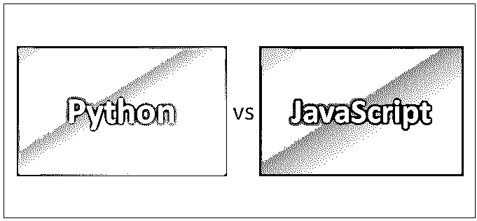
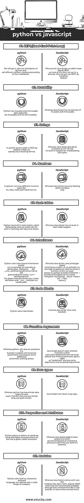

# Python vs JavaScript

> 原文：<https://www.educba.com/python-vs-javascript/>

## Python 和 JavaScript 的区别

Python 是一种解释型高级编程语言，具有动态语义和面向对象的编程，旨在易于阅读和实现。它是一种类似 Perl/ruby 的脚本语言，也用于创建 web 应用程序。Java-Script 是一种面向对象的编程语言，允许您创建动态网页，并在 ECMAScript 语言规范中得到标准化。Java-Script 支持不同的编程模式，如面向对象、函数式和命令式编程，但不支持过程式编程。

### Python 是什么？

Python 支持不同的编程范式，如面向对象编程、函数式编程、命令式编程和过程式编程。它提出了巨大的内置模块和包。它允许程序员对简单和复杂的程序使用不同的程序风格。现在我们将讨论 Python 和 Javascript。

<small>网页开发、编程语言、软件测试&其他</small>

### 什么是 Java-Script？

Java-Script 是一种面向对象的编程语言。它在浏览器中被大量使用来提供动态功能，这是我们无法通过普通的 HTML 和 CSS 实现的。它支持带有文本、[正则表达式](https://www.educba.com/regular-expressions-in-javascript/)和日期的标准应用程序。

### Python 和 JavaScript 之间的直接比较

下面是 Python 和 JavaScript 的 11 大对比

### Python 和 JavaScript 的主要区别

下面解释了一些要点，展示了 Python 和 JavaScript 之间的区别。

*   Python 是强类型的——类型之间没有隐式转换，而 JavaScript 是弱类型的。
*   同步和阻塞代码在 JavaScript 中是标准的，而 python 实际上是默认的。
*   JavaScript 可以用来在前端运行，而 python 是在服务器端编程或者后端。
*   Python 有过程化编程，而 Java-Script 没有。
*   Java-Script 有；作为语句结束符，而 python 有一个换行符。
*   Python 是一种设计更好的语言，易于维护，而 JavaScript 很差。
*   Python 不适合移动开发，而 Java-Script 却很适合。
*   与 JavaScript 相比，Python 运行速度较慢。
*   Python 提供了一个庞大的标准库，而 JavaScript 只有有限的标准库。
*   Python 非常依赖赋值，变量和赋值之间没有区别，而 JavaScript 没有。
*   Python 有许多用于科学计算、数据分析和机器学习的库，而 JavaScript 没有。
*   Python 支持许多数字数据类型，如 int、float、定点十进制，而 Java-Script 主要处理浮点变量。
*   Python 有内置的 REPL，而 JavaScript 没有。
*   JavaScript 在浏览器和服务器上都可以运行，而 python 主要用于服务器端编程。
*   Python 比 JavaScript 容易上手。
*   这年头 Python 比 JavaScript 好找新工作。
*   基于对象的 Python 几乎等同于 JavaScript，python 支持使用简单函数和变量的编程风格。
*   与 python 相比，JavaScript 是最复杂的现代编程语言。
*   Python 和 JavaScript 都使用词法范围，但有一些小的区别。
*   Python 有一个自参数作为每个方法的第一个参数，而 JavaScript 使用“this”访问对象。
*   与 JavaScript 不同，python 没有从实例继承的方法。
*   如果我们进行数据分析、机器学习或数学密集型操作，Python 很好，而 JavaScript 则适合构建网站或原生应用程序，因为它在 UI 工作上花费的时间更少。

### Python 与 JavaScript 对照表

下面是 Python 和 JavaScript 之间的比较表

| **比较依据** | **python** | **JavaScript** |
| **REPL(读取-评估-打印-循环)** | 我们将在安装 python 时得到它，并根据我们的安装调用不同的 python 版本。 | 而对于 Java-Script，我们没有内置的 REPL，因为大部分时间我们都在浏览器中运行。但是我们可以通过安装 node.js 来使用 REPL |
| **可变性** | Python 有可变和不可变的数据类型，比如 set(可变)和 list(不可变)。 | 而 Java-Script 没有可变和不可变的概念 |
| **琴弦** | 在 Python 中，源代码默认是 ASCII，除非我们指定任何编码格式。 | 而 Java-Script 应该编码为 UTF-16，并且没有对处理原始字节的内置支持 |
| **数字** | 在 python 中，我们有不同的数字类型，如 int、float、定点小数等。 | 而 Java-Script 只有浮点数。 |
| **哈希表** | Python 有内置的哈希表，叫做字典、集合等。，它可以与键和值一起用在哈希中。 | 而 Java-Script 没有内置的哈希表支持 |
| **继承** | Python 使用基于类的继承模型。下面我们来考虑一个例子:
类 Welcome:
def __init__(self，name):
self . name = name
def greet(self):
print(' hello，I am' + self.name)
从上面的例子给你展示了一个类定义，而 __init__ 函数是一个构造函数。 | 而 Java-Script 使用基于原型的继承模型。让我们考虑一个如下的例子:
我们需要创建一个函数，其中我们使用了如下 python 中的类:
Welcome = function(name)
{
this . name = name
this . greet = function()
{
return“你好，我是”+ this。名称
}} |
| **代码块** | Python 使用缩进 | 而 java-script 使用花括号 |
| **函数参数** | 而如果用不正确的参数调用函数并接受一些额外的参数传递语法，Python 将引发异常。 | Java-Script 不关心用精确参数调用的函数是否缺省情况下任何缺少的参数的值都是“未定义的”,任何额外的参数都以特殊参数结束。 |
| **数据类型** | 而 python 有两种相似的数据类型 list 和 tuple。Python 的 list 和 Java-Script 数组非常相似。 | JavaScript 有一个内置的数组类型。 |
| **特性和属性** | Python 允许使用描述符协议定义属性，我们可以使用 getter、setter 函数。 | 而 Java-Script 对象具有可以由底层属性组成的属性，它允许您定义属性 |
| **模块** | Python 自称为一种电池内置语言，因为它提供了广泛的模块。 | 而 Java-Script 只有很少的模块，如 date、math、regexp、JSON，它的功能可以通过主机环境获得，如 web 浏览器或其他环境。 |

### 结论

最后是 Python 和 JavaScript 的概述，希望你看完这篇 Python 和 JavaScript 的文章，至少学到了几点。

Python 和 JavaScript 语言之间的差别很小。你几乎可以用 Python 和 JavaScript 语言做任何事情，因为它们有一些共同之处，比如词法范围、面向对象、解释型、函数式和命令式编程。如果任何一种语言缺少某个特性，我们有大量现有的库和其他扩展来实现任何需要的东西。

我希望你能更好地理解这些编程语言。如果你想建议一个人最好先学习，我会建议 python，因为它在 it 行业有很好的市场，而且容易学习。

### 推荐文章

这是 Python 和 JavaScript 之间差异的有用指南；我们讨论了它们的含义、直接比较、主要差异和结论。您也可以阅读以下文章，了解更多信息——

1.  [节点 JS vs Java 8](https://www.educba.com/java-vs-node-js/)
2.  [Ruby vs Python](https://www.educba.com/ruby-vs-python/)
3.  [Java vs Python](https://www.educba.com/java-vs-python/)
4.  [Java vs JavaScript](https://www.educba.com/java-vs-javascript/)

