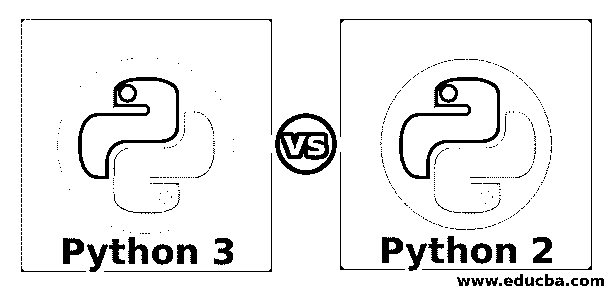
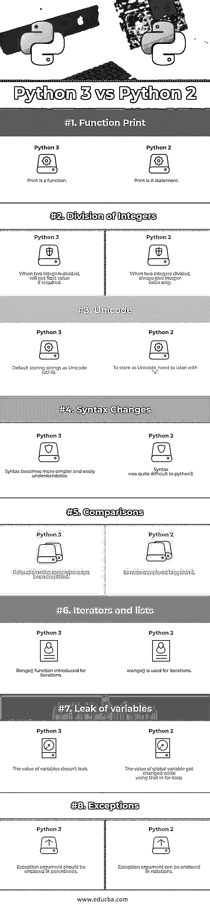

# Python 3 对 Python 2

> 原文：<https://www.educba.com/python-3-vs-python-2/>

## Python 3 和 Python 2 的区别

Python 3 是 python 2 的升级版。在 python 3 版本中观察到了许多显著的差异或改进。其中一些是 Python 3 的语法比 python 2 简单。在 python 3 中，异常参数用括号表示，这在以前的版本中是没有的；python 3 将打印作为一个函数，而 python 2 将打印作为一个语句。在 python 2 中，当两个整数相除时，结果值也显示为整数，但是 python 3 也允许浮点值结果，并且在 python 3 中新引入了 range()函数，这在以前的版本中是没有的。

### Python 3 和 Python 2 的面对面比较(信息图)

下面是 Python 3 和 Python 2 的前 8 名对比:

<small>网页开发、编程语言、软件测试&其他</small>

### Python 3 和 Python 2 的主要区别

让我们讨论一下 Python 3 和 Python 2 之间的一些主要区别:

1.  Python 3 在开发各种 GUI 应用程序方面得到了广泛的支持，与 Python 2 相比，Python 3 中还提供了许多其他的包。
2.  在 Python 3 中，使用了打印函数，这意味着参数应该用括号括起来。例如 print(“这是 Python 3”)。在 Python 2 中，打印被视为一个语句。例如打印“这是 Python”。
3.  在 Python 3 中，默认情况下整数除法的值是合适的。例如，除以 5/2 将得到 2.5。在 Python 2 中，如果输出是十进制的，我们需要以浮点形式提供数据类型；否则，结果只能是整数。例如 5/2 给出结果 2。
4.  在 Python 3 中，已经使用了文本和数据。Unicode (UTF-8)是 python 3 的默认编码源，str 表示为长度为 1 的字符串。在 python 2 中，str 被表示为长度为 8 位的字符串。
5.  与 Python 2 相比，Python 3 中的语法变化使得编程语言对开发人员来说更加有效和简单。
6.  在 Python 3 中，我们需要使用“as”关键字来处理或捕捉异常。例如，除了作为 err 的错误(除了作为变量的一些例外)。在 Python 2 中，我们同样需要使用'，'。例如 except Error，err(除了某些例外，err)。
7.  在 Python 3 中，我们需要用它来引发错误(“错误消息”)来引发异常。提供的斜体语法为(引发异常(args))。在 python 2 中，用作引发错误“消息”的语法。提供的斜体语法为(引发异常，参数)。
8.  在 Python 3 中，包含了新的内置函数；与 Python 2 相比，有些被删除和重命名了。

Python 3 的开发方式使得 [Python 3 与](https://www.educba.com/python-3-commands/)Python 2 不兼容。

**推荐课程**

*   [c++和 DirectX 认证培训](https://www.educba.com/python-3-vs-python-2/)
*   [胡迪尼球场](https://www.educba.com/design/courses/houdini-training-course/)

### Python 3 和 Python 2 的对照表

下面是 Python 3 和 Python 2 的对比表。

| **比较的基础** | **Python 3** | **Python 2** |
| **功能打印** | 指纹是一种功能。 | 印刷品是一种声明。 |
| **整数的除法** | 当两个整数相除时，如果需要，它们将得到浮点值。 | 当两个整数相除时，总是只给出整数值。 |
| **Unicode** | 默认将字符串存储为 Unicode (UTF-8)。 | 要存储为 Unicode，需要用“u”标记。 |
| **语法变化** | 语法变得更简单，更容易理解。 | python3 的语法很难理解。 |
| **比较** | 排序比较的规则已经简化。 | 它比 python 3 更复杂。 |
| **迭代器和列表** | 为迭代引入的 Range()函数。 | xrange()用于迭代。 |
| **变量泄漏** | 变量值不会泄露。 | 在 for-loop 中使用全局变量时，该变量的值发生了变化。 |
| **异常情况** | 异常参数应该用括号括起来。 | 异常参数可以用符号括起来。 |

### 结论

根据需求，Python 3 和 Python 在组织中得到了广泛的应用。Python 2。x 被广泛使用，因为它长期稳定。Python 3。x 也引起了开发者的注意。由于从 python 2 到 python 3 的过渡正在发生，开发人员过去习惯于使用 python 2，并且一些库在 Python 3 中不可用，这在 Python 2 中非常有用。

Python 是一种容易理解的通用编程语言。开发人员可以有效地编写代码。如果你是初学者，这是一门很好的语言，可以帮助你在这个领域获得自信。用哪个版本都无所谓，python 2 还是 python 3。Python 3 随着它的稳定发行版正以良好的速度增长，它肯定是下一个工作的语言。

上面的描述可以让您很好地了解 Python 3 和 Python 2 版本之间的区别。如果 python 在未来几年成为 It 公司和程序员最想要的语言，这并不奇怪。

### 推荐文章

这是 Python 3 和 Python 2 之间差异的指南。在这里，我们讨论了它们的含义、直接比较、主要差异，以及信息图和比较表。您也可以阅读以下文章，了解更多信息——

1.  [Python vs JavaScript](https://www.educba.com/python-vs-javascript/)
2.  [Java vs Python](https://www.educba.com/java-vs-python/)
3.  [Python vs 围棋](https://www.educba.com/python-vs-go/)
4.  [Python vs JavaScript](https://www.educba.com/python-vs-javascript/)

