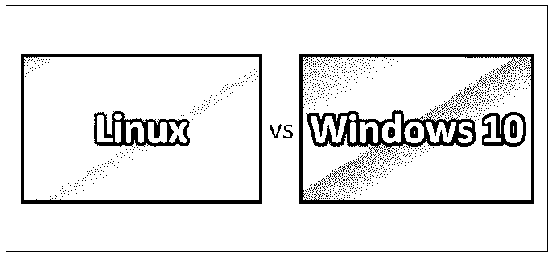
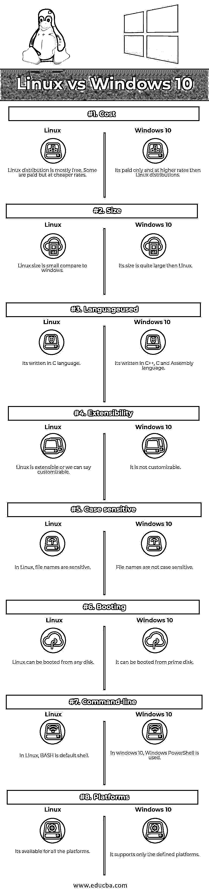

# Linux vs Windows 10

> 原文：<https://www.educba.com/linux-vs-windows-10/>

## Linux 与 Windows 10 的区别

[Linux 是一个](https://www.educba.com/what-is-linux/)开源操作系统，允许用户应用他们想要的定制。Windows 10 是微软公司的付费产品，用户的定制选项非常有限。与 Windows 10 操作系统相比，Linux 的存储内存较少，文件名区分大小写。BASH 是 Linux 使用的 Shell 脚本，PowerShell 是 Windows 10 系统使用的 shell 脚本。

### Linux 操作系统

Linux 由 Linus Torvalds 开发，并于 1991 年发布。在 Linux 中，像组件升级、修改、配置组件这样的新变化非常容易，不会给现有组件带来任何问题。Linux 的术语包括引导装载程序、初始化程序、内核、系统库、系统实用程序。

<small>网页开发、编程语言、软件测试&其他</small>

Linux 有广泛的发行版，即:

1.  Ubuntu Linux
2.  Linux 作为
3.  Arch Linux
4.  Deepin
5.  一种男式软呢帽
6.  一种自由操作系统
7.  打开使用。
8.  每个发行版都是不同的，彼此之间有不同的接口。人们可以根据自己的需求选择发行版。

Linux 体系结构主要分为两部分或两层，即内核层和用户层。内核层由接口、内核代码、板卡支持包组成。

### Windows 10

Windows 10 由微软开发，于 2015 年发布。在 Windows 8 没有获得好评后，微软选择回归传统，在 windows 10 中再次整合开始菜单。在 Windows 10 中，没有什么像现在的程序；它叫做应用程序。

Windows 10 推出了像微软 Edge 浏览器这样的新功能，可以非常容易和快速地从 PC 到手机到平板电脑进行浏览。具有 3D 功能的 Microsoft office 使演示更加真实有效。

Windows 10 推出了一项名为 Cortana 的伟大功能。这是一个改进的搜索栏，就在开始菜单旁边。这是微软全新的数字助手，拥有自己的操作系统。你可以用它来查找系统中的东西，并提醒你即将到来的事件，如电影、旅行等。您可以向 Cortana 询问任何类型的事实、疑问或问题。Windows 10 确实是一个全新的、用户友好的操作系统。

### Linux 和 Windows 10 之间的直接比较

以下是 Linux 和 Windows 10 的 8 大区别:

### Linux 和 Windows 10 的主要区别

下面解释了 Linux 和 Windows 10 之间的一些主要差异:

1.  Linux 可以下载一次，在许多机器上使用或安装。Windows 10 是微软授权的，从微软购买的许可证数量可以合法安装在多少台机器上。许可证数量=机器数量。
2.  Linux 提供了更多的安全性，或者说它是一个更安全的操作系统。与 Linux 相比，Windows 不太安全，因为病毒、黑客和恶意软件会更快地影响 windows。
3.  Linux 性能不错。这是更快，更快，更流畅，即使在旧硬件的。与 Linux 相比，Windows 10 速度较慢，因为在后端运行批处理，需要良好的硬件才能运行。
4.  Linux 更新很容易获得，并且可以快速更新/修改。Windows 10 更新并不容易获得，而且需要花费大量时间通过不同的论坛来下载和安装新的更新。
5.  Linux 是开源操作系统，而 Windows 10 可以被称为闭源操作系统。
6.  Linux 保护隐私，因为它不收集数据。在 Windows 10 中，隐私得到了微软的照顾但仍然不如 Linux。
7.  开发人员主要使用 Linux 是因为它的命令行工具。我们可以在 Linux 中使用许多命令行工具和[有效的脚本。Windows 10 主要用于其桌面操作系统。它因其用户友好的外观而更受开发人员的欢迎。](https://www.educba.com/linux-apps/)
8.  Linux 通过许多论坛和网站提供在线支持，以检查和理解 Linux。还提供有偿支持。Windows 10 在官网上有很多文档，付费支持由微软提供。Windows 10 支持更容易获得。
9.  Linux 提供了大量可以轻松免费集成的应用程序。Windows 10 没有这个责任。
10.  Linux provides centralized space for installing, searching and uninstalling software or application. In Windows 10, downloading, installing of applications can be done at a different place as per user convenience.

    **推荐课程**

    *   [C++和 DirectX 认证课程](https://www.educba.com/design/courses/directx-course/)
    *   [胡迪尼计划](https://www.educba.com/design/courses/houdini-training-course/)

### Linux 和 Windows 10 对比表

以下是 Linux 和 Windows 10 的对比表差异。

| **比较依据** | **Linux** | **Windows 10** |
| **成本** | Linux 发行版大多是免费的。有些是有报酬的，但价格更低。 | 它只收费，而且比 Linux 发行版收费更高。 |
| **尺寸** | 与 windows 相比，Linux 的尺寸较小。 | 它的大小比 Linux 大得多。 |
| **使用的语言** | 是用 C 语言写的。 | 是用 C++，C，和[汇编语言](https://www.educba.com/what-is-assembly-language/)写的。 |
| **扩展性** | Linux 是可扩展的，或者我们可以说是可定制的。 | 它不可定制。 |
| **区分大小写** | 在 Linux 中，文件名是敏感的。 | 文件名不区分大小写。 |
| **启动** | Linux 可以从任何磁盘启动。 | 它可以从主磁盘启动。 |
| **命令行** | 在 Linux 中， [BASH 是默认的](https://www.educba.com/bash-shell-in-linux/) shell。 | 在 Windows 10 中，使用的是 [Windows Power Shell](https://www.educba.com/powershell-tools/) 。 |
| **平台** | 它适用于所有平台。 | 它只支持定义的平台。 |

### 结论

Linux 和 Windows 10 是两种不同的操作系统，Linux 和 Windows 10 在各自的区域都很受欢迎。由于其现成的可用性、安全性和性能，Linux 正在 IT 公司和其他部门获得一席之地。Linux 现在是组织为银行部门开发应用程序的首选。

Windows 10 总是最终用户的首选，因为它具有新的功能和外观。它也被称为已知操作系统，因为几乎每个人都熟悉 Windows 操作系统或环境，并发现它易于使用。组织使用 Windows 10 从 Windows 上一版本升级，并丰富点网络应用程序。

每个[操作系统都有自己强大的](https://www.educba.com/features-of-operating-system/)领域和优势。这些可以根据你的需求来使用。如今，人们足够聪明来为他们的办公室、家庭或一群人选择操作系统，开发应用程序和其他目的。

### 推荐文章

这是一个关于 Linux 和 Windows 10 之间差异的有用指南。在这里，我们讨论了 Linux 与 Windows 10 的直接比较、关键差异、信息图和比较表。您也可以阅读以下文章，了解更多信息——

1.  [Linux vs Windows](https://www.educba.com/linux-vs-windows/)
2.  [Linux vs Windows Server](https://www.educba.com/linux-vs-windows-server/)
3.  [Linux vs BSD](https://www.educba.com/linux-vs-bsd/)
4.  [Linux vs Android](https://www.educba.com/linux-vs-android/)

