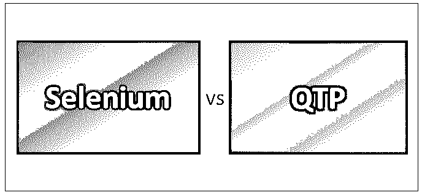
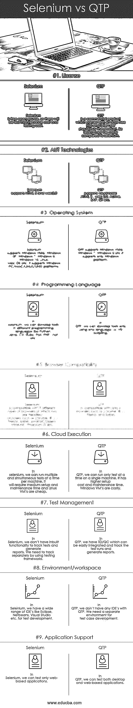

# 硒 vs QTP

> 原文：<https://www.educba.com/selenium-vs-qtp/>

## 硒和 QTP 的区别

在针对 QTP 实施 Selenium 期间或之后，组织观察到的主要差异是“与 QTP 相比，Selenium 在性能和效率方面更智能，而后者则“性能较慢，效率较低”。另一方面，Selenium 只能用于测试使用任何编程语言(如 Java)的基于 web 的应用程序。net，PHP 等。然而，QTP 可以用来测试任何类型的应用程序，包括系统软件和应用软件，但只能支持 VB 脚本编程。

### 硒是什么？

Selenium 是一个开源的自动化测试工具。Selenium 有如下四个组件:1) Selenium 集成开发环境(IDE)，2) Selenium 远程控制(RC)，3) Web 驱动和 4) [Selenium 网格](https://www.educba.com/selenium-grid/)。然而，Selenium RC 和 web driver 被合并到一个框架中，成为 selenium 2。杰森·哈金斯在 2004 年创造了硒。因为它是开源的，所以没有许可费用，这是相对于其他[测试工具](https://www.educba.com/web-performance-testing-tools/)的一个主要优势。我们可以使用任何语言编写测试脚本，如 [java](https://www.educba.com/java-interview-questions/) ，python， [ruby](https://www.educba.com/ruby-vs-ruby-on-rails/) ，C#，Perl 等等。Selenium 适用于编码和测试的敏捷方法。

<small>网页开发、编程语言、软件测试&其他</small>

### 什么是 QTP？

QTP 是一个快速测试专家，这是一个自动化功能测试工具。借助 QTP，我们可以自动化用户操作、窗口和基于网络的计算机应用程序，并为不同的用户测试相同的操作。对于测试，我们可以启动 QTP 和登录活动；它将记录步骤，并能够在未来运行相同的步骤。QTP 有执照；当我们第一次安装时，会给出 60 天的全功能演示许可证；之后，我们需要购买许可证。使用 QTP，我们可以测试基于 web 和桌面的应用程序，它提供了记录和回放功能。它基于 VB 脚本语言。技术和非技术用户都可以使用 QTP。

### 硒和 QTP 的直接比较

以下是硒和 QTP 的 9 大对比:

### 硒和 QTP 的主要区别

以下几点解释了硒和 QTP 之间的一些关键区别:

*   在 Selenium 中，我们可以在浏览器最小化时执行测试，而在 QTP 中，我们需要让测试中的应用程序在桌面上可见。
*   QTP 有内置的对象存储库，而 Selenium 没有内置的对象存储库。
*   在 QTP，数据驱动测试更容易，因为它有内置的全局和本地表，而在 Selenium 中，我们需要依靠[编程语言能力](https://www.educba.com/learning-algorithms/)。
*   在 Selenium 中，我们可以并行执行多个测试，而在 QTP 中，我们一次只能执行一个测试。我们可以在 QTP 进行平行测试，但我们需要使用一个质量中心，一个付费产品。
*   在 QTP，我们可以在浏览器中访问控件，而在 Selenium 中，我们不能访问 web 应用程序之外的元素。
*   使用 Selenium，我们可以在 9 种不同类型的浏览器中运行我们的测试，而在 QTP，我们只能在 chrome、firefox、IE 11 和 Safari 中运行。
*   QTP 具有将测试数据导出为外部格式的内置功能，而 Selenium 没有将运行时数据导出为外部格式的功能。
*   Selenium 支持 Android、iPhone、黑莓、Headless WebKit 等移动设备，而 [QTP 使用商业产品](https://www.educba.com/what-is-qtp/)进行移动应用测试自动化，即惠普 UFT 移动。
*   在 QTP，我们可以很容易地与惠普质量中心或惠普 ALAM 集成，这些都是商业产品，而在 Selenium 中，我们可以使用 Eclipse、 [Maven](https://www.educba.com/maven-commands/) /Ant、 [Jenkins](https://www.educba.com/jenkins-interview-questions/) 、TestNG/JUnit、SVN/GIT 等建立一个框架。
*   QTP 有专门的惠普支持和在线论坛，而 Selenium 有一个开源社区和几个在线论坛。
*   Selenium 的维护成本为零，因为它是开源的，而 QTP 有许可证和年度维护费用。
*   基于图像的测试在 QTP 是可能的，而在硒也是可能的，但不容易。

### 硒和 QTP 对照表

下面是硒和 QTP 的比较表。

| **硒和 QTP 的比较基础** | **硒** | **QTP** |
| **执照** | Selenium 是免费开源的，所以维护成本和测试成本会少一些。 | [QTP 是一款](https://www.educba.com/what-is-qtp/)商业产品，提供 60 天免费试用，后期用户需要购买该产品。因此，与硒相比，测试可能成本较高。 |
|  | Selenium 支持 [HTML 5](https://www.educba.com/what-is-html5/) 和 web2.0 | [QTP 支持 visual basic，HTML 5，web 2.0，Active，SAP](https://www.educba.com/sap-vs-oracle/) ，QT 等。 |
| **操作系统** | Selenium 支持 Windows Vista、Windows XP、Windows 7、Windows 8、Windows 10、Linux、Mac OS 等。它支持 Windows PC/MAC/LINUX/UNIX 平台。 | QTP supports Windows Vista, Windows 7, Windows 8 etc.

它仅支持 Windows 平台。

 |
| **编程语言** | 在 selenium 中，我们可以用不同的[编程语言开发测试，比如 Python、Java、C#](https://www.educba.com/c-sharp-interview-questions-and-answers/) 、Ruby、Perl、PHP、。网络等。 | 在 QTP，我们可以只用一种语言开发测试，即 VB 脚本。 |
| **浏览器兼容性** | Selenium 兼容 9 种不同类型的浏览器，其中两种是无头浏览器，如 chrome、IE 11、Firefox、Safari、Android、Opera、HtmlUnit、Phantom JS 等。 | QTP 仅兼容 chrome、IE 11、Firefox 和 Safari 等 4 种浏览器。 |
| **云执行** | 在 selenium 中，我们可以在每台机器上同时运行多个测试。它需要中等的设置和维护时间，而且 Linux 虚拟机很便宜。 | 在 QTP，我们一次只能在一台机器上运行一个测试。它具有较高的安装成本和维护时间。Windows 虚拟机成本高昂。 |
| **测试管理** | 在 Selenium 中，我们没有跟踪测试和生成报告的内置功能。我们需要通过使用[测试框架来分别跟踪。](https://www.educba.com/what-is-test-automation-frameworks/) | 在 QTP，我们有 TD/QC，可以轻松集成，跟踪测试运行并生成报告。 |
| **环境/工作空间** | 在 Selenium 中，我们有各种各样的 ide，如 Eclipse、Netbeans、Visual Studio 等。，用于测试开发。 | 在 QTP，我们与 QTP 没有任何 IDE。我们需要一个单独的测试用例开发环境。 |
| **应用支持** | 在 Selenium 中，我们只能测试基于 web 的应用程序。 | 在 QTP，我们可以测试桌面和基于网络的应用程序。 |

### 结论

最后，概述一下 [Selenium 和 QTP 测试自动化工具](https://www.educba.com/selenium-commands/)之间的区别。我希望在阅读了这篇关于硒和 QTP 的区别的文章后，你能更好地理解硒和 QTP 工具。尽管 QTP 有更多的功能，Selenium 在成本、灵活性和并行测试方面占优势。如果我们使用 Selenium 作为功能测试自动化工具，我们可以降低 QTP 的许可成本。一旦所有解决方案都到位，Selenium vs QTP 几乎需要同样的自动化工作。

### 推荐文章

这是硒与 QTP 之间的主要差异的指南。在这里，我们讨论了 Selenium 与 QTP 的直接比较、关键差异以及信息图和比较表。您也可以看看以下文章——

1.  [硒 vs 幻影](https://www.educba.com/selenium-vs-phantomjs/)
2.  [硒 vs 黄瓜](https://www.educba.com/selenium-vs-cucumber/)
3.  [Angular vs JQuery](https://www.educba.com/angular-vs-jquery/)
4.  [JavaScript vs Ruby](https://www.educba.com/javascript-vs-ruby/)

