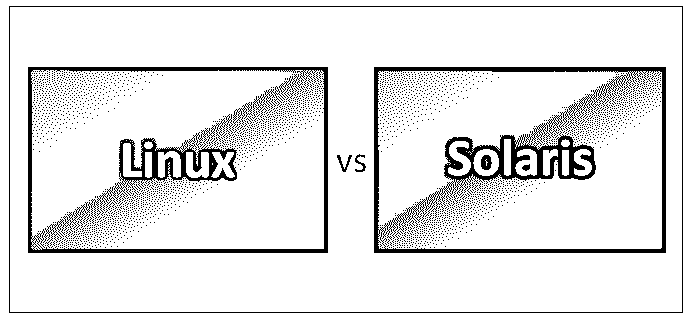
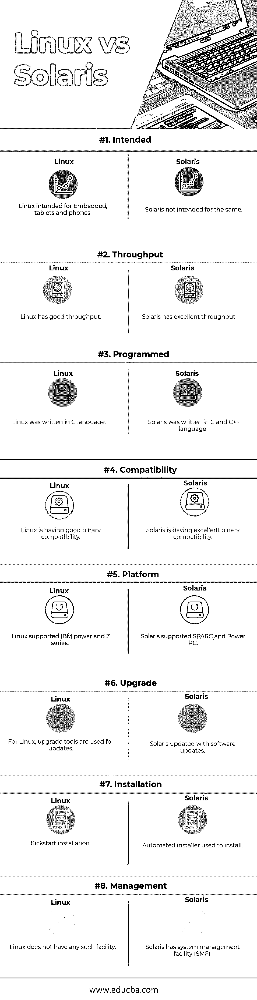

# Linux vs Solaris

> 原文：<https://www.educba.com/linux-vs-solaris/>

## Linux 与 Solaris 之间的差异

[Linux 是一个](https://www.educba.com/what-is-linux/)开源的操作系统。Linux 不是一个程序。它是软件和硬件之间的接口。Linux 是提供高稳定性和依赖性的最好的软件之一。Linux 是免费且容易获得的，因为它是独立于平台的。Solaris 是基于 UNIX 操作系统的操作系统。Solaris 是用 C 和 [C++语言](https://www.educba.com/c-programming-language-basics/)编写的。Solaris 支持 SPARC 和 Power PC 平台。Solaris 是在开放源代码的概念下创建的，包含了源代码，包括库、命令和内核。

### Linux 操作系统

*   Linux 由 Linus Torvalds 开发，并于 1991 年发布。在 Linux 中，像组件升级、修改、配置组件这样的新变化非常容易，不会给现有组件带来任何问题。
*   Linux 的术语包括引导装载程序、初始化程序、内核、系统库、系统实用程序。Linux 的发行版范围很广，分别是:1。Ubuntu Linux 2。Linux Mint 3。Arch Linux 4。Deepin 5。Fedora 6。 [Debian](https://www.educba.com/what-is-debian/) 7。打开使用。
*   每个发行版都是不同的，彼此之间有不同的接口。人们可以根据自己的需求选择发行版。Linux 体系结构主要分为两部分或两层，即内核层和用户层。内核层由接口、内核代码、板卡支持包组成。

### Solaris

*   Solaris 最初由 Sun Microsystems 创建，并于 1992 年发布。Solaris 最初获得了软件许可，需要获得许可证才能在机器上安装。2010 年甲骨文收购太阳微系统后，更名为甲骨文 Solaris。甲骨文停止开源 Solaris。
*   Oracle 提供该软件的 90 天免费试用版。要在免费试用一天后继续使用该软件，我们必须从 Oracle 购买许可证，以使用 Solaris 作为开发平台。
*   多年来，Oracle 发布了具有新特性和增强功能的 Solaris，如服务管理工具、内核区域和其他服务。Oracle Solaris 被认为易于更新云安装，并且通过提供最重要的安全性和性能，它已被用于云环境中的遗留应用程序。

### Linux 和 Solaris 之间的直接比较(信息图表)

下面是 Linux 和 Solaris 之间的 8 大比较:

<small>网页开发、编程语言、软件测试&其他</small>

### Linux 和 Solaris 之间的主要区别

尽管有许多相似之处，Linux 和 Solaris 也有许多不同之处；我们将详细研究 Linux 和 Solaris 之间这些差异:

1.  Linux 的稳定性较差。与 Linux 相比，Solaris 具有更强的稳定性。
2.  Linux 有基本的调度。Solaris 具有广泛的调度功能，并且能够在需要时使用和配置。
3.  Linux 有标准的输入输出能力。Solaris 具有广泛的多路径 COMSTAR 支持。
4.  Linux 有一个旧的服务机制，如 SVR4，它是基于文本的，不允许任何依赖性，并且服务配置不能恢复。Solaris 有一个新的服务机制，具有像 SMF 一样的强大功能，它是基于 x ml 配置的，允许在需要时恢复依赖关系和配置。
5.  Linux 是独立于平台的。尽管 Solaris 可用于不同的体系结构，但它在某些平台上不可用。
6.  Linux 提供了良好的安全性和性能。Solaris 提供了严格的安全特性，这为安全性和性能提供了很大的优势。
7.  Linux 有很好的管理员能力。Solaris 具有出色的管理员能力，能够轻松安装和管理系统。
8.  Linux 支持主要由[红帽](https://www.educba.com/career-in-redhat/)提供。Oracle 提供的 Solaris 支持(在收购 Sun Microsystem 之后)。

**推荐课程**

*   [C++和 DirectX 认证培训](https://www.educba.com/design/courses/directx-course/)
*   [胡迪尼培训课程](https://www.educba.com/design/courses/houdini-training-course/)

### Linux 和 Solaris 对照表

下面是 Linux 和 Solaris 之间的比较表。

| **BASIS FOR****比较** | **Linux** | **索拉里斯** |
| **预期** | 面向嵌入式平板电脑和手机的 Linux。 | Solaris 不打算做同样的事情。 |
| **吞吐量** | Linux 有很好的吞吐量。 | Solaris 具有出色的吞吐量。 |
| **已编程** | Linux 是用 C 语言编写的。 | Solaris 是用 C 和 C++语言编写的。 |
| **兼容性** | Linux 具有良好的二进制兼容性。 | Solaris 具有出色的二进制兼容性。 |
| **平台** | Linux 支持 IBM power 和 Z 系列。 | Solaris 支持 SPARC 和 Power PC。 |
| **升级** | 对于 Linux，升级工具用于更新。 | Solaris 通过软件更新进行了更新。 |
| **安装** | Kickstart 安装。 | 用于安装的自动安装程序。 |
| **管理** | Linux 没有任何这样的功能。 | Solaris 有一个系统管理工具(SMF)。 |

### 结论

Linux 和 Solaris 都是操作系统。这些类似 UNIX 的系统在虚拟内存、进程、内核、分页、系统调用、缓冲区、高速缓存、多处理器支持、CPU 调度和支持、资源控制、映射文件等方面具有相似性。Linux 和 Solaris 使用一组不同的命令行命令。如果你熟悉一个，使用另一个会很容易。

使用 Linux 主要是因为它是开源的。Linux 是免费且容易获得的。Linux 可以轻松下载，并根据需要安装在任意多的机器上。Solaris 拥有许可软件；需要从 Oracle 获得许可证才能将其安装在机器上。获得的许可证数量等于要安装的机器数量。

Oracle Solaris 没有 Linux 那样受欢迎。使用 Solaris 主要是因为[安全和性能因素](https://www.educba.com/data-security-techniques/)。Solaris 是安全、简单、云友好和云就绪的，因为它提供了与管理工具的良好兼容性，可以轻松高效地在云上运行基础架构。

他们都在相互学习和创新，并根据需要实现新的功能。通过以上内容，您将对 Linux 和 Solaris 的差异和特性有一个大致的了解。

如今，组织正在明智地选择操作系统；安全是他们最关心的问题。在今天的世界里，有如此多类型的病毒；恶意软件可以让你的系统变得缓慢和不安全。系统安全性是重中之重，这也将为系统提供良好的性能。

### 推荐文章

这是 Linux 和 Solaris 之间区别的指南。在这里，我们讨论了 Linux 与 Solaris 的直接比较、关键差异以及信息图和比较表。您也可以阅读以下文章，了解更多信息——

1.  [Linux vs Windows](https://www.educba.com/linux-vs-windows/)
2.  [Linux vs Windows Server](https://www.educba.com/linux-vs-windows-server/)
3.  [Linux vs BSD](https://www.educba.com/linux-vs-bsd/)
4.  [Linux vs Android](https://www.educba.com/linux-vs-android/)

