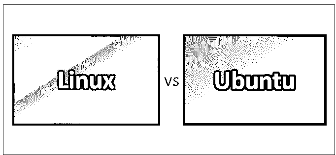
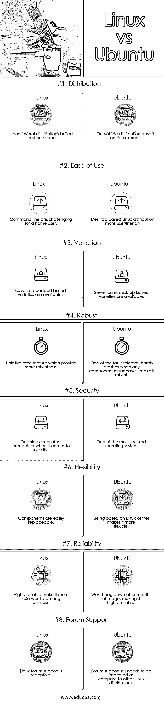

# Linux vs Ubuntu

> 原文：<https://www.educba.com/linux-vs-ubuntu/>

## Linux 和 Ubuntu 的区别

[Linux 是一个围绕 Linux 内核构建的](https://www.educba.com/what-is-linux/)开源自由软件操作系统，由 Linux Torvalds 于 1991 年 9 月 17 日首次发布。一个操作系统家族使用“Linux”这个名字来强调许多 [Linux 发行版](https://www.educba.com/careers-in-linux-administration/)共享 Linux 内核。

Ubuntu 是一个开源的免费操作系统，是 Linux 发行版之一。市场上有几种版本的 Ubuntu，比如用于个人计算的 Ubuntu desktop，用于服务器的 Ubuntu Server 和用于物理设备网络的 Ubuntu core，这些设备通常被称为[物联网](https://www.educba.com/iot-applications/) (IoT)。

<small>网页开发、编程语言、软件测试&其他</small>

Linux 在服务器中的使用率非常高；世界上大多数网络服务器运行在基于 Linux 的操作系统上。尽管 Windows 和 MAC 之类的操作系统在个人计算中比 Linux 更受欢迎，但 Linux 仍然在大众中稳步普及。

Ubuntu 基于 Linux 内核，是 Linux 发行版之一，是由南非人 Mark Shuttle worth 发起的项目。Ubuntu 是桌面安装中最常用的基于 Linux 的操作系统。Ubuntu 提供了一个友好且足够稳定的操作系统，它是针对普通电脑用户的。它易于安装，简单是它的主要特点之一。

Linux 内核是操作系统的核心，相当于一个引擎。Linux 操作系统基于 Linus Torvalds 精心制作的内核。

在默认安装下，Ubuntu 有各种各样的可用软件，比如 Firefox 和几个简单的游戏，比如象棋和数独。

Linux 发行版包括 Fedora，Debian 等等。就桌面安装而言，最流行的是 Ubuntu。Linux 在 20 世纪 90 年代获得了一些高度，因为开发人员基本上都是业余爱好者。虽然不像 windows 和 MAC 那样用户友好，但它很少崩溃，很可靠。

像所有基于 Linux 的操作系统一样，Ubuntu 很少出现病毒问题，而且大部分时间可以在没有杀毒软件的情况下运行。Ubuntu 需要特定的权限来安装文件，因此病毒很难被加载。这是 Ubuntu 提供的基本优势。一些版本的 Linux，如 Ubuntu，从互联网上关闭文件，这也有助于阻止感染。由于像 Ubuntu 这样的操作系统是后起之秀，心怀恶意的作者还没有花足够的时间来瞄准 Ubuntu 用户。

Linux 是开源的；因此，大多数用户可以修改它，从而标志着它的范围从手机到电脑。用户友好的桌面环境、网络浏览器和游戏有助于增加 Linux 的受欢迎程度，使其更适合家庭桌面。Linux 的另一个吸引人的特性是灵活性。如果我不喜欢某些东西的行为方式，我可以通过替换与我的需求兼容的软件来改变它。

### Linux 和 Ubuntu 的正面比较(信息图)

以下是 Linux 和 Ubuntu 之间的 8 大对比:

### Linux 和 Ubuntu 的主要区别

以下几点解释了 Linux 和 Ubuntu 之间的主要区别:

1.  Linux 是一个通用术语，它是一个内核，有几个发行版，而 Ubuntu 是一个基于 Linux 内核的发行版。
2.  Linux 在 1991 年开始了它的旅程，而 Ubuntu 在 2004 年起飞。
3.  Linux 最初在服务器中占主导地位，这使得它在家庭和办公室用户中很难做到用户友好，而随着桌面计算机上可用的 Ubuntu 的出现，现在变得对家庭和办公室用户更容易接受和友好。
4.  有几个 Linux 发行版是可用的，比如 Fedora、Suse、Debian 等等，而 Ubuntu 就是这样一个基于 Linux 内核的基于桌面的发行版。
5.  Linux 基于 Linux 内核，而 [Ubuntu 基于 Linux 系统](https://www.educba.com/uses-of-ubuntu/)并且是一个项目或发行版。
6.  Linux 是安全的，大多数 Linux 发行版不需要安装反病毒，而 Ubuntu，一个基于桌面的操作系统，在 Linux 发行版中是超级安全的。
7.  一些 Linux 发行版不是基于桌面的，在服务器中占主导地位，而 Ubuntu 是基于桌面的，与其他 Linux 发行版相比更加用户友好。
8.  Linux 命令遵循大多数基于 Linux 的操作系统所遵循的规则和程序，而 Ubuntu 也一样，但有自己的风格和特性列表。
9.  对于家庭和办公室用户来说，在 Linux 发行版中导航可能是一个相当大的挑战，而对于最终用户来说，Ubuntu 是简单而直观的。
10.  对于最终用户来说，安装一个免费的基于服务器的 Linux 发行版可能会令人望而生畏，而 Ubuntu 的后续工作比基于服务器的发行版更容易。
11.  基于 Linux 的操作系统，如 Debian，不推荐初学者使用，而 Ubuntu 更适合初学者。

**推荐课程**

*   [C++和 DirectX 课程](https://www.educba.com/design/courses/directx-course/)
*   [胡迪尼编程培训](https://www.educba.com/design/courses/houdini-training-course/)

### Linux 和 Ubuntu 对照表

下面是 8 Linux 和 Ubuntu 的对比表。

| **BASIS FOR**

**比较**

 | **Linux** | **Ubuntu** |
| **分布** | 有几个基于 Linux 内核的发行版 | 基于 Linux 内核的发行版之一 |
| **易用性** | 命令行对于家庭用户来说很有挑战性 | 基于桌面的 Linux 发行版，更加用户友好 |
| **变化** | 基于服务器、嵌入式的产品种类繁多 | 服务器、核心、基于桌面的种类都有。 |
| **健壮** | [类似 Unix 的架构](https://www.educba.com/unix-architecture/),提供更强的健壮性 | 其中一个容错很难崩溃时，任何组件行为不当，使其健壮 |
| **安全** | 在安全性方面胜过所有其他竞争对手 | 最安全的操作系统之一 |
| **灵活性** | 组件易于更换 | 基于 Linux 内核使它更加灵活 |
| **可靠性** | 高可靠性使其在企业中更具销售价值 | 它不会在使用几个月后停滞不前，这使得它非常可靠 |
| **论坛支持** | Linux 论坛支持是可以接受的 | 与其他 Linux 发行版相比，论坛支持仍然需要改进。 |

### 结论

Linux 内核是 Ubuntu 的心脏。它有类似 Linux 的体系结构来与计算机的硬件交互。Ubuntu 命令也遵循标准 Linux 发行版遵循的相同标准，但同时，Ubuntu 有自己的一套标准和特性列表。

Ubuntu 是一个基于图形用户界面的操作系统，是 Windows 和 Mac 操作系统最强有力的竞争者。在 GUI 的顶部，Ubuntu 的安全[特性与其他 Linux 发行版如 Fedora、Debian 等不相上下。越来越多的人开始关注基于 Linux 的操作系统，这主要是因为 Ubuntu。](https://www.educba.com/ubuntu-commands/)

当 Ubuntu 在 2004 年发布时，Linux 已经存在了一段时间。其他基于 Linux 的发行版主要是基于服务器的，不像 Ubuntu 那样用户友好，尽管它们共享相同的内核。这是 Ubuntu 的第一个版本，使得 Linux 在家庭和办公室用户中广泛传播。Linux 系统可以安装在各种计算机硬件、智能手机、笔记本电脑等。它的使用在服务器中很普遍。虽然它在桌面市场上的受欢迎程度可能比不上 MAC 和 Windows，但它仍然在这个地区越来越受欢迎，这要归功于像 Linux 发行版一样的 Ubuntu。

### 推荐文章

这是 Linux 和 Ubuntu 之间区别的有用指南。在这里，我们讨论了 Linux 和 Ubuntu 的直接比较、关键差异、信息图和比较表。您也可以阅读以下文章，了解更多信息——

1.  [Linux vs BSD](https://www.educba.com/linux-vs-bsd/)
2.  [Linux vs Android](https://www.educba.com/linux-vs-android/)
3.  [Linux Mint vs Ubuntu](https://www.educba.com/linux-mint-vs-ubuntu/)
4.  [Linux vs BSD](https://www.educba.com/linux-vs-bsd/)

