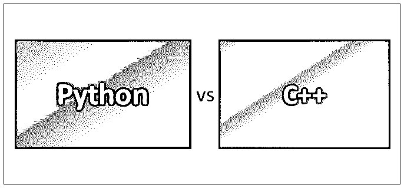
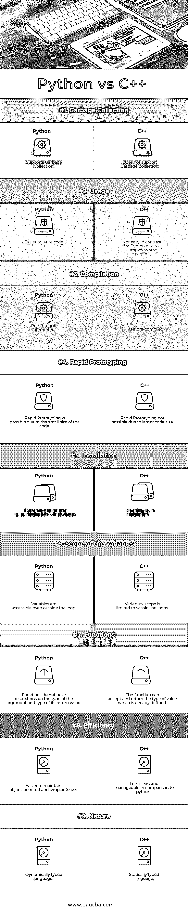

# Python vs C++

> 原文：<https://www.educba.com/python-vs-c-plus-plus/>

## Python 和 C++的区别

Python 和 C++是用于通用目的的编程语言，但是 Python 和 C++语言在许多方面彼此不同。C++起源于 C 语言，具有多种范式，并提供编译功能。

[Python 是](https://www.educba.com/what-is-python/)一种通用的、[高级编程语言](https://www.educba.com/learning-algorithms/)之一。在 python 中编写代码时，变量可以直接使用，无需声明。

<small>网页开发、编程语言、软件测试&其他</small>

在 C++中，单个程序需要在运行该代码的每个操作系统上编译。

Python 提供了“一次编写，随处运行”的能力，这使得它可以在所有安装了 [Python 的操作系统上运行。](https://www.educba.com/python-and-django-for-web-development/)

C++容易出现内存泄漏，因为它不提供[垃圾收集](https://www.educba.com/c-plus-plus-garbage-collection/)并且[在很大程度上使用指针](https://www.educba.com/pointers-in-c-plus-plus/)。

Python 有一个内置的垃圾收集和动态内存分配过程，支持高效的内存管理。

在 C++中，开发人员需要在使用数据类型之前声明它。因此，关于代码做什么就不那么模糊了，并且错误处理变得比 python 更容易。

在用 Python 编写代码时，用户在使用它之前不需要提及数据的类型，从而使代码的长度更短，更容易维护。例如，在 C++中，用户必须声明 int a=5，而在 Python 中，a=5 就足够了。

C++也被称为中级编程语言，因为它是使用低级和高级语言功能开发的。C++还支持面向对象的功能，如类的概念、运算符重载、多重继承、[虚函数](https://www.educba.com/virtual-function-in-java/)、[异常处理](https://www.educba.com/python-exception-handling/)等。

Python 以其简单、易于阅读相关代码而闻名，并被公认为一种高级编程语言。Python 由内置的结构组成，这些结构具有在小规模和大规模上执行清晰代码的特性。Python 是一种面向对象的编程语言。

C++，这些天来，一般用于设计硬件。首先用 C++对其进行描述，然后对其进行分析，在体系结构上进行约束，并计划开发一种寄存器传输级硬件描述语言。

Python 被用作脚本语言，有时也用于非脚本目的。此外，借助一些现有工具，Python 有一个独立的可执行应用程序。

### Python 和 C++的面对面比较(信息图)

以下是 Python 和 C++之间的 9 大区别:

### Python 和 C++的主要区别

Python 和 C++之间的主要区别在以下几点进行了解释:

*   Python 中的每个实体都被视为一个对象，无论它是在堆中还是驻留在堆中的浮点数。栈上的实体主要是引用了堆的变量名。
*   Python 具有较少的向后兼容性，而 C++与正在使用的系统更加兼容。
*   与 C++中的代码相比，Python 程序的长度要短得多，c++中的代码可以实现快速原型化，从而提高编码速度。
*   C++是完整的，基于使用现有库执行编码操作的二进制文件。
*   Python 在调用函数和返回值时具有灵活性。
*   C++使用编译器来编译代码。
*   Python 在运行时使用解释器。
*   各种各样的应用程序使用 C++来开发。
*   Python 可以访问基于 3D 的各种应用程序的 API。
*   与 C++相比，Python 是一种易于使用的编程语言。
*   Python 比 C++慢。
*   Python 有助于加快应用程序开发，并不断引入额外的语言特性。
*   由于复杂的语法，用 C++编写代码不像 python 那么简单。
*   Python 因其友好的语法而更易于使用和编写代码。
*   Python 内置了易于使用的库，对于学习和实现来说更加用户友好。
*   当划分到 Python 中时，两个数字导致 float(当从 _future_ 导入除法时)，而在 C++中，需要实现强制转换来实现这个功能。
*   使用 pickle 可以在 Python 中轻松实现对象的序列化。Saves()方法在 C++中是一项更费力的任务。
*   Python 扩展了对一整套反射特性的支持，通过这些特性可以迭代类方法、成员等。
*   Python 拥有比 C++中可用的库更大的标准库。

### Python 和 C++对照表

下面是要点列表，描述 Python 和 C++的比较。

| **BASIS FOR****比较** | **Python** | **C++** |
| **垃圾收集** | 支持垃圾收集 | 不支持垃圾收集 |
| **用途** | 更容易编写代码 | 与 Python 相比并不容易，因为语法复杂 |
| **编译** | 运行解释程序 | C++是预编译的 |
| **快速成型** | 由于代码很小，快速原型制作是可能的 | 由于较大的代码大小，快速原型制作不可能 |
| **安装** | Python 很难安装在 windows 系统上 | 安装没有困难 |
| **变量的范围** | 即使在循环之外也可以访问变量 | 变量的范围被限制在循环内 |
| **功能** | 函数对参数的类型及其返回值的类型没有限制。 | 该函数可以接受并返回已经定义的值类型。 |
| **效率** | 易于维护，面向对象，易于使用 | 与 python 相比，不够简洁和易于管理 |
| **性质** | 动态类型语言 | 静态类型语言 |

### 结论

有许多 C++软件编译器，无论是开源的还是免费的都可以很容易地在市场上买到。其中一些软件是 GNU Project、微软、英特尔和 Embarcadero Technologies。C++也对 C#和 Java 等其他编程语言产生了影响。C++变得比 C 更受欢迎，众所周知，C 是本机代码的编译器。C++还包括客户端应用程序、高性能服务器应用程序、设备驱动程序、嵌入式驱动程序组件、系统软件和[应用软件](https://www.educba.com/what-is-application-software-its-types/)。它也用于开发视频游戏的领域。因为 C++是一种静态类型的语言，所以程序是在编译时确定的。

Python 是另一种在很多方面不同于 C++的面向对象编程语言。与 C++相比，Python 使开发人员能够用更少的代码行编写函数，从而减少工作量。Python 被认为是一种具有多种范例的编程语言，具有更简单的编码语法和方法。Python 附带了大量内置的标准库。这些特性使得 [Python 成为一种实用的语言](https://www.educba.com/python-interview-questions/)。Python 的解释器可以很容易地在许多不同的操作系统中找到。在 Python 中，程序的类成员是在运行时确定的。开发人员可以在运行时重新分配方法和函数。

### 推荐文章

这是 Python 和 C++之间区别的指南。我们已经讨论了 Python 和 C++的直接比较、主要区别以及信息图和比较表。您也可以阅读以下文章，了解更多信息——

1.  [C++面试问题](https://www.educba.com/c-plus-plus-interview-questions/)
2.  [Java vs Node JS](https://www.educba.com/java-vs-node-js/)
3.  [Python vs Node.js](https://www.educba.com/python-vs-node-js/)
4.  [C++ vs Java](https://www.educba.com/c-plus-plus-vs-java/)

