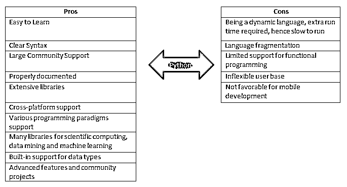
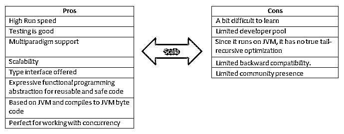
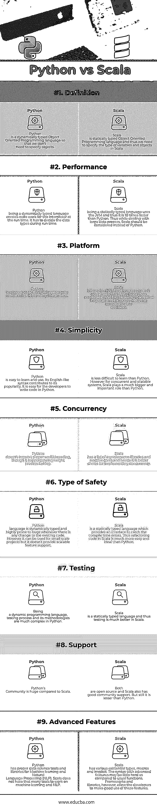

# Python vs Scala

> 原文：<https://www.educba.com/python-vs-scala/>

## Python 和 Scala 的区别

Python 和 Scala 是[数据科学](https://www.educba.com/data-science-vs-data-visualization/)、[大数据](https://www.educba.com/careers-in-big-data/)、集群计算的两大语言。 [Python 是](https://www.educba.com/what-is-python/)一种解释型高级面向对象编程语言。它是一种动态类型语言。它有一个到许多操作系统调用的接口，并支持多种编程模型，包括面向对象、命令式、函数式和过程式范例。 [Scala 是](https://www.educba.com/what-is-scala/)也是一种面向对象的编程语言。它用于为函数式编程和强大的静态类型系统提供支持。Scala 的名字来源于“可扩展”和“语言”的混合，它可以根据用户数量进行扩展，在这里，一切都是表达式。它平滑地集成了面向对象语言和函数式语言的特性。

**让我们更详细地学习 Python 和 Scala:**

<small>网页开发、编程语言、软件测试&其他</small>

Python 和 Scala 都是通用编程语言，支持面向对象的模型来创建应用程序。Python 和 Scala 语言在数据科学项目的发展和未来中都扮演着非常重要的角色。但是在同一时间点，Python 和 Scala 都有一些优点和缺点。

### Python 和 Scala 的优缺点

以下是 python 和 scala 的一些优缺点:

**Python(利弊)**

**Scala(利弊)**

### Python 和 Scala 的面对面比较(信息图)

下面是 Python 和 Scala 的 9 大对比:

### Python 和 Scala 的主要区别

Python 和 Scala 之间的差异将在以下几点进行解释:

1.  Python 是动态类型的解释语言，而 Scala 是静态类型的编译语言。
2.  对于开发来说，Python 似乎更有生产力，并且在大多数情况下不需要编译，这使得开发更快更快。在 Scala 的情况下，编译太慢；因此，Scala 应用程序的开发需要更多的时间。
3.  根据不同的任务复杂性，Python 拥有庞大的库。就 Scala 而言，它的库很小。
4.  Python 有很多可用的平台，但是最常用的是 CPython，而对于 Scala，应用程序运行在 JVM 中。
5.  在 [Python](https://www.educba.com/python-interview-questions/) 的情况下，低级可以通过使用 C 和 [C++](https://www.educba.com/c-programming-language-basics/) 进行扩展来实现。对于 Scala 来说，不容易做到一个很低的水平，大部分依赖 JVM。
6.  Python 有不错的内存使用，而 Scala 有更多的内存消耗。
7.  Python 比 Scala 好学多了。
8.  作为一种动态语言，Python 执行起来比 Scala 慢
9.  Python 测试起来不太复杂，因为它是动态的，而静态的；Scala 很适合[测试](https://www.educba.com/scalability-testing/)
10.  Python 是一种成熟的语言，它的使用还在继续增长。但是对于 Scala 来说，它没有广泛的用途或知识基础。

**推荐课程**

*   [c++和 DirectX 认证课程](https://www.educba.com/design/courses/directx-course/)
*   [胡迪尼在线认证培训](https://www.educba.com/design/courses/houdini-training-course/)

### Python 和 Scala 对照表

下面是展示 Python 和 Scala 之间比较的一系列要点。

| **比较依据** | **Python** | **Scala** |
| **定义** | Python 是一种动态类型的面向对象编程语言，因此我们不需要指定对象。 | Scala 是一种静态类型的面向对象编程语言，因此我们需要指定 Scala 中变量和对象的类型。 |
| **性能** | Python 是一种动态类型的语言，在运行时给解释器带来了额外的工作。它必须在运行时决定数据类型。 | Scala 是一种静态类型语言，使用 JVM，因此比 Python 快 10 倍。因此，在处理大型数据处理时，应该考虑 Scala 而不是 Python。 |
| **平台** | Python 有许多操作系统调用和库的接口。它有许多翻译。 | Scala 基于 JVM，其源代码被编译成 Java 字节码，然后由 JVM 执行。它基本上是一种编译语言，所有的源代码都是在执行前编译好的。 |
| **简单** | Python 易学易用。它类似英语的语法有助于它的流行。开发者用 Python 写代码很容易。 | Scala 没有 Python 难学。然而，对于并发和可伸缩的系统，Scala 扮演着比 Python 更大更重要的角色。 |
| **并发** | Python 不支持适当的多线程，尽管它支持重量级进程分叉。 | Scala 有一系列异步库和反应核心，因此它是实现并发性的更好选择。 |
| **安全类型** | Python 语言是动态类型的，只要现有代码有任何变化，就很容易出现错误。然而，它可以用于小规模项目，但它不提供可伸缩的功能支持。 | Scala 是一种静态类型语言，它提供了一个接口来捕捉编译时错误。因此，在 Scala 中重构代码比 Python 更容易也更理想。 |
| **测试** | 作为一种动态编程语言，Python 中的测试过程及其方法非常复杂。 | Scala 是一种静态类型语言，因此在 Scala 中测试要好得多。 |
| **支持** | 与 Scala 相比，Python 的社区是巨大的 | 两者都是开源的，Scala 也有很好的社区支持。但是，它仍然不如 Python。 |
| **高级功能** | Python 有合适的[数据科学工具](https://www.educba.com/data-science-tools/)和用于机器学习和自然语言处理(NLP)的库。Scala 没有那么多工具来处理机器学习和 [NLP](https://www.educba.com/nlp-interview-questions/) 。 | Scala 有各种[存在类型](https://www.educba.com/uses-of-scala/)，宏和隐式。与普通函数相比，高级特性的语法可能有点难。然而，框架和库允许开发者很好地利用这些特性。 |

### 结论

在对 Python 和 Scala 进行了一系列因素的比较后，可以得出结论，选择哪种语言完全取决于最适合项目需求的特性，因为每种语言都有自己的优缺点。因此，在决定编程语言之前，开发者应该学习和分析不同的 Python 和 Scala 语言。因此，根据项目需要、工作时间和其他讨论的方面，应该选择这些语言中的任何一种来达到预期的目标。

### 推荐文章

这是 Python 和 Scala 之间区别的指南。我们还讨论了 Python 和 Scala 的直接比较、主要区别以及信息图和比较表。您也可以阅读以下文章，了解更多信息——

1.  [Java 性能 vs Python](https://www.educba.com/java-performance-vs-python/)
2.  [Python vs 围棋](https://www.educba.com/python-vs-go/)
3.  [JavaScript vs Python](https://www.educba.com/python-vs-javascript/)
4.  [Perl vs Python](https://www.educba.com/perl-vs-python/)

