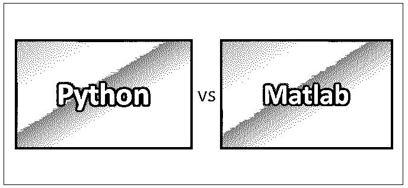
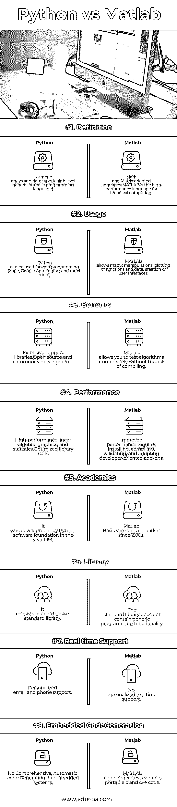

# Python vs Matlab

> 原文：<https://www.educba.com/python-vs-matlab/>

## Python 和 Matlab 的区别

Python 是一种高级编程语言。Python 是一种解释型、交互式和面向对象的编程语言，类似于 PERL 或 Ruby。它主要被设计成易于阅读和实现非常简单。它是开源的，这意味着它可以免费使用。Python 可以在所有操作系统上运行。 [MATLAB 是](https://www.educba.com/what-is-matlab/)一种高性能语言，通常用于技术计算。它在一个易于使用的环境中集成了计算、可视化和编程，其中问题和解决方案用熟悉的数学符号表示。

### 大蟒

*   Python 是一种广泛使用的语言。它最初是由 Guido Van Rossum 在 1991 年设计的，并在 Python 软件基金会中开发。开发它主要是为了强调代码的可读性。Python 是一种编程语言，可以让你快速工作，更有效地集成系统。
*   有两个主要的 [Python 版本](https://www.educba.com/versions-of-python/)——Python 2 和 Python 3。两者截然不同。Python 基本上是一种编程语言。最常见的实现是在 C 中，所以它被称为 CPython，最后被称为 Python。Python 也有广泛的标准库。

**Python 的用途和特点:**

<small>网页开发、编程语言、软件测试&其他</small>

1.  易学(干净、清晰的语法)。
2.  高度便携(几乎可以在任何地方运行–高端服务器和工作站)。
3.  可扩展且免费。
4.  使用空白来分隔块。

**生产力::**减少开发时间，提高程序维护性而 python 主要用于快速原型制作、Web 脚本、XML 处理、GUI 应用等。

### Matlab

Matlab 是矩阵实验室的缩写。它主要适用于与线性代数有关的矩阵运算和程序求解。它提供了许多额外的工具箱，如控制设计，图像处理，数字信号处理等。

**Matlab 的用途和特点::**

1.  通过模拟工作(节省时间、拯救生命、降低成本等)。)
2.  使用图像处理。
3.  Matlab 不仅是一种编程语言，也是一种编程接口。
4.  工具箱的加入可以大大扩展 Matlab 的功能。这些是提供更专门化功能的特定函数集。例如:Excel link 允许以 Excel 可识别的格式写入数据，Statistics Toolbox 允许对数据进行更专业的统计处理(方差分析、基本拟合等)。)

**生产力::例:**把大部分时间花在准备分析的数据上。

在上面的场景中，大部分时间将浪费在手工准备上；在这种情况下，Matlab 可以自动收集和准备数据，以便进行更好的分析。有了 Matlab，我们可以减少时间和准确性。

### Python 和 Matlab 的面对面比较(信息图)

以下是 Python 和 Matlab 之间的 8 大对比:

### Python 和 Matlab 的主要区别

让我们看看 Python 和 Matlab 之间的区别:

*   MATLAB 是编程语言，它是商业 MATLAB 软件的一部分，经常在研究和工业中使用。它是高级脚本语言的一个例子，也被称为第四代语言。
*   Python 是另一种高级语言，与 MATLAB 非常相似:它是解释型的，具有交互式提示，允许动态键入，并提供自动内存管理(并带有内置的复数)。
*   Matlab 对数据读入和命令执行的方式有些特别。这是一个预料中的问题，因为软件更倾向于开放代码，对非专业人员不太友好。因此，虽然这是直接使用 Matlab 的一个缺点。
*   Python 更容易把想法做成编码语言。有了这个免费的程序，它附带了库、列表和字典，将帮助程序员以一种组织良好的方式实现他们的最终目标。它通过与各种模块一起工作来使用，这允许它非常快速地启动。

### Python 和 Matlab 对照表

下面是解释 Python 和 Matlab 之间的比较的要点列表:

| **Python 与 Matlab 的对比基础** | **Python** | **Matlab** |
| **定义** | 数值数组和数据类型(一种高级通用编程语言) | 面向数学和矩阵的语言(MATLAB 是用于技术计算的高性能语言) |
| **用途** | Python 可以用于 web 编程(Zope、Google App Engine 等等) | MATLAB 允许矩阵操作、绘制函数和数据、创建用户界面 |
| **好处** | Extensive support libraries.开源和社区发展。 | Matlab 允许你不用编译就能立即测试算法， |
| **性能** | 高性能线性代数、图形和统计。优化的库调用 | 提高性能需要安装、编译、验证和采用面向开发人员的附加组件。 |
| **学术界** | 它是由 Python 软件基金会在 1991 年开发的。 | 自 20 世纪 70 年代以来，Matlab 基本版已经上市。 |
| **图书馆** | 它包括一个广泛的标准库 | 标准库不包含通用编程功能。 |
| **Real-time****支持** | 个性化电子邮件和电话支持 | 没有个性化的实时支持 |
| **Embedded****代码****代** | No comprehensive, Automatic  code

嵌入式系统的一代。

 | MATLAB 代码生成可读、可移植的 c 和 c++代码。 |

### 结论

最后，总结一下，Python 和 Matlab 各有优缺点。Python 和 Matlab 都是市场上非常成功的。与 Matlab 相比，Python 是最近的一次，它是专门为云环境设计的(随着数据持续增长，我们不断更新服务器和数据库)。这里我们讨论了 Python 和 Matlab 的优缺点。

MATLAB 是一个交互式系统，它的基本数据元素是一个不需要标注尺寸的数组。这使您能够解决许多技术计算问题，特别是那些矩阵和向量公式，所用的时间只是用标量非交互式语言(如 C 或 FORTRAN)编写程序的一小部分。

MATLAB 已经随着许多用户的输入发展了多年。它是大学环境中数学、工程和科学的入门和高级课程的标准教学工具。在业界，MATLAB 是高生产率研究、开发和分析的首选工具。

Python 也是顶尖的编码语言之一，截止到 2014 年)。这种语言是美国大学和世界各地更多大学的绝大多数计算机科学课程所要求的，或者至少是使用的。这意味着，如果一个人希望获得任何需要一些编码和/或计算机科学实践基础知识的学位，学习 Python 几乎是必不可少的，特别是对于那些希望开始数据分析职业生涯的人(因为开源)。

### 推荐文章

这是 Python 和 Matlab 之间最大区别的指南。在这里，我们用信息图和比较表来讨论 Python 和 Matlab 之间的主要区别。您也可以阅读以下文章，了解更多信息——

1.  [Python vs JavaScript](https://www.educba.com/python-vs-javascript/)
2.  [Java vs Python](https://www.educba.com/java-vs-python/)
3.  [Ruby vs Python](https://www.educba.com/ruby-vs-python/)
4.  [Python vs Groovy](https://www.educba.com/python-vs-groovy/)

