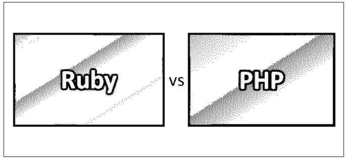
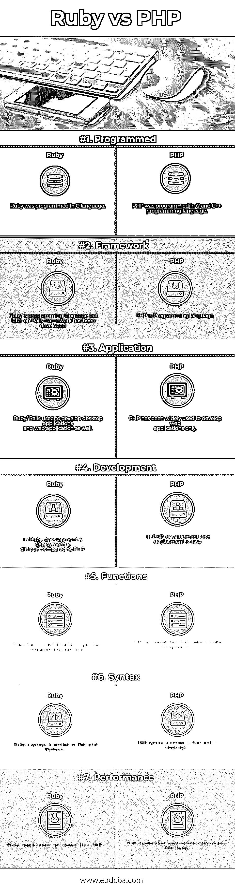

# Ruby vs PHP

> 原文：<https://www.educba.com/ruby-vs-php/>

## Ruby 和 PHP 的区别

Ruby 是一种面向对象的脚本语言。它是一种解释编程语言，用于高速开发 web 应用程序。Ruby 有非常清晰的语法，更容易理解和编写。Ruby 是开源的，免费且容易获得。它可以支持多种平台，如 Linux、Unix、Windows 和 Mac。PHP 是一种用于 web 开发的开源编程语言。它支持类似 Unix 和 Windows 的平台。PHP 文件名有如下扩展名。php、. php3、. php4、. php5、. php7、. phps. php 也简称 PHP:超文本预处理器。PHP 的语法类似于 C 语言。

### 红宝石

*   Ruby 是用 C 语言编写的。Ruby 的文件扩展名为“rb”。Ruby 具有 Perl、Small talk 和 Python 等其他脚本语言的特性。主要是它有一个类似 Perl 和 C 语言的语法。
*   Ruby 在强大和简单之间提供了很好的平衡，因为用 Ruby 编写的程序很容易维护和升级。有许多库是为扩展 ruby 而编写的，它主要强调测试。
*   Ruby 已经开发了一些特性，如动态类型和鸭类型、灵活的语法、继承、垃圾收集、异常处理、重载、词法闭包、[迭代器](https://www.educba.com/iterators-in-c-sharp/)、内置支持、可变范围。
*   Ruby 在 2005 年通过 Rails 框架获得了对 web 开发的重要性。Ruby on Rails 可用于开发界面脚本。 [Ruby on Rails](https://www.educba.com/ruby-commands/) 可以用 HTML 语言编写脚本。Ruby on rails 可以很容易地连接到数据库，内置函数可以用来构建 Ruby 脚本。

### 服务器端编程语言（Professional Hypertext Preprocessor 的缩写）

*   PHP 是由拉斯马斯·勒德尔夫和 Zend technologies 创建和开发的，并于 1995 年发布。上一次稳定发布是 2018 年的 7.2.5。是用 [C 和 C++语言](https://www.educba.com/c-vs-c-plus-plus/)写的。PHP 代码也可以嵌入到 HTML 语言中，用作服务器端脚本语言。
*   它使应用程序更加动态和简单。它可以很容易地连接到数据库，如 Oracle、MySQL、T2、SQL Server 等。PHP 使用了 PHP 解释器来处理代码。它可以在命令行工具和 GUI 应用程序的帮助下执行。
*   PHP 非常简单、高效、安全和灵活。PHP 广泛应用于小型 web 应用程序，比其他语言更受欢迎。
*   有 PHP 标志的蓝色大象代表 PHP 的吉祥物。哎呀，PHP 3 和 PHP 4 中引入的一个概念使编程变得更容易。

### Ruby 和 PHP 的直接比较(信息图表)

下面是 Ruby 和 PHP 的 7 大对比:

<small>网页开发、编程语言、软件测试&其他</small>

### Ruby 和 PHP 的主要区别

以下是 Ruby 和 PHP 的区别:

1.  Ruby 没有提供不同的语法来访问方法、变量和属性。PHP 提供了不同的语法来访问相同的。
2.  在 Ruby 中，语句终止符可以用作换行符；意思是下一行的一个字符。在 PHP 中，语句结束符是分号。
3.  在 Ruby 中，连接两个字符串。使用了“(点)”。在 PHP 中，为了连接，使用“+”号。
4.  Ruby 不支持整数数据类型。PHP 支持 32 位和 64 位整数数据类型。
5.  Ruby 具有强类型的类型。PHP 的类型比较弱。
6.  Ruby 具有很强的表现力和可读性。PHP 既健壮又简单
7.  Ruby 使用“END”来结束代码块。在 PHP 中，花括号{}用于结束代码块。
8.  Ruby 使用不同的语法来查找字符串的长度，可以写成“string.length”。而在 PHP 中，它可以写成‘strlen($ string)’。
9.  运行 Ruby 应用程序既昂贵又复杂，而且是一个非常耗时的过程。PHP 应用程序便宜得多，耗时也少。
10.  Ruby 支持记录和复数。但是 PHP 不支持复杂的数字和记录。
11.  Ruby 语法更容易理解和掌握。PHP 的语法从它的标准库开始就很复杂。

### Ruby 和 PHP 对照表

下面是要点列表，描述 Ruby 和 PHP 的比较:

| **BASIS FOR****比较** | **红宝石** | **PHP** |
| **已编程** | Ruby 是用 C 语言编程的。 | PHP 是用 C 和 C++编程语言编写的。 |
| **框架** | Ruby 是一种编程语言，但是后来，Rails 框架被开发出来了。 | PHP 是一种编程语言。 |
| **应用** | Ruby/ Rails 用于开发桌面应用程序和 web 应用程序。 | PHP 仅被广泛用于开发 web 应用程序。 |
| **开发** | 在 Ruby 中，开发和部署比 PHP 更难。 | 在 PHP 中，开发和部署很容易。 |
| **功能** | Ruby 必须加载库来获得相应的函数。 | PHP 有内置的函数，这使得事情变得更容易。 |
| **语法** | Ruby 的语法类似于 Perl 和 Python。 | PHP 的语法类似于 Perl 和 C 语言。 |
| **性能** | Ruby 应用程序比 PHP 慢。 | PHP 应用程序提供了比 Ruby 更好的性能。 |

### 结论

Ruby 和 PHP 都是通用的编程语言。这些都是开源的，免费的，平台上很容易获得。这些主要用于 web 开发应用程序，作为服务器端脚本语言。Ruby 和 PHP 都是动态类型的，而且 Ruby 和 PHP 都有伸缩能力。

PHP 在提供一致性、统一变量语法、敏感上下文和抽象语法方面更强，这使得语言一致，尽管在标准库问题上存在问题。PHP 简单易学，在市场上应用最为广泛。PHP 在在线资源、大量模板引擎和开发人员、大量编辑器和工具方面拥有强大的支持。

Ruby 比 PHP 更强大。它在 Rails 框架中很受欢迎，这使得该语言更加通用和适应性更强。与 PHP 相比，Ruby 很难学。Ruby 有一个很好的在线社区来提供支持，并受到开发人员的欢迎。

每种语言都有自己的强项。在构建应用程序时，有许多事情需要考虑，选择合适的语言来开发应用程序是一项复杂的任务。选择时会考虑语言的利弊，最重要的是，性能、可伸缩性、成本、支持和可维护性是主要考虑因素。

### 推荐文章

这是 Ruby 和 PHP 之间区别的有用指南。在这里，我们将讨论直接比较、主要差异以及信息图和比较表。您也可以阅读以下文章，了解更多信息——

1.  [Ruby vs Ruby On Rails](https://www.educba.com/ruby-vs-ruby-on-rails/)
2.  [Ruby vs Python](https://www.educba.com/ruby-vs-python/)
3.  [Rails vs PHP](https://www.educba.com/rails-vs-php/)
4.  [JavaScript vs Ruby](https://www.educba.com/javascript-vs-ruby/)

