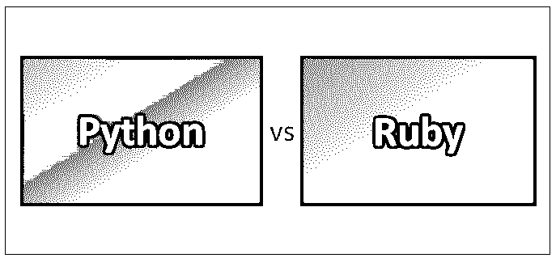

# Python vs Ruby

> 原文：<https://www.educba.com/python-vs-ruby/>

## Python 和 Ruby 的区别

Python 和 Ruby 是新一代的高级服务器端脚本语言，专注于更简单、更清晰和高性能的代码。Python 在科学界被有机地开发成一种原型语言，如果原型有效的话，它可以很容易地被翻译成 C++。Python 设想了一种直接的编程方法。在 Python 中，做一件事只有一种“最佳”方式。 [Ruby 专注于“人类语言”编程。它的代码读起来更像口头语言，而不是基于机器的语言，这使得 Ruby 在程序员中很受欢迎，无论是初学者还是专家。](https://www.educba.com/uses-of-ruby/)

**让我们更详细地学习 Python 和 Ruby:**

<small>网页开发、编程语言、软件测试&其他</small>

*   由于它们的标准库、持久性支持和功能丰富的框架，它们被广泛用于开发 web 应用和原型——Python 的 Django 框架和 Ruby 的 Ruby on Rails。Python 和 Ruby 都有解释脚本语言，不像 Java、C++等编译语言。尽管编译语言运行起来相对更快。
*   Ruby on Rails 作为 web 开发工具[比 Django-Python 更受欢迎。在学术和科学术语中，Python 更受青睐。Python 旨在让程序员明白一切。](https://www.educba.com/top-10-web-development-tools/)
*   这发生在它首次用于 web 开发之前很久。另一方面，Ruby 成为主要玩家是因为 web 开发。Rails 框架扩大了 Ruby 在开发复杂网站的人群中的受欢迎程度。
*   Ruby 遵循“最小惊讶”的原则，并提供了无数种方法来做同样的事情。这些类似的方法可以有多个名称，这让许多开发人员感到困惑和沮丧。

### Python 和 Ruby 的直接比较

以下是 Python 和 Ruby 的 6 大对比:

### Python 和 Ruby 的主要区别

以下是要点列表，描述了 Python 和 Ruby 之间的主要区别:

*   Python 有列表、元组、集合和字典形式的丰富的内置数据类型，而 Ruby 有数组和哈希作为 Python 的列表和字典的等价物。
*   Python 避免名称空间冲突的方法是给每个文件赋予自己的名称空间，这是通过模块、嵌套函数和类来实现的。相比之下，Ruby 的方法更容易发生冲突。
*   迭代器的使用是 Python 编程的核心，并与语言特性[自然融合，而 Ruby 中的迭代器](https://www.educba.com/iterators-in-c-sharp/)并不那么重要，很少使用。
*   Python 区分了“Unicode 字符串”和“字节字符串”，前者是代码点的集合，后者是没有确定编码的经典字节包，可以通过显式声明解析所用的编码将其转换为 Unicode 字符串。另一方面，Ruby 把所有的字符串都当作字节串，用一个半隐藏的标志来告诉它们是用什么编码存储的。
*   Python 嵌套函数背后的思想是，您可以嵌套 def 来定义只能在另一个封闭函数的范围内使用的函数。这非常有用。当 Ruby 遇到嵌套 def 时，它在调用封闭函数的对象类上定义一个新函数，这并不重要。
*   Ruby 有三个处理日期和时间的类。Date 将日期存储为年-月-日元组；DateTime 将日期和时间存储在一起；时间也存储日期和时间。Time 和 DateTime 的区别在于，前者内置于语言中，并将日期时间存储为 POSIX timespec。相比之下，后者在 stdlib 中，这意味着它随语言一起提供，但不会自动加载。它“正确地”实现了公历(计算从某个无人关心的任意纪元开始的天数，并在此基础上添加时间)。).Python 也能识别“天真”和“有意识”的日期时间对象。前者没有时区存在的概念，而后者是可扩展的，以允许支持例如 IANA tz 数据库的完整历史时区意识。
*   Ruby 的 IO.select 很好很简单，但是不够灵活。Python 为多路复用 I/O 系统调用的各种 UNIX/POSIX 变体提供了完整的接口库。Python 还有一个 BSD kqueue 系统调用的接口，这是 Ruby 所没有的。不利的一面是，IO.select，与它的名字相反，明智地选择了 select 或 poll，这取决于哪一个最适合这种情况；Python 让你自己选择。
*   Ruby 的积木更简单优雅。相比之下，Python 试图通过使用仍然远远落后的装饰器、类和一级函数来解决这个问题。
*   Ruby 中的列表理解比 Python 中的更容易阅读和理解。例如，Ruby 的变体看起来像(0..99).选择{|x| x % 2 == 0 }。map {|x| x ** 2 }比 Python 的[(x ** 2) for x in range(100) if (x % 2 为 0)]更容易理解。

### Python 和 Ruby 对照表

下面是 Python 和 Ruby 的对比表。

| **比较的基础** | **Python** | **红宝石** |
| **核心区域** | 学术和科学规划。它有许多数据科学的图书馆。 | [Web 开发](https://www.educba.com/career-in-web-development/)和函数式编程 |
| **用例** | 高流量的数据密集型站点和服务器。更快地运行数学、大数据和科学计算。因此，被数据科学家首选用于原型和数据分析。 | 快速实施复杂的高流量网站和应用程序 |
| **动机** | “实现目标的正确方法之一。”强调简单而非灵活 | “事半功倍。”以多种方式完成工作的自由和灵活性 |
| **与众不同的特性** | 简单易学，保守，代码可读性，快速，高效 | 富有表现力、高效、优雅和强大 |
| **开发者倾向** | 对变化的稳定性，保守的代码，更少的更新 | 创造性的编码、频繁的更新、自由和灵活性以及可读的代码 |
| **主要应用** | YouTube、Instagram、Spotify、Reddit 和 BitTorrent | Basecamp、Hulu、Twitter(最初)、 [Github](https://www.educba.com/install-github/) 和 Airbnb |

### 结论

总之，Python 和 Ruby 都是快速、高效的，并且拥有一个庞大而忠诚的社区。在涉及大量数据计算和处理的地方，Python 是显而易见的选择。Ruby 适合于需要对流量大的应用程序进行快速原型开发的场景。

对于 web 开发，Ruby 有 Rails，Python 有 Django。Python 和 Ruby 都是强大的框架；然而，Ruby 很受欢迎，也很灵活。在它的基础上还有一个非常强大的社区，他们总是处于发展的边缘。Python 是创建 web 应用程序的首选框架，web 应用程序具有更容易学习的额外优势。

### 推荐文章

这是 Python 和 Ruby 之间区别的指南。在这里，我们讨论了 Python 和 Ruby 的直接比较、关键差异、信息图和比较表。您也可以阅读以下文章，了解更多信息——

1.  [Python vs JavaScript](https://www.educba.com/python-vs-javascript/)
2.  [Node vs Ruby](https://www.educba.com/ruby-vs-node/)
3.  [Python vs Ruby 性能](https://www.educba.com/python-vs-ruby-performance/)
4.  [Ruby vs PHP](https://www.educba.com/ruby-vs-php/)

