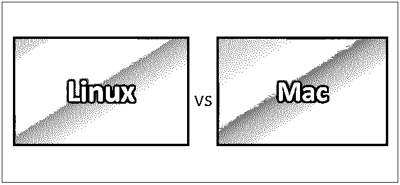
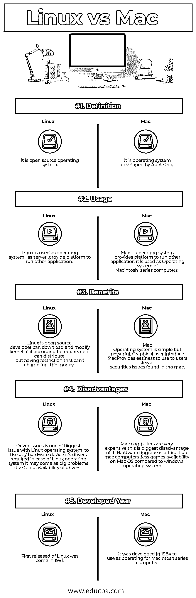

# Linux vs Mac

> 原文：<https://www.educba.com/linux-vs-mac/>

## Linux 和 Mac 的区别

虽然 Linux 和 Mac 都是电脑设备的操作系统，但是 [Linux 是一个](https://www.educba.com/what-is-linux/)可以在任何设备上使用的开源操作系统，Mac 是一个只能在 Mac 设备上使用的操作系统。Linux 充当操作系统、运行其他系统应用程序的平台和服务器单元。而 Mac 是允许其他系统应用程序在其上运行的操作系统。

### 什么是 Linux 和 Mac？

Linux 发行版的定义组件是 Linux 内核，它是由 Linus Torvalds 于 1991 年 9 月 17 日首次发布的操作系统内核。许多 Linux 发行版在它们的名称中使用了单词 Linux。Linux 最初是为基于 Intel x86 体系结构的个人计算机开发的，但后来被移植到比任何其他操作系统都多的平台上。由于基于 Linux 内核的 Android 操作系统在智能手机上的主导地位，Linux 在所有通用操作系统中拥有最大的安装基数。

<small>网页开发、编程语言、软件测试&其他</small>

1984 年，苹果发布了最初的麦金塔系统软件，开发了现在被称为经典 Mac OS 的操作系统。目前的 Mac 操作系统是 Mac OS，2012 年之前最初命名为 Mac OS X，2016 年之前命名为 OS X。苹果收购 NeXT 后，Mac OS X 在 1997 年至 2001 年间开发了一种基于 NeXTSTEP 的全新架构，这种 UNIX 系统消除了传统 Mac OS 面临的许多技术挑战。

Linux 包括许多版本，如 Android、Arch、Debian、Gentoo、kabunto、Mandriva、PC、Red Hat、Sabayon、Slackware 和 Suse。

Mac OS 的第一个桌面版本发布于 2001 年 3 月 24 日。从那以后，又发布了几个增加了新特性和新技术的版本。自 2011 年以来，每年都会发布新版本。

*   Mac OS X 狮子–版本 10.7，发布于 2011 年
*   OS X Mountain Lion–版本 10.8，发布于 2012 年
*   OS X Mavericks–2013 年发布的版本 10.9
*   OS X Yosemite–版本 10.10，发布于 2014 年
*   OS X El Capitan–版本 10.11，发布于 2015 年
*   MAC OS Sierra–2016 年发布的版本 10.12
*   MAC OS High Sierra–2017 年发布的版本 10.13

### Linux 和 Mac 的正面比较(信息图表)

以下是 Linux 和 Mac 的 5 大对比:

### Linux 和 Mac 的主要区别

下面解释了一些要点，展示了 Linux 和 Mac 之间的区别:

1.  Linux 开源操作系统，任何人都可以下载，并根据需要修改内容，然后分发。
2.  Mac OS 不是开源操作系统；如果有人想使用 Mac OS，他必须购买。its 没有人能像 [Linux](https://www.educba.com/linux-vs-ubuntu/) 一样按照自己的要求改变内容。
3.  基于 Linux 的驱动程序在市场上不容易买到，因为它是开源的。这给使用特定的硬件设备带来了问题。它是一家开源公司，不像微软和 Mac OS 那样为 Linux 创建驱动程序。
4.  Mac OS 不是开源的，所以它的驱动程序很容易获得。由于各种硬件驱动程序的可用性，任何种类的硬件设备都可以很容易地插入 Mac 计算机。
5.  Linux 是一个开源的操作系统，所以用户不需要花钱就可以使用 Linux。
6.  Mac OS 是苹果公司的产品；它不是一个开源产品，所以要使用 Mac OS，用户需要付费，然后唯一的用户才能使用它。Mac 电脑很贵；这是 Mac OS 的缺点之一。
7.  支持是开源产品的一个问题；发行 Linux 的公司通过支持赚钱。
8.  虽然在 Mac OS 中支持开箱即用，但您无需担心像 Linux 产品那样的支持，因为它是付费产品。
9.  Linux 操作系统非常安全；它以安全著称
10.  Mac OS 也是安全的，但与 Linux 相比差不了多少
11.  由于 Linux 的安全性和强大性，它被大多数公司用作服务器；许多公司都提供对 Linux 的支持，其中很少是 Red Hat、SUSE 和 CANONICAL。

### Linux 和 Mac 对照表

下面是 Linux 和 Mac 的对比表。

| **BASIS FOR****比较** | **Linux** | **Mac** |
| **定义** | 这是一个开源的操作系统 | 它是由苹果公司开发的操作系统 |
| **用途** | Linux 被用作操作系统，作为服务器，提供运行其他应用程序的平台。 | Mac 是一个操作系统，它提供了一个运行其他应用程序的平台；它被用作 Macintosh 系列计算机的操作系统。 |
| **好处** | Linux 是开源的；开发者可以根据需要下载并修改它的内核进行分发，但是有一个限制就是不能收费。 | Mac 操作系统简单但功能强大。图形用户界面 Mac 为用户提供了易用性。mac 中发现的证券发行减少。 |
| **缺点** | 驱动程序问题是 Linux 操作系统最大的问题之一。要使用任何硬件设备，就需要 Linux 操作系统的驱动程序；由于没有司机，这可能会成为大问题。 | Mac 电脑很贵；这是它最大的缺点。Mac 电脑上的硬件升级很难。与 Windows 操作系统相比，Mac OS 上的游戏可用性较低。 |
| **开发年份** | 1991 年，Linux 第一次发布 | 它是在 1984 年开发的，用作麦金塔系列计算机的操作系统。 |

### 结论

Linux 是一个开放源码的操作系统，如果需要支持，可以免费使用，那么你必须付费才能使用 Linux 的发行版，提供改变 Linux 内容和重新发行的工具，Linux 的安全特性吸引公司使用它作为服务器，这也是大多数公司使用 Linux 作为服务器的原因。Linux 发行公司为此提供支持。

Mac OS 是苹果公司的产品，用于 Macintosh 系列计算机，要使用 Mac OS，你必须支付大量的钱来购买，这是一种付费产品，因此失去了开箱即用的功能，并由公司提供支持，具有良好的图形用户界面，供个人用户使用，游戏，应用程序，应用程序可供使用。它适合个人使用；IOS 开发也是在 Mac OS 上完成的。

Linux 和 Mac 都是操作系统，各有其重要性，选择哪一个取决于需求，如果是公司服务器，一般选择 Linux，因为安全性强，如果是个人使用，Mac OS 会很好，因为有开箱即用的支持和许多应用程序。

### 推荐文章

这是一个关于 Linux 和 Mac 之间区别的有用指南。在这里，我们讨论了 Linux 与 Mac 的直接比较、关键差异、信息图和比较表。您也可以阅读以下文章，了解更多信息——

1.  [Linux vs Windows](https://www.educba.com/linux-vs-windows/)
2.  [Linux vs Windows 10](https://www.educba.com/linux-vs-windows-10/)
3.  [Linux vs Ubuntu](https://www.educba.com/linux-vs-ubuntu/)
4.  [Linux vs Windows Server](https://www.educba.com/linux-vs-windows-server/)

