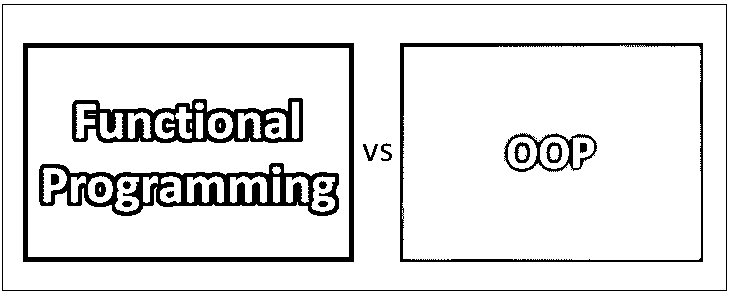
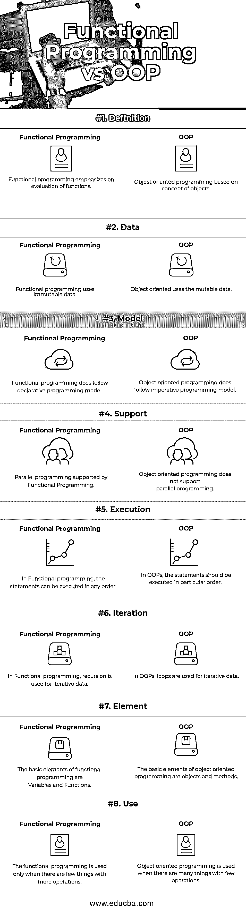

# 函数式编程与面向对象编程

> 原文：<https://www.educba.com/functional-programming-vs-oop/>

## 函数式编程与面向对象编程的区别

函数式编程是一种强调创建和实现程序所需的函数因素的编程技术。OOP 或面向对象的程序是使用对象作为关键的概念编程技术。函数式编程中使用的编程模型是声明式编程模型，而面向对象编程使用命令式编程模型。在函数式程序中，变量和函数是代码的主要元素，而在面向对象程序中，对象和方法是关键元素。

### 函数式编程

*   函数式编程还支持 Lisp、Clojure、Wolfram、Erlang、Haskell、F#、R 等编程语言，以及其他重要的特定领域语言。函数式编程非常适合数据科学工作，而 R 是数据科学家们的流行语言。
*   FP 语言可以很好地翻译成交互环境，这使得代码的理解更加容易。
*   函数式编程提供了诸如效率、惰性评估、[嵌套函数](https://www.educba.com/javascript-nested-functions/)、无 bug 代码、并行编程等优势。用简单的语言来说，函数式编程就是编写具有语句的函数来执行应用程序的特定任务。
*   该函数可以在任何时候轻松调用和重用。还有助于代码的管理，同样的事情或者语句不需要一遍又一遍的写。
*   基于不同概念的函数式编程是 1。高阶函数。2.纯函数。3.递归。4.严格评估和非严格评估。5.类型系统。6.参照透明。在函数式编程中，函数被称为一等公民。

### 面向对象编程

*   基于面向对象编程的主要特点有: **1 .抽象:**它有助于将有用的信息或相关数据提供给用户，提高程序的效率，使事情变得简单。 **2。继承:**它有助于继承派生类中基类的方法、函数、属性和字段。 **3。多态性:**借助重载和覆盖，它有助于以多种方式完成一项任务，这也分别被称为编译时和运行时多态性。 **4。封装:**它有助于对用户隐藏不相关的数据，并防止用户未经授权的访问。
*   [面向对象编程语言有 C++，C#](https://www.educba.com/c-sharp-interview-questions-and-answers/) ，Java，Python，Ruby，PHP，Perl，Objective-C，Swift，Dart，Lisp 等。在面向对象的应用程序中，对象可以很容易地在另一个应用程序中重用。可以很容易地为同一个类创建新对象，并且可以很容易地维护和修改代码。
*   它还具有内存管理的特性。它在设计大型程序时提供了很大的好处，大型程序可以很容易地分成较小的部分，并有助于区分需要以某种方式执行或计划的组件或阶段。

### 函数式编程和面向对象程序设计的直接比较

下面是函数式编程和面向对象编程的八大对比:

<small>网页开发、编程语言、软件测试&其他</small>

### 函数式编程和面向对象编程的主要区别

下面是描述函数式编程和面向对象编程之间区别的要点列表:

1.  [函数式编程用于](https://www.educba.com/functional-programming-in-javascript/)执行许多数据固定的不同操作。面向对象编程，用于执行一些具有共同行为和不同变体的操作。
2.  函数式编程有一个无状态的编程模型。面向对象编程有一个有状态编程模型。
3.  在函数式编程中，状态并不存在。在面向对象编程中，状态是存在的。
4.  在函数式编程中，函数是主要的操作单元。在面向对象中，对象是主要的操作单元。
5.  在函数式编程中，它的函数没有副作用，这意味着它不会影响在多个处理器上运行的代码。在[面向对象编程](https://www.educba.com/concepts-of-programming-languages/)中，它的方法会有副作用，可能会对处理器产生影响。
6.  在函数式编程中，编程的主要焦点是*我们在做什么*。在面向对象编程中，编程的主要焦点是*我们做得怎么样*。
7.  函数式编程主要支持数据抽象和行为抽象。面向对象编程主要只支持对数据的抽象。
8.  函数式编程为应用程序提供了处理大数据的高性能。面向对象编程不利于[大数据处理](https://www.educba.com/careers-in-big-data/)。
9.  函数式编程不支持条件语句。在面向对象编程中，条件语句可以像 if-else 语句和 [switch 语句](https://www.educba.com/switch-statement-in-matlab/)一样使用。

### 函数式编程和 OOP 对照表

下面是函数式编程和面向对象编程的对照表

| ****对比的依据**** | **功能编程** | **OOP** |
| **定义** | 函数式编程强调对函数的评估。 | 基于对象概念的面向对象编程。 |
| **数据** | 函数式编程使用不可变的数据。 | 面向对象使用可变数据。 |
| **型号** | 函数式编程确实遵循声明式编程模型。 | 面向对象编程确实遵循命令式编程模型。 |
| **支持** | 函数式编程支持的并行编程。 | 面向对象编程不支持并行编程。 |
| **执行** | 在函数式编程中，语句可以按任何顺序执行。 | 在 OOPs 中，语句应该按照特定的顺序执行。 |
| **迭代** | 在函数式编程中，递归用于迭代数据。 | 在 OOPs 中，循环用于迭代数据。 |
| **元素** | 函数式编程的基本元素是变量和函数。 | 面向对象编程的基本元素是对象和方法。 |
| **使用** | 函数式编程只有在操作比较多的事情比较少的时候才会用到。 | 面向对象编程用在事情多操作少的时候。 |

### 结论

函数式编程和面向对象编程都是编程语言的不同概念。函数式编程和面向对象编程语言的目标都是[提供无错误的代码](https://www.educba.com/advantages-of-oop/)，这些代码易于理解、编码良好、易于管理且开发快速。

函数式编程和面向对象编程使用不同的方法来存储和操作数据。在函数式编程中，数据不能存储在对象中，只能通过创建函数来进行转换。在面向对象编程中，数据存储在对象中。面向对象编程被程序员广泛使用，也很成功。

在面向对象编程中，很难在增加继承级别的同时维护对象。它也打破了封装的原则，甚至不是完全模块化的。在函数式编程中，总是需要一个新的对象来执行函数，并且需要大量的内存来执行应用程序。

最后，总结一下，总是由程序员或开发者来选择[编程语言概念](https://www.educba.com/learning-algorithms/)，这使得他们的开发富有成效且容易。

### 推荐文章

这是函数式编程和面向对象编程之间区别的有用指南。在这里，我们讨论了函数式编程与面向对象编程的直接比较、关键差异、信息图和比较表。您也可以阅读以下文章，了解更多信息——

1.  [硒和幻象](https://www.educba.com/selenium-vs-phantomjs/)
2.  [编程与脚本](https://www.educba.com/programming-vs-scripting/)
3.  [Linux vs Mac](https://www.educba.com/linux-vs-mac/)
4.  [硒 vs 幻影](https://www.educba.com/selenium-vs-phantomjs/)

