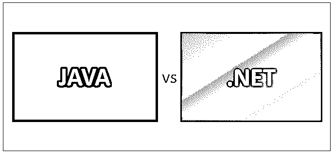
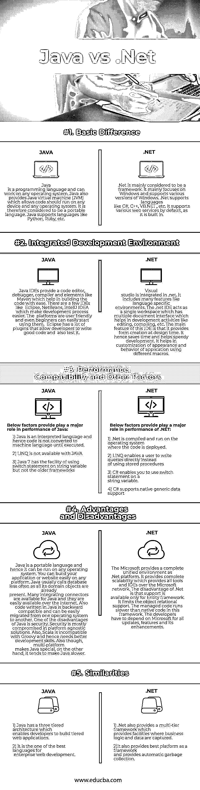

# Java 与. Net

> 原文：<https://www.educba.com/java-vs-dot-net/>

## Java 和. Net 的区别

Java 是一种编程语言，可以在任何操作系统上工作。Java 还为[提供了一个 Java 虚拟机](https://www.educba.com/java-virtual-machine/) (JVM)，它允许代码在任何操作系统上运行。NET 实际上是这个词最严格意义上的框架。.NET 使用 ASP.NET 创建不同的应用程序。Java 是一种编程语言，而。NET 是一个可以使用多种语言的框架。Java 和。Net 在编程世界中经常携手并进。Java 和。Net 平台执行类似的功能。虽然 Java 和. NET 通常都被称为框架，但是。

**让我们来看看 Java 和. Net 的主要区别。**

<small>网页开发、编程语言、软件测试&其他</small>

### Java 和。网络(信息图表)

下面是 Java 和。网络:

### Java 和。网

Java 和。Net 在以下几点进行了解释:

*   Java 基本上是一种编程语言，而。Net 是一个框架。Java 可以被认为是一个具有 JE 框架的平台，比如 J2EE。JEE 等。它有一个 Java 运行时环境，其中有 JVM、实时编译器和字节码编写器。它是一种有许多库的语言，可以在任何操作系统上使用。.另一方面，Net 使用 Windows 操作系统，即 Windows 企业服务器。它的框架由公共语言运行库、框架类库和 ASP.NET 组成。它也有自己的构建块服务和 visual studio。
*   .Net 拥有微软的专有平台，比任何开源平台都更安全。安全性是一个主要问题，Asp.Net 开发者很容易将其作为一个封闭的平台来处理。对于 Java，由于缺乏资源，安全性可能是一个问题。的公共语言运行库。Net 比 JVM 好，因为 JVM 只是将代码转换成底层操作系统的字节码。这不是针对计算机的，比 CLR 慢一点。Java 有很多编程的 ide，比如 Eclipse，NetBeans，而 etc.Net 有一个 Visual Studio。

### Java 和。净比较表

下面是描述 Java 和. Net 之间比较的要点列表

| **比较的基础** | **JAVA** | **。网络** |
| **基本差异** | Java 是一种编程语言，可以在任何操作系统上工作。Java 还提供了 Java 虚拟机(JVM)，它允许代码应该在任何设备和任何操作系统上运行。因此，它被认为是一种可移植的语言。Java 支持像 [Python、Ruby、](https://www.educba.com/python-vs-ruby/)等语言。 | .Net 主要被认为是一个框架。主要以 Windows 为主，支持各种版本的 Windows。.Net 支持 C# 、C++、【VB.NET】等语言。默认情况下，它支持各种 web 服务，因为它是内置的。 |
| **集成开发环境** | Java ide 提供了代码编辑器、调试器、编译器和类似 [Maven 的元素，帮助](https://www.educba.com/maven-commands/)轻松构建代码。有几个 ide 像 Eclipse，NetBeans，IntelliJ IDEA，让开发过程变得更简单。这些平台对用户友好，即使是初学者也可以很容易地开始使用。Eclipse 有许多插件，允许开发人员编写好的代码并进行测试。 | Visual Studio 与. net 集成在一起。它包括许多功能，如特定于语言的环境。的。net IDE 作为一个单一的工作空间，具有多个文档接口，有助于开发活动，如编辑、编译等。这个 IDE 的主要特点是它提供了在设计时创建窗体的功能。因此，它节省了时间，有助于快速开发。它有助于使用不同的宏定制应用程序的外观和行为。 |
| **性能、兼容性等因素。** | 以下因素对 Java 的性能起着重要作用:
1) Java 是一种解释型语言，因此代码在执行之前不会被转换成机器语言。2) LINQ 不适用于 JAVA
3) Java 7 可以在字符串变量上使用 switch 语句，但旧的框架不能 | 以下因素提供了发挥主要作用的性能。NET:
1)。Net 在部署代码的操作系统上编译和运行。2) LINQ 使用户能够直接编写查询，而不是使用存储过程。
3) C#允许你在字符串变量上使用 switch 语句。4)C#支持原生通用数据支持 |
|  | Java 是一种可移植的语言，因此它可以在任何操作系统上运行。您可以在任何平台上轻松构建您的应用程序或网站。Java 通常调用数据库——不太频繁，因为它的所有域对象都已经存在。许多集成连接器可用于 Java，并且它们很容易通过互联网获得。此外，用 Java 编写的代码是向后兼容的，可以很容易地从一个操作系统移植到另一个操作系统。Java 的缺点之一是安全性。在平台无关的解决方案中，安全性通常会受到影响。此外，Scala 与 Groovy T2 不兼容，因此需要更好的开发技能。此外，尽管多平台使 Java 与众不同，但另一方面，它也使 Java 变得更慢。 | 微软提供了一个完整的统一环境作为. Net 平台。它提供了完全的可伸缩性，在微软网络上提供了所有的工具和 ide。的缺点。Net 的一个缺点是只对实体框架提供支持。它限制了对象关系支持。在这个框架中，托管代码比本机代码运行得慢。开发人员必须依赖微软的所有更新，功能和它的增强。 |
| **相似之处** | 1)Java 有一个三层体系结构，使开发人员能够构建分层的 web 应用程序。它是企业网站开发的最佳语言之一。 | 1) .Net 还提供了一个多层框架，该框架提供了捕获业务逻辑和数据的工具。2)它还提供了最好的平台作为框架，并提供自动垃圾收集。 |

### 结论

总之，Java 和. Net 都是优秀的语言，是否使用 Java or.Net 取决于开发者的技能、需求和基础设施。用户必须计算 Java 和。Net 平台，[如果他们更依赖 Windows，那么他们可以去](https://www.educba.com/windows-interview-questions/)找. Net. Java 适合 web 项目，但是。Net 很适合于涉及 web 服务和 API 的项目。因此，最好是分析您的需求，检查您对 Java 和. Net 语言的偏好，这将有助于您最终确定使用哪种语言。最终，企业的整体运营效率才是最重要的。

### 推荐文章

这是 Java 和. Net 之间区别的指南。Net 头对头比较，关键差异，信息图和比较表。您也可以阅读以下文章，了解更多信息——

1.  [Java 与 c#–找出差异](https://www.educba.com/java-vs-c-sharp/)
2.  [JavaScript 应用 vs 调用及其优势](https://www.educba.com/javascript-apply-vs-call/)
3.  [Java 与 Ruby 7 有用的区别](https://www.educba.com/java-vs-ruby/)
4.  [JavaScript vs Ruby](https://www.educba.com/javascript-vs-ruby/)
5.  [Java 与 JavaScript 的比较](https://www.educba.com/java-vs-javascript/)
6.  [OS X vs Linux:哪个更有利](https://www.educba.com/os-x-vs-linux/)

