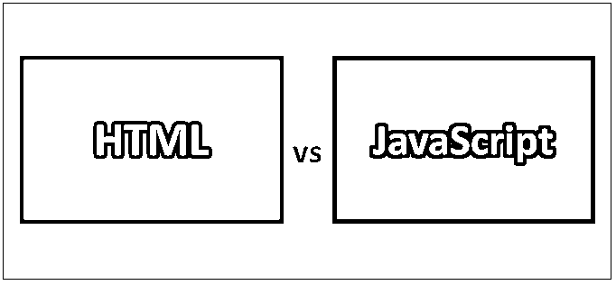
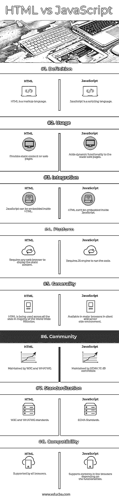

# HTML 与 JavaScript

> 原文：<https://www.educba.com/html-vs-javascript/>

## HTML 和 JavaScript 的区别

超文本标记语言是一种缩写为 HTML 的标记语言，用于[创建网络应用](https://www.educba.com/how-to-build-web-applications-using-mongodb/)或网页。HTML 可以将 JavaScript 程序以脚本的形式嵌入其中，通过修改网页内容而无需重新加载网页，将静态形式转换为动态形式。JavaScript 是一种[脚本语言](https://www.educba.com/programming-vs-scripting/)，通常缩写为 JS，一种高级解释的动态的、原型的基于继承的语言。JavaScript 支持函数式、面向对象和事件驱动的编程。

### Java Script 语言

JavaScript 是由 Brendan Eich 设计的，于 1995 年首次出现。JavaScript 由 ECMA(欧洲计算机制造商协会)组织标准化和维护，作为它的标准化名称命名为 ECMAScript。JavaScript 引擎是解释和运行 javaScript 代码所必需的，现在在服务器端和客户端的大多数 web 浏览器中都可以使用。

<small>网页开发、编程语言、软件测试&其他</small>

### 超文本标记语言

HTML 最初发布于 1993 年。HTML 5.2 是截至目前的最新版本。HTML 是由 W3C(万维网联盟)和 WHATWG(网络超文本应用技术工作组)共同开发的。文件扩展名可以是。html 或者。一般 htm。使用 html。HTML 的外观也可以通过包含 CSS(级联样式表)来修改和变得更好，CSS 是一种仅由 W3C 维护的样式表语言。CSS 通过将内容加载或包含到 HTML 中，使网页的感觉和外观更加丰富。

### HTML 和 JavaScript 的直接比较

以下是 HTML 和 JavaScript 的 8 大对比:

### HTML 和 JavaScript 的主要区别

以下是 HTML 和 JavaScript 的区别:

1.  HTML 有不同类型的元素来表示要在网页上显示的不同形式的数据，而 JavaScript 是一种脚本语言，可以将静态的 HTML 内容变成动态的。
2.  HTML 只是提供了网页应该显示什么而不是如何显示，而 JavaScript 提供了如何根据用户需求显示数据的功能。
3.  HTML 要求 CSS 以结构化格式正确地格式化和显示数据，而 JavaScript 通过将其集成到 HTML 代码中来提供动态功能。
4.  HTML 标准用于标记 web 内容，而 JavaScript 为 [HTML 和 CSS](https://www.educba.com/html-vs-css/) 提供编程功能，类似于通过 HTML 创建对象，然后由 JavaScript 根据用户输入操作它们。
5.  HTML 有不同类型的标签，如标题标签、段落标签、换行符标签、水平线、内容居中等。，而 JavaScript 具有不同的内置函数来定义和操作对象形式的数据，这是面向对象编程中基于原型的继承。
6.  HTML 具有可被定义为开始元素或开始标签(

    )的元素，其结束或结束标签的元素名称以正斜杠(

    )开头，而 JavaScript 具有要在 HTML 内容之间使用的函数和事件，以通过执行函数来提供动态功能。
7.  HTML 具有用于定义 HTML 元素特征的属性，并附加在 HTML 元素的开始标记之后，而 JavaScript 具有不同类型的对象符号和结构，例如数字、布尔、字符串、数学、日期、正则表达式、HTML DOM 等。,
8.  HTML 具有跨浏览器兼容性，可以很好地与所有版本的浏览器兼容，包括旧版本的浏览器，而 JavaScript 不具有跨浏览器兼容性，当浏览器改变时，它无法执行某些功能，这是一个缺点。
9.  HTML 将从服务器端呈现，因为它是静态内容，不需要任何客户端环境。相比之下，JavaScript 是执行的，是一种客户端脚本语言，JIT 编译器将在内部编译代码，然后在浏览器中解释它。然后，脚本或功能将在 web 浏览器上的客户端环境中执行。
10.  HTML 最新版本 5.0 及以上支持视频流和更多多媒体功能，而最新的 JavaScript 标准 ES 8 (ECMAScript)支持高级[函数编程](https://www.educba.com/functional-programming-vs-oop/)和更高阶的函数以及许多更强大的异步函数和内存优化。
11.  HTML 包含不同类型的数据类型支持，例如标题、页眉、页脚、内容、音频、视频、图像和锚标签，以在网页上显示，而 JavaScript 基于设计的功能和要求控制这些数据格式在网页上的显示。
12.  HTML 包含一个 DOM(文档对象模型)树，可以使用页面中的脚本(通常是 JavaScript 函数)来操作[网页](https://www.educba.com/design-web-page-in-html/)内容。
13.  每个页面中的 HTML DOM 都被视为一个对象，可以使用 HTML 规范提供的 API 对其进行操作，而 JavaScript 规范则可以利用函数式编程的优势来处理一些复杂的功能需求。

### HTML 和 JavaScript 对照表

下面是 HTML 和 JavaScript 的详细对比。

| **BASIS FOR****比较** | **HTML** | **JavaScript** |
| **定义** | HTML 是一种标记语言 | JavaScript 是一种脚本语言 |
| **用途** | 在网页上提供静态内容 | 向静态网页添加动态功能 |
| **整合** | JavaScript 可以嵌入到 HTML 中 | HTML 不能嵌入 JavaScript 中 |
| **平台** | 需要任何 web 浏览器来显示静态内容 | 需要 JS 引擎来运行代码 |
| **通用性** | 大多数万维网网站的所有站点都在使用 HTML | 适用于客户端和服务器端环境中的主流浏览器 |
| **社区** | 由 W3C 和 WHATWG 维护 | 由 ECMA TC-39 委员会维护 |
| **标准化** | W3C 和 WHATWG 标准 | ECMA 标准 |
| **兼容性** | 所有浏览器都支持 | 根据功能不同，支持少数浏览器中的内容 |

### 结论

HTML 提供了与 XHTML 相关的 API，XHTML 是 HTML 的扩展形式。HTML 提供实际的内容，而 JavaScript 通过为用户生成动态内容为最终用户提供一个交互界面。

HTML 主要用于提供静态网页内容，而 JavaScript 提供动态环境来处理网页上的动态事件。HTML 没有支持库，而 JavaScript 有强大的库，如 [AngularJS](https://www.educba.com/angularjs-interview-questions-for-experienced/) ，ReactJS，ExtJS，Vue JS 等。，以提供超快速和丰富的 web 应用程序。

### 推荐文章

这是 HTML 和 JavaScript 之间区别的指南。在这里，我们讨论了 HTML 与 JavaScript 的直接比较、关键差异、信息图和比较表。您也可以阅读以下文章，了解更多信息——

1.  [HTML vs XML](https://www.educba.com/html-vs-xml/)
2.  [Flash vs HTML5](https://www.educba.com/html5-vs-flash/)
3.  [JavaScript vs Ruby](https://www.educba.com/javascript-vs-ruby/)
4.  [HTML5 vs JavaScript](https://www.educba.com/html5-vs-javascript/)

