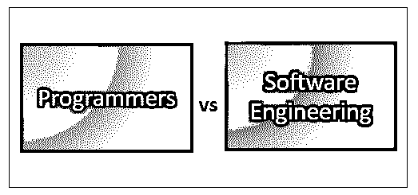
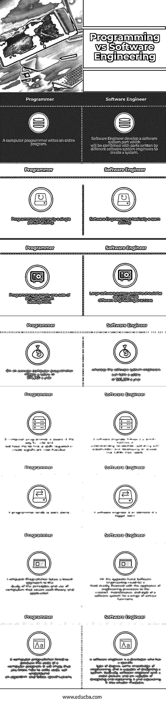

# 程序员 vs 软件工程

> 原文：<https://www.educba.com/programmers-vs-software-engineering/>

## 程序员和软件工程的区别

计算机程序员从软件工程师那里得到指导，并将编程风格转换成计算机可以遵循的书面代码指令。计算机程序员可以开发软件系统的基本风格，并通过编写代码将它们转化为现实。软件工程师(SEs)，又称为[软件开发人员](https://www.educba.com/career-as-a-software-developers/)，他们可以制作可靠的软件系统。软件工程师分析用户需求、公司需求和预算，然后根据需求设计、开发和实现软件系统。他们也关心创新风格的工作，这对开发新系统或任何应用程序都很重要。

### 什么是软件工程师？

软件工程师必须分析用户需求、公司需求、预算和风格，以开发和实现支持这些需求的软件系统解决方案。然后他们指导电脑程序员编写软件代码。一旦测试了程序的标准，软件系统工程师就参与维护软件系统以确认可靠性和效力。

<small>网页开发、编程语言、软件测试&其他</small>

他们决定一个企业或客户想要什么，并能根据他们的期望设计软件系统。计算机程序员可以做出关于软件系统应用程序应该开发什么以及如何出现的任何决定。

一些软件系统工程师也被称为计算机程序工程师，他们可以使用风格操作系统来管理笔记本电脑，电脑游戏控制台，智能手机和不同的设备。

*   计算机程序员构建软件系统的各个部分，这些部分可以与不同软件工程师编写的部分结合起来，创建一个系统&大画面的一小部分。
*   从质量谨慎的角度设计产品。
*   大型软件系统必须按照不同工程师实践的相同方式来构建(依赖于大量最新的工程实践，这些实践融入了流行的技术)

### 什么是程序员？

程序员应该是笔记本电脑语言的专家，如 C++和 Java，并准备好升级、扩展和纠正现有的程序代码，找出错误并修复它们。

这种写作可以构建应用程序或软件包或任何需要执行的工作。一个计算机用户可以理解不同的网络开发语言，像 Rails、 [PHP](https://www.educba.com/php-interview-questions/) 、Go、 [C++](https://www.educba.com/c-programming-language-basics/) 、 [Java](https://www.educba.com/java-vs-c-sharp/) 、 [Python](https://www.educba.com/python-vs-c-plus-plus/) 以及很多其他语言。直到最近，计算机用户基本上可以专注于一种编程。但是一个“[全栈开发者”](https://www.educba.com/full-stack-web-developer/)的替换术语，让交易预期有点完全不一样；因此，任何计算机用户都可以理解最少五种编程技巧来搞清楚任何代码开发。

*   计算机用户编写完整的程序或开发代码。
*   编程主要是一个人的活动。
*   编程只是软件系统开发的一个方面。

编程和软件工程，虽然看起来很相似，但也有不同之处。让我们详细研究以下差异:

### 程序员和软件工程之间的直接比较

下面是程序员和软件工程之间的 8 大区别:

### 程序员和软件工程对照表

下面是程序员和软件工程的对比表。

| **序列号** | **Programmer** | **软件工程师** |
| 1< | 一个电脑程序员编写一个完整的程序。 | 软件工程师开发一个软件系统部件，该部件将与不同软件系统工程师编写的部件结合起来，以创建一个系统。 |
| Two | 编程主要是一个人的活动。 | 软件工程基本上是一项团队活动。 |
| Three | 编程只是软件系统开发的一个方面。 | 大型软件系统的开发应该像不同的工程实践一样。 |
| Four | 在一台普通的计算机上，程序员的年薪是 78，260 美元。 | 而软件系统工程师的年薪是 93，280 美元。 |
| Five | 一个计算机程序员知道编码的方法，并具备创造重要商品所需的技术技能。 | 软件工程师遵循一种科学的方法来理解需求，与利益相关者一起工作，开发出满足他们需求的答案。 |
| Six | 程序员倾向于独自工作。 | 软件工程师是更大团队的一部分。 |
| Seven | 计算机程序员采取广泛的方法来研究计算机的原理和使用，包括每一个理论和应用。 | 另一方面，软件工程可能是一个主要涉及工程过程的应用的领域，它涉及一系列不同功能的软件系统的创建、维护和风格。 |
| Eight | 被雇来编写计算机程序代码的计算机程序员。这将意味着你知道如何编写代码，能够理解算法并遵循规范。 | 软件工程师是一个开发者，他有特定类型的学位，一些工程知识，并且有能力设计一个系统。基本上，软件工程师看到了一个更广阔的图景，并有能力设计和解释它，并把它分成更小的模块。 |

### 结论

最后，我只想提一下，计算机编程和软件工程的角色似乎是不可互换的。虽然有些人认为每个人都有类似的写作工作，但解读和提出他们的工作描述是完全不同的，这种区别会对他们的日常工作产生很大的影响，进而影响他们在组织中的角色和职责。

除了知道编程与软件工程之间的主要区别，每个工作角色都是那些试图成为拥有巨大职业机会的专业人士的更高选择。现在你可以决定你想成为什么样的人——计算机程序员或计算机用户。

### 推荐文章

这是程序员和软件工程之间最大差异的指南。我们还讨论了程序员与软件工程的直接比较、关键差异、信息图和比较表。您也可以看看以下文章，了解更多信息–

1.  [函数式编程与面向对象编程](https://www.educba.com/functional-programming-vs-oop/)
2.  [编程与脚本](https://www.educba.com/programming-vs-scripting/)
3.  [数据科学家 vs 软件工程师](https://www.educba.com/data-scientist-vs-software-engineer/)
4.  [数据科学 vs 软件工程](https://www.educba.com/data-science-vs-software-engineering/)

