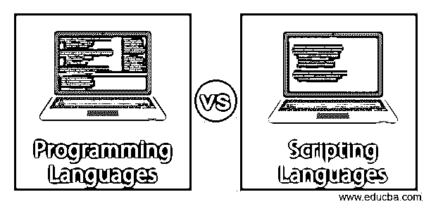
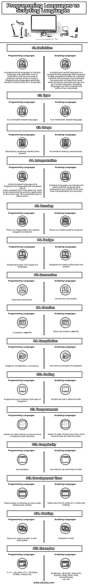

# 编程语言 vs 脚本语言

> 原文：<https://www.educba.com/programming-languages-vs-scripting-languages/>

## 编程语言和脚本语言的区别

[编程语言是](https://www.educba.com/what-is-a-programming-language/)使用编译器和脚本语言的是使用解释器的。重点讨论编译器和解释器，它们到底是什么编译器，扮演什么角色。编译器把高级语言转换成机器语言，这就是解释器的工作？

所以一个明显的问题出现了，编程语言和脚本语言之间有什么区别吗？是的，虽然他们做一些工作，但是他们执行的方式不同于编译器和解释器。系统不接受这种 HLL，所以编译器通过将这些 HLL 转换成[机器语言来帮助我们。](https://www.educba.com/machine-learning-programming-languages/)这些机器语言有一个二进制语言的伪名。以 0 和 1 的形式出现。

<small>网页开发、编程语言、软件测试&其他</small>

解释器通过将 HLL 编译成机器语言来实现完全相同的功能，但它是逐行执行的。解释器以一行一行的方式进行代码编译，而编译器一次完成所有的工作(在一个程序块中)。

### 编程语言和脚本语言(信息图表)

下面是编程语言和脚本语言的 15 大对比:

### 编程语言和脚本语言的主要区别

在我们研究编程语言和脚本语言之间的区别之前，很明显要知道这些语言为什么会诞生，开发人员之前的需求是什么？

最初，编写编程语言是为了构建像 Microsoft Excel、Microsoft Word、PowerPoint、互联网浏览器等程序。(为了便于理解，采用了这些术语)。因此，程序代码是用各种语言构建的，如 Java、 [C 和 C++](https://www.educba.com/c-vs-c-plus-plus/) 等。用户需要这些程序代码来添加新的功能，必须有一种替代方法来为他们的 bye 代码提供适当的接口，因此它导致了脚本语言的出现。

可以说脚本语言是一种不需要——显式编译步骤的编程语言。下面的场景将为读者的理解提供一些有用的见解。

举个例子，正常情况下你有一个 [C++程序](https://www.educba.com/c-programming-language-basics/)，你要先编译它，然后才能运行它。类似地，如果你有一个 [JavaScript 程序](https://www.educba.com/careers-in-javascript/)，那么你不需要在运行前编译它。这清楚地表明 JavaScript 是一种脚本语言。

### 编程语言与脚本语言的直接比较

1.  PL(编程语言)(类型)下有 5 个子类别:第一代/第二代/第三代/第四代/第五代 PL，而 SC(脚本语言)有服务器端和客户端脚本语言。
2.  PL 支持

*   数据类型的显式支持，
*   丰富的用户界面类型支持，
*   丰富的图形设计支持，而 SL 支持
*   数据类型的隐式支持，
*   对[用户界面设计](https://www.educba.com/what-is-ui-designer/)的有限支持，
*   不支持[图形设计](https://www.educba.com/graphic-design-interview-questions/)。

3.  从适用性的角度来看，PL。

*   在将代码与数学公式集成时，它更加兼容，而 SL
*   自动执行程序中的某项任务，并从数据集中提取信息。

### 编程语言和脚本语言对照表

以下是积分列表；描述编程语言和脚本语言的比较。

| **参数** | **编程语言** | **脚本语言** |
| **定义** | 编程语言是一种正式语言，它指定了一组可用于产生各种输出的指令。编程语言通常由计算机指令组成。 | 脚本或脚本语言是一种编程语言，它支持为特殊运行时环境编写的脚本 **:** 程序，这些程序可以自动执行任务，这些任务也可以由操作员逐个执行。脚本语言通常是解释型的(而不是编译型的)。 |
| **类型** | 这是一种基于编译器的语言 | 它是一种基于解释器的语言 |
| **用途** | 从头开始开发任何需要的东西 | 合并现有组件。 |
| **解读** | 与脚本语言不同，编程语言被编译成更紧凑的形式，不需要另一个应用程序以同样的方式解释。编译结果是独立的。 | 脚本语言在另一个程序中被解释(就像 JavaScript 被放在 HTML 中，然后被浏览器解释)。 |
| **运行中** | 它们独立于父程序或外部运行 | 这些在另一个程序中运行 |
| **设计** | 旨在充分利用一种语言 | 旨在使编码快速简单 |
| **转换** | 一次转换 | 逐行转换 |
| **创作** | 它创建了一个**。exe** 文件 | 不创建**。exe** 文件 |
| **编译** | 程序编译是必要的 | 不需要编译程序 |
| **编码** | 编程就是编写完整的程序代码 | 脚本只是一段代码 |
| **气质** | 更难编码。每个函数都需要许多行代码 | 更容易编码。每个函数只需要几行简短的代码 |
| **复杂度** | 很复杂 | 它们易于使用和书写 |
| **开发时间** | 因为需要编写更多的代码，所以需要更长的开发时间。 | 它需要较少的编码时间，因为它需要较少的编码。 |
| **主持** | 不需要主机。可自行执行 | 需要一个主机 |
| **例题** | C，C++，C#，Java，VC++，VB，Basic， [COBOL](https://www.educba.com/what-is-cobol/) ，Pascal 等。 | [JavaScript，VB 脚本](https://www.educba.com/javascript-vs-vbscript/)，Shell，Perl， [Python，Ruby](https://www.educba.com/python-vs-ruby/) ，Rexx，PHP，GameMonkey，Lua 等 |

### 结论

可以说，SL 是 PL 的一个子集，在看了上面提到的所有要点之后。执行环境是决定编程语言和脚本语言区别的决定性因素。脚本一般是用来控制应用程序行为的，编程语言用来[构建应用程序](https://www.educba.com/how-to-build-web-applications-using-mongodb/)。

在结束关于编程语言与脚本语言的讨论之前，我只想引用一些关于到目前为止所讨论主题的陈述。当我们根据脚本或程序相关的环境对编程语言和脚本语言的区别进行分类时，是必须要考虑的。一个活生生的例子说，我们可以为 C 语言设计一个解释器，我们可以将它用作脚本语言，同时，反过来也有它的价值。V8 是 Chrome 的 JavaScript 引擎，它将 JavaScript 代码编译成机器语言，而不是解释它。

底线是环境决定特性，并产生编程语言和脚本语言之间的差异。

### 推荐文章

这是编程语言和脚本语言之间差异的有用指南。在这里，我们讨论了编程语言与脚本语言的直接比较、关键差异以及信息图和比较表。你也可以看看下面的文章来了解更多。

1.  [函数式编程与面向对象编程](https://www.educba.com/functional-programming-vs-oop/)
2.  [编程与脚本](https://www.educba.com/programming-vs-scripting/)
3.  [棱角 vs 脊柱](https://www.educba.com/angular-vs-backbone/)
4.  [编码 vs 编程](https://www.educba.com/coding-vs-programming/)

