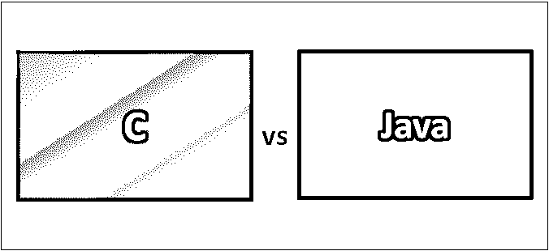
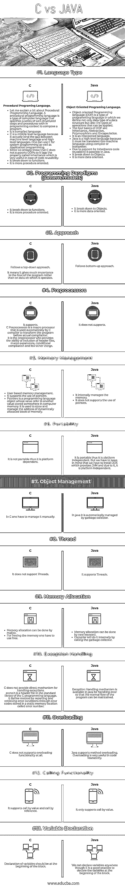

# c 与 Java

> 原文：<https://www.educba.com/c-vs-java/>

## C 和 Java 的区别

几乎我们所有人都知道丹尼斯·m·里奇是谁。是的，C 语言是他在 1969 年到 1973 年间在贝尔实验室开发的，它被用来重新实现 UNIX 操作系统。你知道开发 C 的项目名吗？这是多种多样的**。**

Java: 詹姆斯·高斯林是 Java 的[开发者。它是由 Sun Microsystems 开发的，并于 1995 年作为 Sun Microsystems 的一个组件发布。最初，它被称为橡树，以高斯林办公室外的一棵橡树命名。然后又改成了绿色，最后，改名为 Java。](https://www.educba.com/java-developer-interview-questions/)

<small>网页开发、编程语言、软件测试&其他</small>

### C 与 Java 的直接比较(信息图表)

以下是 C 与 Java 之间的 13 大对比:

### C 和 Java 的主要区别

C 语言和 Java 语言的主要区别如下:

*   C 和 Java 的主要区别是编程范式告诉我们 C 是面向过程的，而 Java 是面向数据的。
*   c 不支持 [OOPs 概念](https://www.educba.com/functional-programming-vs-oop/)，而它的对应物支持 OOPs。因此，当一个人不得不根据现实世界来联系事物时，Java 是合适的。
*   内存管理也是需要考虑的一个重要方面，因为 Java 不允许访问它内部管理的任何内存，因此很容易将精力集中在开发业务逻辑上。
*   异常处理是 Java 中一种强大的机制，它可以在出现任何异常的情况下保持程序的正常运行，而这是我们在 c 语言中无法直接实现的。
*   当我们比较语言时，可移植性也是一个因素。当收入到 Java 时，它在可移植性方面赢得了比赛。
*   c 也不支持线程的概念，而这在 Java 中也是一大优势。在当今的日常环境中，线程化是一个很大的优势，它允许我们同时完成工作，这样我们还可以节省时间。

### c 与 Java 对照表

下面是描述 C 与 Java 之间比较的要点列表:

| **比较的基础** | **C** | **Java** |
| **语言类型** | 程序编程语言。

*   Let me explain about the procedural programming language. Programming language is a computer language, which specifies a series of well-structured steps and procedures in the programming context to write programs.
*   It is a compiled language.
*   C is an intermediate language because it actually binds the gap between machine-level languages and high-level languages. People can use C for system programming and application programming.
*   Because we already know that C does not support OOPs, it lags behind the attribute [called inheritance, which is very useful in the case of code reuse.](https://www.educba.com/what-is-inheritance-in-programming/)

 | 面向对象编程语言。

*   Object-oriented programming language (OOP) is a programming language, in which we not only define the data types of data structures, but also define the applicable operation types.
*   The four foundations of object-oriented are inheritance, abstraction, polymorphism and encapsulation.
*   It is an explanatory language.
*   Java is a high-level language because it must be translated into machine language using a compiler or interpreter.
*   With the support of inheritance, code reuse becomes possible in Java.

 |
| **编程范例(模式/模型)** | 

*   It breaks down into functions.
*   It is more program-oriented.

 | 

*   It breaks down into objects.
*   It is more data-oriented.

 |
| **接近** | 

*   Follow the top-down approach.
*   This means that it pays more attention to the process of the program than the data it operates.

 | 

*   Follow the bottom-up approach.

 |
| **预处理器** | 

*   It supports.
*   C Predecessor is a macro processor, which is automatically used by [C compiler](https://www.educba.com/best-c-compilers/) to convert the program before it is actually compiled. The preprocessor provides header files, macro extensions, conditional compilation and other functions.

 | 

*   It does not support.

 |
| **记忆**
**管理** | 

*   Memory management based on users.

 | 

*   It manages memory internally.
*   It does not support the use of pointers.

 |
| **便携性** | 

*   Not portable; Therefore, it depends on the platform.

 | 

*   It is portable; Therefore, it is platform independent.
*   But we have to remember that we have to [install JDK](https://www.educba.com/install-jdk/) , which provides JVM, and because of it, it is platform independent.

 |
| **对象**
**管理** | 圆锥中的

*   It must be managed manually.

 | 

*   In Java, it is automatically managed by the garbage collector.

 |
| **线程** | 

*   Threads are not supported.

 | 

*   Support threads.

 |
| **内存**
**分配** | 

*   Memory allocation can be done through malloc.
*   To free up memory, you have to use it for free.

 | 

*   Memory allocation can be done by a new keyword.
*   The compiler will do it internally by calling [garbage collector](https://www.educba.com/what-is-java-garbage-collector/) .

 |
| **异常**
**处理** | 

*   C does not provide a direct mechanism for handling exceptions.
*   Errno.h is a header file in the standard library of C programming language. It defines macros for reporting and retrieving error conditions through error codes stored in static memory locations called error numbers.

 | 

*   Java provides an exception handling mechanism to handle errors to maintain the normal flow of the program.

 |
| **过载** | 

*   C does not support overloading at all.

 | 

*   Java [supports method](https://www.educba.com/advantages-of-c/) overloading.
*   Overloading is very useful in code readability.

 |
| **呼叫功能** | 

*   Support call by value and call by reference.

 | 

*   Only call by value is supported.

 |
| **变量声明** | 

*   The variable declaration should be at the beginning of the block.

 | 我们可以在任何地方声明变量，尽管在块的开始声明变量是一个好习惯。T3】 |

### 结论

所以从上面的讨论中，我们得出的结论是 C 和 Java 都是两种不同的编程语言。Java 是行业层面上最流行的语言，用于 web 应用程序(T1)和移动应用程序(T3)的开发。但是我们不能否认 C 语言是最古老的语言，也是非常流行的语言。从[微控制器](https://www.educba.com/what-is-microcontroller/)到操作系统的一切都是用 C 写的，因为它的灵活性和多功能性，允许用最少的命令实现最大的控制。C 和 Java 编程语言都在不同的方面持有自己的立场，所以总有一些我们可以比较但不能取代对方的地方。

### 推荐文章

这是 C 与 Java 的对比指南。在这里，我们讨论了 C 与 Java 的直接比较、主要区别、信息图和比较表。您也可以看看以下文章，了解更多信息–

1.  [Java 与 C#的区别](https://www.educba.com/java-vs-c-sharp/)
2.  [C 与 C++:差异](https://www.educba.com/c-vs-c-plus-plus/)
3.  [C 与 C++性能:有什么区别](https://www.educba.com/c-vs-c-plus-plus-performance/)
4.  [C 与 C#:优势](https://www.educba.com/c-vs-c-sharp/)

