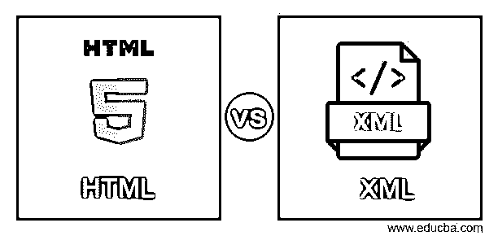
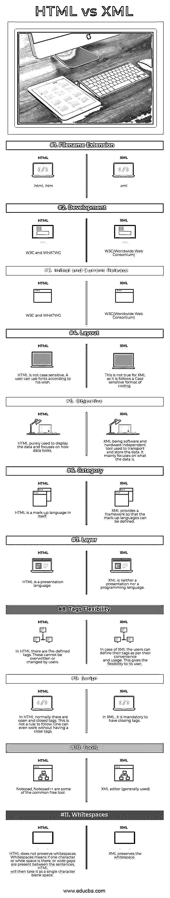

# HTML 与 XML

> 原文：<https://www.educba.com/html-vs-xml/>

## HTML 和 XML 的区别

计算机像人一样使用语言交流。计算机与互联网通信的方式是通过一种计算机语言，这就是本文 HTML 与 XML 的内容。像往常一样，在我们进入 HTML 与 XML 文章的细节之前，最好先弄清楚一些术语。

条款

<small>网页开发、编程语言、软件测试&其他</small>

1.  **超文本**是将对象相互链接的过程，这样当一个对象被点击时，被链接的对象可以被相应地查看或使用(意思是根据所采取的动作)。
2.  **标记**字面上的意思是符号或记号，用于在组成文本时进行纠正，并指示文本应该如何显示。一些常用的符号是(<、>、^、/、？).标记是指可以插入文本文件中特定位置的字符或其他符号的序列，以指示文件在打印或显示时的外观。
3.  **可延伸的**指能够被拉长或延伸的东西。在[信息技术](https://www.educba.com/information-technology-benefits/)中，可扩展指的是一个程序或[编程语言](https://www.educba.com/what-is-a-programming-language/)，它的用户和开发者可以扩展或增加它的功能。

### HTML 和 XML 的直接比较(信息图表)

以下是 HTML 和 XML 的 11 大区别:

### HTML 和 XML 的主要区别

以下是要点列表，描述了 HTML 和 XML 之间的主要区别:

在我们讨论 HTML 和 XML 之间的区别之前，我们应该知道它们之间有一些相似之处。首先，HTML 和 XML 都是语言，都是用于 web 的。XML 和 HTML 都是标记语言。标签是构建 XML 和 HTML 的博客。最后一个有趣的相似之处是它们都起源于 SGML(标准化标记语言)

让我们看看 HTML 和 XML 下的基本代码示例。这将使您清楚地理解其中使用的元素、结构和标签元素。

**HTML**

——————————这是开头的标签

**XML**

<contact-information></contact-information>

<name>教育署/name></name>

<designation>组织</designation>

<address>孟买</address>

<contact>987654321</contact>

注:红色信息为标记，黑色信息为普通文本。

1.  XML 和 XHTML 有无限多的可能元素，而 HTML 遵循一组严格的预定义元素。
2.  这两只股票之间还有一个有趣的关系。一个可以是其他的子集，而其他的不能是 first 的超集。所有的 HTML 都可以是 XML，但是反过来也不包含值，除非它使用 HTML 元素并充当 XHTML。
3.  XML 元素不传递含义，它的解析器不会对这些元素起作用，而另一方面，HTML 元素通过它们的使用来传递含义或浏览器指令。
4.  XML 属性必须有引号，不能没有值。在某些情况下， [HTML 属性](https://www.educba.com/html-attributes/)需要引号，可以省略多余的值，除非是 XHTML，在这种情况下，它采用 XML 属性规则。

### HTML 和 XML 对照表

下面是 HTML 和 XML 的对照表。

| **比较的基础** | **HTML** | **XML** |
| **文件扩展名** | .html，。html 文件的后缀 | .xml |
| **开发** | W3C 和 WHATWG | 万维网联盟 |
| **初始和当前版本** | 1993 年首次发布。最新版本(2017 年 12 月 14 日日)。 | 没有这样的细节。有一个稳定的版本。 |
| **布局** | HTML 不区分大小写。用户可以根据自己的意愿使用字体 | 这对于 XML 是不正确的，因为它遵循区分大小写的编码格式。 |
| **目标** | HTML 纯粹用于显示数据，并关注数据的外观。 | XML 是一种独立于软件和硬件的工具，用于传输和存储数据。它主要关注数据是什么。 |
| **类别** | HTML 本身就是一种标记语言。 | XML 提供了一个框架，因此可以定义标记语言。 |
|  **层** |  HTML 是一种表示语言 |  XML 既不是一种表示，也不是一种编程语言 |
| **标签灵活性** | 在 HTML 中，有预定义的标签。用户不能覆盖或更改这些内容。 | 在 XML 的情况下，用户可以根据他们的方便和使用来定义他们的标签。这为其用户提供了灵活性。 |
| **脚本** | 在 HTML 中，通常有开始和结束标签。这不是一个可以遵循的规则。人们甚至可以在没有近距离标签的情况下工作。 | 在 XML 中，必须有结束标记。 |
| **工具** | 记事本，记事本++是一些常见的免费工具 | XML 编辑器(通常使用) |
| **空格** | HTML 不保留空白。空白意味着如果有一个字符或空白，或者句子之间有很大的空白，HTML 就会把它当作单个字符空白。 | XML 保留空白。 |

### 结论

我们已经看到了这些技术是如何成为 web 开发的构件的。到目前为止，这篇文章已经介绍了与 HTML 和 XML 相关的术语——比较了它们的用处以及在使用方面的优劣。我们还看到了它们的正确语法以及它们之间的标记差异。HTML 和 XML 实际上是很大的主题，但是我必须说，到目前为止的读者肯定会按照要求学习技术细节。这些 web 开发技术最好的部分是工具的可用性，这些工具很容易获得和实践。

这两者都是全球公认的 web 开发工具，并被 W3C 接受。HTML 在格式化文本、添加图形、创建链接、输入表单、框架和表格方面有着巨大的潜力。XML 的存储和传输能力也是如此。然后，浏览器使用这些信息向世界各地的人们显示信息。

### 推荐文章

这是 HTML 和 XML 之间最大差异的指南。我们还讨论了 HTML 和 XML 的直接比较、主要区别、信息图和比较表。您也可以看看以下文章，了解更多信息–

1.  [HTML vs CSS](https://www.educba.com/html-vs-css/)
2.  [HTML vs HTM](https://www.educba.com/html-vs-htm/)
3.  [HTML vs XHTML](https://www.educba.com/html-vs-xhtml/)
4.  HTML vs WordPress

