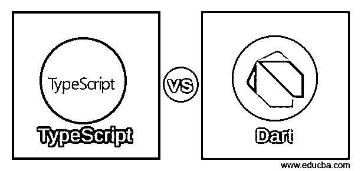
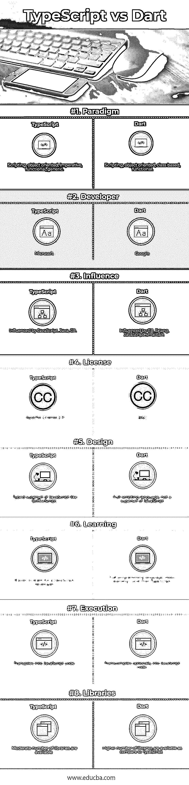

# 打字稿与飞镖

> 原文：<https://www.educba.com/typescript-vs-dart/>

## TypeScript 和 Dart 之间的区别

[TypeScript 是一种](https://www.educba.com/what-is-typescript/)开源编程语言，是 JavaScript 的类型化[超集，编译成普通 JavaScript。它由微软](https://www.educba.com/typescript-vs-javascript/)开发和[维护。由于 TypeScript 是 JavaScript 的超集，所有现有的 JavaScript 程序也是有效的 TypeScript 程序。](https://www.educba.com/microsoft-azure-interview-questions/) [TypeScript 可用于](https://www.educba.com/typescript-operators/)开发客户端和服务器端执行的 JavaScript 应用程序。

Dart 是一种通用的、基于类的、面向对象的编程语言，具有 C 风格的语法，用于构建 web 和[移动应用](https://www.educba.com/mobile-applications/)。它还被用于创造[物联网](https://www.educba.com/iot-applications/)(物联网)设备。它是开源的，由 Google 开发，后来被 ECMA 批准为标准。Dart 支持接口、[抽象类](https://www.educba.com/abstract-classes-in-javascript/)、泛型、静态类型和混合。

<small>网页开发、编程语言、软件测试&其他</small>

TypeScript 可以被认为是应用程序规模开发的 JavaScript。它是强类型、面向对象和编译语言。TypeScript 还附带了一组工具。换句话说，TypeScript 是带有一些附加特性的 JavaScript。它是为大型应用程序的开发和 JavaScript 的移植而设计的。TypeScript 编译器本身是用 TypeScript 编写的，然后编译成 JavaScript。

Dart 可选地转换编译成 JavaScript。人们可以认为 Dart 是 JavaScript 的 Google 替代品。它于 2011 年 10 月发布，旨在提供与 JavaScript 相同的工具，只是作为强大的工具。Dart 有很多面向对象的特性，典型的 JavaScript 程序员可能不熟悉这些特性。

TypeScript 支持可以包含现有 JavaScript 库的类型信息的定义文件。此功能使程序能够使用文件中定义的值，就像它们是静态类型化的 TypeScript 实体一样。它作为一级编程语言包含在 Microsoft Development Studio 2013 和更高版本中。安德斯·海尔斯伯格在微软设计了它，他也是 C#的设计者。

Dart 大量用于创建单页面应用程序。这些类型的应用程序能够在网站的不同屏幕之间导航，而无需在浏览器中加载整个网页。例如，在 Gmail 中，点击收件箱中的一封邮件，浏览器会停留在同一个[网页](https://www.educba.com/free-web-page-designing-software/)，但是 JavaScript 会隐藏收件箱并将邮件正文显示在屏幕上。在 web 浏览器中运行 Dart 代码时，使用 dart2js 编译器将代码预编译成 JavaScript。由于代码编译为 JavaScript，Dart 兼容所有主流浏览器，无需浏览器采用 Dart。

TypeScript 采用了来自 JavaScript 的程序的基本构建块。任何知道 [JavaScript](https://www.educba.com/what-is-javascript/) 的人都可以流畅地使用 TypeScript，因为所有的 TypeScript 代码都被转换成 JavaScript 以便执行。生成的 JavaScript 可以重用所有已有的 [JavaScript 框架](https://www.educba.com/best-javascript-frameworks/)，库，工具；因此，任何有效的。js 文件可以重命名为。ts 并用其他类型脚本文件编译。TypeScript 可跨浏览器、设备和操作系统移植。它不需要专用的虚拟机或特定的运行时环境来执行。TypeScript 通过 TLS 附带了一个可选的静态类型化和类型推理系统，即 TypeScript 语言服务。

### TypeScript 和 Dart 之间的直接比较

下面是 TypeScript 和 Dart 之间的 8 大对比:

### TypeScript 和 Dart 之间的主要区别

下面列出了描述 TypeScript 和 Dart 之间差异的要点:

1.  TypeScript 是一种被设计成 JavaScript 的类型化超集的语言；因此，JavaScript 是有效的类型脚本代码，而 Dart 本身是一种完整的[脚本语言](https://www.educba.com/programming-languages-vs-scripting-languages/)，而不是 JavaScript 的超集。
2.  TypeScript 的学习难度较低，因为 JavaScript 也是一种有效的类型脚本，而 Dart 是一种完整的编程语言，提供了一些额外的语法功能。
3.  TypeScript 由微软设计和开发，而 Dart 由谷歌负责，后来被 ECMA 批准为标准。
4.  TypeScript 是开发大型应用程序的理想选择，而 Dart 是 Gmail 等单页应用程序的理想选择。
5.  TypeScript 具有可选的静态类型，支持继承和泛型，而 Dart 是一种单线程编程语言，具有强大的异步语言支持。
6.  TypeScript 有中等数量的具有高质量定义的库，而 Dart 有全面的核心库来帮助:异步集合、字符串、正则表达式、文件、数学等等。
7.  TypeScript 是 JavaScript 的超集，兼容所有浏览器；浏览器上不需要特定的可执行文件，而 Dartium 是一个集成了 Dart VM 的浏览器，它允许运行和调试本机 Dart 代码。
8.  TypeScript 有一个关键字告诉你什么是 private，而在 Dart 中，如果一个成员以 _ 为前缀，它就是一个 private 字段。
9.  TypeScript 为访问 JavaScript 库提供了一流的支持，而对于 Dart，调用库的支持是通过 Dart 内置的互操作性库实现的。
10.  如果一个人有一个必须同时扩展和维护的大型 JavaScript 代码库，那么 TypeScript 看起来很好也很容易，而与 TypeScript 相比，Dart 在日常编程中离 JavaScript 更远。

### 打字稿和 Dart 对照表

下面是 TypeScript 和 Dart 的对照表。

| **的基础**打字稿与飞镖的比较**** | **打字稿** | **镖** |
| **范式** | 脚本，面向对象，命令式，函数式，通用 | 脚本、面向对象、基于类、函数式 |
| **开发者** | 微软公司(全球知名的 PC 软件主要厂商) | 谷歌 |
| **影响** | 受 [JavaScript](https://www.educba.com/java-vs-javascript/) 、 [Java](https://www.educba.com/java-vs-java-ee/) 、C#的影响 | 受 C#，Erlang，JavaScript，Smalltalk 的影响 |
| **执照** | Apache 许可证 2.0 | 加州大学伯克利分校软件(Berkeley Software Distribution) |
| **设计** | JavaScript 的类型化超集，如 CoffeeScript | 一种完整的脚本语言，而不是 JavaScript 的超集 |
| **学习** | JavaScript 开发人员更容易学习 | 完整的编程语言，学习曲线比 TypeScript 陡峭 |
| **执行** | 变成 javascript 代码 | 可选地转换成 JavaScript 代码 |
| **图书馆** | 有一定数量的图书馆可供使用 | 与 TypeScript 相比，有更多的库可用 |

### 结论

TypeScript 和 Dart 语言都是为了编译成 JavaScript 而创建的。TypeScript 是 JavaScript 的严格超集，因此它的语法更接近 JavaScript；任何熟悉 JavaScript 的开发人员最有可能选择 TypeScript。因此，学习曲线对于 TypeScript 初学者来说非常友好。

另一方面，Dart 是一种全新的语言，大多数时候只是碰巧编译成 JavaScript。当我们查看代码时，它看起来并不像一个普通的 JavaScript。因此，相对来说，它更难被开发人员采用，因此不太受欢迎。

它们都有自己的一套库和特性。乍一看，任何 JavaScript 开发人员都倾向于使用 TypeScript，因为它只是带有一些附加特性的 JavaScript。然而，尽管很难采用，Dart 有它自己的优点，如快速开发、大量的库和对单页面应用程序的帮助。如果有人看到 Dart 带来的好处，他会很乐意接受学习挑战。这完全取决于开发人员的技能、效率和项目要求。

### 推荐文章

这是 TypeScript 和 Dart 之间的主要区别的指南。在这里，我们已经讨论了打字稿与飞镖头到头的比较，关键的差异，以及信息图表和比较表。您也可以看看以下文章——

1.  [编程与脚本](https://www.educba.com/programming-vs-scripting/)
2.  [编程 vs 网页开发](https://www.educba.com/programming-vs-web-development/)
3.  [JavaScript Var vs Let 比较](https://www.educba.com/javascript-var-vs-let/)
4.  [TypeScript vs JavaScript](https://www.educba.com/typescript-vs-javascript/)

